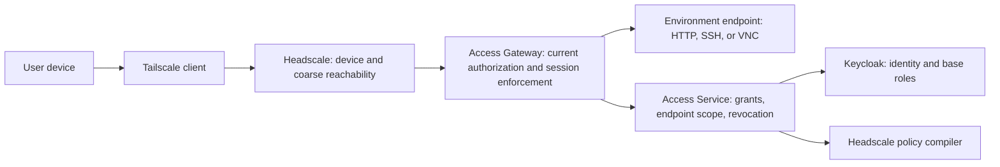

# Access Trust Boundary

Status: documented design baseline for ACCESS-01a; pending human review. This document is E0 design evidence only. It does not prove OIDC, Headscale, Access Gateway, session revocation, or a production network path is implemented.

## Purpose and non-goals

This document defines the P0 trust boundary for external access to LabWeaver environments. It separates authentication, device reachability, business authorization, endpoint mediation, and environment-local credentials so that reaching the Tailnet cannot bypass Access Service authorization.

It does not define a REST API, NATS subject, database schema, Headscale instance, RBAC policy, or deployment configuration. Those interfaces remain planned until their owning implementation issues provide a reviewed contract and current-commit evidence.

## Authority and trust domains

| Domain | Authoritative decision | Explicitly does not decide |
| --- | --- | --- |
| Keycloak/OIDC | authenticated subject, issuer, audience, token validity, base role | course, project, environment, lease, or endpoint entitlement |
| Headscale/Tailscale | enrolled device identity, private-network membership, route/tag policy, coarse reachability | permission to use a particular LabWeaver environment |
| Access Service | `AccessGrant`, `EndpointGrant`, grant revision, endpoint/protocol scope, lifecycle and revocation | upstream user authentication or workload scheduling |
| Access Gateway | request/session mediation and enforcement of a current Access decision | broad Tailnet policy compilation or environment ownership |
| Environment Service | endpoint metadata and short-lived environment-local credentials | caller identity, course membership, or external network policy |

PostgreSQL is the planned durable source of truth for Access Service state. A compiled Headscale policy is a derived, coarse network control and never replaces the Access Service decision. NATS delivery and Gateway caches are not authorization truth.

## P0 access path

For P0, the Access Gateway is the only user-facing entry point for container and VM endpoints. A Subnet Router may carry controlled infrastructure traffic between the Gateway and a private VM network; it must not expose a client-to-VM route that bypasses the Gateway. No environment endpoint receives a public LoadBalancer, NodePort, or direct public ingress.

The portal may be served through public HTTPS under a separate deployment policy. Its login does not grant direct access to environment or operations endpoints: those endpoints remain Tailnet-plus-Gateway paths.

## Identity and device enrollment

1. The client authenticates with Keycloak using Authorization Code plus PKCE. Services validate issuer, audience, signature, expiry, and required role before accepting a bearer token.
2. A device enrollment request is eligible only when its authenticated subject has a currently valid course or project relationship. Access Service issues a one-time, short-lived enrollment authorization bound to that subject; it is not a reusable Tailnet credential.
3. Headscale records the stable OIDC provider subject, owner, device lifecycle state, expiry, revocation reason, and last-seen data. A disabled identity, inactive device, expired enrollment, or revoked device is denied.
4. Headscale group claims may restrict enrollment, but they do not replace platform-owned course or endpoint authorization.

The document deliberately does not set credential formats, TTL values other than the 60-second session-revocation bound below, or an approval workflow beyond the eligibility rule. Those require an implementation contract and operational review.

## Authorization and session rules

An endpoint request succeeds only when all checks pass:

- the OIDC identity and device are valid;
- the request reaches the Gateway through the permitted Tailnet path;
- an Access Service decision finds a current `AccessGrant` and `EndpointGrant` for the subject, resource, endpoint, requested protocol, and time window;
- the grant and policy revisions are current enough for the Gateway to enforce; and
- Environment Service can issue the scoped, short-lived environment-local credential required by the endpoint.

`AccessGrant` and `EndpointGrant` are planned immutable decision records for a subject, resource, endpoint, permitted protocols, `not_before`, `expires_at`, revision, and lifecycle reason. `Device` records the device-to-subject binding and lifecycle. `PolicyRevision` identifies the source revision, compiler outcome, applied revision, and safe failure state. Implementations must reject conflicting IDs, stale revisions, missing dependencies, unsupported protocols, or incomplete records rather than selecting a first matching record.

Grant expiry or revocation immediately denies new connections. The Gateway must revalidate active SSH, VNC, HTTP, and code-server sessions and terminate them within 60 seconds of observing a revoked or expired decision. Failure to read a required decision, validate a session, compile/apply the required policy, or establish the scoped downstream credential fails closed: it must not create or retain access on the basis of a stale allow.

## Failure, audit, and evidence requirements

Future public contracts must expose stable diagnostics for invalid identity, inactive device, missing/expired/revoked grant, unsupported endpoint protocol, stale or unapplied policy revision, and session-revocation failure. The final decision boundary logs each outcome once with structured `event` and diagnostic code, trace/request ID, subject ID, device ID, resource/endpoint ID, protocol, grant/policy revision, and reason category.

Audit records and machine-readable reports may contain identifiers, timestamps, revisions, decision outcomes, hashes, and safe diagnostic metadata. They must not contain bearer tokens, enrollment keys, SSH/VNC credentials, cookies, full request payloads, terminal streams, or session content.

The required production evidence is not yet available: API and negative authorization tests (E1/E2), a deployed Gateway and policy path (E3), and multi-role expiry/revocation replay with traces (E4). A policy or Gateway implementation must add explicit tests for cross-user denial, expired and revoked grants, inactive devices, policy-application failure, stale-session termination within 60 seconds, and absence of public endpoint bypass.
