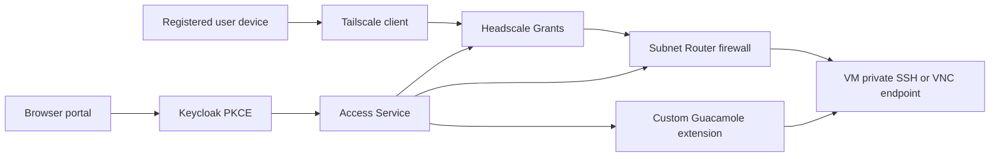

# Access Trust Boundary

Status: documented design baseline for ACCESS-01a; pending B security review and D verification review. This document is E0 design evidence only. It does not prove OIDC, Headscale, Subnet Router firewall enforcement, Guacamole, KubeVirt, session isolation, or a production network path is implemented.

## Purpose and non-goals

This document defines the P0 trust boundary for external access to LabWeaver environments. It separates authentication, device reachability, business authorization, direct VM transport, browser mediation, and environment-local credentials so that Tailnet reachability never becomes a substitute for Access Service authorization.

It does not define a REST API, NATS subject, database schema, Headscale instance, Router firewall implementation, Guacamole extension, RBAC policy, or deployment configuration. Those interfaces remain planned until their owning implementation issues provide reviewed contracts and current-commit evidence.

## Authority and trust domains

| Domain | Authoritative decision | Explicitly does not decide |
| --- | --- | --- |
| Keycloak/OIDC | authenticated subject, issuer, audience, token validity, base role | course, project, environment, lease, or endpoint entitlement |
| Headscale/Tailscale | enrolled device identity, Tailnet membership, route distribution, coarse Grants enforcement | business entitlement or VM lifecycle |
| Access Service | AccessGrant, DirectAccessGrant, EndpointGrant, device eligibility, revisions, lifecycle and revocation | identity-provider login or workload scheduling |
| Router enforcement | exact device-to-endpoint packet filtering, connection-state removal and enforcement receipt | whether a subject deserves access |
| Guacamole extension | browser-session mediation after a one-time Access handoff | independent OIDC login, business authorization truth or connection inventory |
| Environment Service | endpoint metadata and short-lived SSH/VNC credentials | caller identity, course membership or external network policy |

PostgreSQL is the planned durable source of truth for Access Service state. Headscale Grants, Router firewall state, Guacamole session state and caches are derived enforcement state; none may independently grant access.

## P0 access paths

Native SSH and native VNC use the direct VM path only after Access Service activates a `DirectAccessGrant`. It is limited to the subject's Active registered devices, one VM private address and the granted SSH/VNC port. It must not permit public ingress, CIDR-wide access, wildcard ports, direct access to containers, or a route to another endpoint.

Browser SSH and VNC use Guacamole. The portal completes Authorization Code plus PKCE with Keycloak, then receives a one-time, short-lived handoff token from Access Service. The custom Guacamole extension validates that token over an internal mutually authenticated channel, loads only the current authorized connection, and does not expose the token or endpoint credential to the browser. Code-server, Jupyter and other HTTP endpoints remain Access Gateway paths.

## DirectAccessGrant lifecycle

`DirectAccessGrant` is a planned Access Service record derived from an approved `AccessGrant`. It contains its immutable ID, subject, endpoint, allowed protocol, endpoint address and port, all Active device IDs and Tailnet addresses for that subject, `not_before`, `expires_at`, authorization revision, Headscale policy revision, Router enforcement revision, lifecycle reason and audit correlation IDs.

Access Service must recalculate a DirectAccessGrant whenever its parent grant, endpoint, device enrollment, device status, membership, lease or policy revision changes. A device added after activation is not implicitly trusted: it receives access only through a new revision that names it. An inactive or revoked device is removed immediately. Endpoint IP reuse requires the prior revision to be withdrawn and its connection state cleared before a new endpoint identity can be activated.

Activation is ordered but atomic from the caller's perspective:

1. Access Service persists an intended revision and emits the controlled enforcement work through its transactional boundary.
2. Router enforcement applies its default-deny policy and the exact device-to-endpoint permit for that revision, then returns a safe receipt.
3. Policy Compiler applies the matching default-deny Headscale Grants revision and returns its receipt.
4. Only matching successful receipts change the grant to `active`; any missing, stale or failed receipt leaves it `pending` or `blocked` and unusable.

Each active native VNC grant additionally requires Environment Service to issue a short-lived, subject-and-endpoint-bound VNC credential. SSH uses an equivalently scoped short-lived certificate or one-time credential. No credential may be stored in the grant record, policy, ordinary logs or Guacamole connection inventory.

## Revocation and containment

Ordinary expiry or revocation must produce network isolation for that DirectAccessGrant within 60 seconds. Router enforcement first removes the exact permit, blocks the affected device-to-endpoint traffic and clears the associated connection state; the Policy Compiler then withdraws the matching Headscale Grants revision. The completion report includes both enforcement results and the affected device, endpoint and revision, but no credentials or session payload.

This action must not disrupt another active grant to the same VM. A security incident, failed isolation receipt or an endpoint-wide containment decision escalates to `endpoint_isolated`, where the external network boundary blocks all user access to that endpoint. The system may stop the VM only after confirming that no other active grant remains and recording the actor, reason, target state and recovery condition. VM stop is an exceptional resource-level action, not the default result of an individual access revocation.

Kubernetes NetworkPolicy alone is not acceptable evidence for the 60-second condition because its treatment of established connections is implementation-defined. The enforcing Router must provide its own observed isolation receipt and connection-state result.

## Failure, audit and evidence requirements

Future contracts must expose stable diagnostics for invalid identity, inactive device, invalid handoff token, missing/expired/revoked grant, DirectAccessGrant pending or blocked state, unsupported protocol, mismatched enforcement revision, Router isolation failure, policy application failure and endpoint containment escalation. The final decision boundary logs each result once with structured `event`, diagnostic code, trace/request ID, subject ID, device ID, endpoint ID, protocol, authorization/policy/firewall revisions and safe reason category.

Audit records and machine-readable reports may contain identifiers, timestamps, revisions, decision outcomes, hashes and safe diagnostics. They must not contain bearer tokens, handoff tokens, enrollment keys, SSH/VNC credentials, cookies, full request payloads, terminal streams or session content.

Required evidence remains unavailable: contract and negative authorization tests (E1/E2), a deployed Router/Headscale/Guacamole path with receipts (E3), and multi-device, multi-role replay proving native and browser-path containment (E4).
