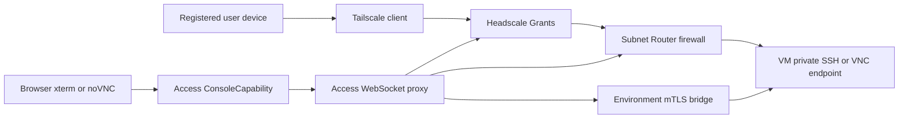

# Access Trust Boundary

Status: the current P0 is `ssh gateway@gateway connect <server-alias>`. ADR 0012 supersedes Guacamole for browser consoles and freezes only the ConsoleCapability contract; #131 and #124 own its xterm/noVNC implementations. Current evidence does not prove a deployed browser-console path.

## Purpose and non-goals

This document defines the P0 trust boundary for external access to LabWeaver environments. It separates authentication, device reachability, business authorization, direct VM transport, browser mediation, and environment-local credentials so that Tailnet reachability never becomes a substitute for Access Service authorization.

The versioned contracts define the Access data/API boundary. This document does not define the Gateway image, runtime executor, ConsoleCapability persistence, noVNC UI, KubeVirt bridge or deployment credentials.

## Public discovery projection

`GET /api/v1/environments/{environmentId}/access-grants` returns only grants visible to the current
actor. The response omits actor identity, endpoint host/port, credentials, Headscale policy, Router
rules and raw authorization inputs. It exposes grant and endpoint identities/revisions, protocol,
safe alias, effective state, expiry, and a stable decision reason so the console can explain access
without becoming an authorization authority. Missing or unavailable ownership fails closed.

## Authority and trust domains

| Domain | Authoritative decision | Explicitly does not decide |
| --- | --- | --- |
| Keycloak/OIDC | authenticated subject, issuer, audience, token validity, base role | course, project, environment, lease, or endpoint entitlement |
| Headscale/Tailscale | enrolled device identity, Tailnet membership, route distribution, coarse Grants enforcement | business entitlement or VM lifecycle |
| Access Service | AccessGrant, DirectAccessGrant, EndpointGrant, device eligibility, revisions, lifecycle and revocation | identity-provider login or workload scheduling |
| OpenSSH Gateway (#63) | present a key fingerprint, redeem a one-time token, report session heartbeat/close and execute termination commands | authorization truth, VM endpoint ownership or independent `authorized_keys` policy |
| Router enforcement | exact device-to-endpoint packet filtering, connection-state removal and enforcement receipt | whether a subject deserves access |
| Access WebSocket proxy | browser-session mediation after a one-time ConsoleCapability handoff | runtime target selection, Kubernetes credentials or independent authorization truth |
| Environment Service | endpoint metadata and short-lived SSH/VNC credentials | caller identity, course membership or external network policy |

PostgreSQL is the planned durable source of truth for Access Service state. JetStream, proxy session state and caches are derived enforcement state; none may independently grant access.

## Issue #47 identity and internal service defaults

All deployment-variable values are in `deploy/config/access-auth.yaml.example`; code must not embed issuer URLs, audiences, claim paths, Keycloak role names, certificate locations, Gateway SANs, listener addresses, cookie names, lifetimes, or runtime-pool sizing. The production configuration manager supplies the corresponding non-secret values and secret-file locators. The example uses the recommended `realm_access.roles` source, maps `teacher`, `student`, and `platform-admin`, uses a host-only `__Host-labweaver_session` cookie and `X-CSRF-Token`, and sets a 15-minute absolute / 5-minute idle session lifetime with a 5-minute OIDC transaction lifetime. These are deployment defaults, not protocol constants: role claim path and Keycloak-to-platform role mapping are explicit configuration and are validated at startup. Every browser mutation must have both a live BFF session and a constant-time synchronizer token, and the request `Origin` must exactly match the configured HTTPS origin allowlist. The browser BFF uses the `spiffe://labweaver/access-service` identity when forwarding to Control and Environment; Access internal routes separately allowlist `spiffe://labweaver/control-service` and `spiffe://labweaver/openssh-gateway`.

The same file fixes the bearer-token issuer, API audience, asymmetric signing-algorithm allowlist, and JWKS refresh/retry intervals. The Access runtime validates `exp`, `nbf`, issuer, audience and `azp`, refreshes the JWKS only on an unknown `kid`, and rejects a bearer request when discovery, refresh, signature, claim, or role mapping validation fails. The audited `jwt-authorizer` 0.15.0 patch retains the deployment-configured HTTP client during refresh, merges concurrent refreshes with its mutex and rate-bounds repeated misses by the retry interval, so private-CA rotation cannot silently fall back to a different trust store. No token, cookie, PKCE verifier, or certificate body is permitted in the configuration file or ordinary logs.

Only roles selected by the configured signed-claim path and explicit mapping become `Teacher`, `Student`, or `PlatformAdmin`; absent, malformed, or otherwise unmapped role claims deny authentication. Course and resource access still requires current Access Service membership and owner checks.

The approved Gateway mTLS identity is SAN URI `spiffe://labweaver/gateway`. The internal listener trusts only the configured CA locator, requires a currently valid leaf certificate with `clientAuth` EKU and this exact SAN, and fails closed for missing, expired, untrusted, or unregistered identities. Certificate rotation keeps both reviewed CA/key versions only for their explicit overlap window. The `POST /internal/v1/auth/decision` caller must present this mTLS identity, a live opaque BFF session ID and matching actor ID; Access reloads membership truth for that decision and returns a role/scope decision whose `validUntil` is the maximum cache horizon. The caller-provided revision is advisory only and can never extend a permit.

Operation role and scope policy is generated from the contracts catalog into both OpenAPI surfaces (`x-labweaver-allowed-roles` and `x-labweaver-scope`). Course and project scopes are evaluated only against Access-owned memberships. After #51 merged, Environment scope calls its owner resolver over configured rustls mTLS and binds the environment, course, actor and exact Environment revision to the strong-ETag response. Resolver denial returns 403; transport, store, expiry, identity, revision or response mismatch fails closed. The recommended deployment defaults are a 2-second timeout, one retry after a 100-millisecond backoff and a 5-second decision cache horizon; all remain explicit startup-validated configuration.

`transport_security: strict` is mandatory for deployments. OIDC Discovery and
all consumed authorization, token, JWKS and logout endpoints must use HTTPS.
When an OIDC private CA is configured it replaces, rather than extends, the
system trust roots; the Owner Resolver always uses only its configured CA.
Disposable tests may explicitly select `insecure-test-only`, but startup also
requires `LABWEAVER_ENABLE_INSECURE_AUTH_TEST_MODE=1` and rejects every
non-loopback issuer, resolver, browser/internal bind and HTTP origin. This mode
may accept an invalid loopback server certificate and is never a deployment
fallback.

## P0 access paths

The current P0 authenticates the fixed `gateway` Unix account, then accepts only `connect <server-alias>` as `SSH_ORIGINAL_COMMAND`. This ordering is required because OpenSSH rejects an unknown Unix account before `AuthorizedKeysCommand` can run. The alias is a strict database lookup key and never contains or derives host/port. The first phase binds a short-lived one-time token to Gateway, connection, actor and key; redemption binds it to the exact grant revision and endpoint after a fresh Environment eligibility decision. Route resolution stays in #53/#63.

The same redemption returns only the selected alias and the digest of the
Environment-observed host-key fingerprint. The Gateway's local
`KnownHostsCommand` validates the key offered by the target against that digest
before OpenSSH can start the terminal. This closes the dynamic VM host-key
boundary without copying target addresses into Access or maintaining a stale
cluster-wide `known_hosts` file.

The following `DirectAccessGrant` sections are retained only as a deferred future proposal and are not requirements or completion evidence for browser consoles.

Browser xterm and noVNC use the ADR 0012 ConsoleCapability handoff: discovery and issuance occur on an active AccessGrant; issuance requires BFF, Origin, CSRF, idempotency and exact revision fences. The locator expires after 30 seconds and its single-use secret is a path-scoped Secure HttpOnly cookie, never a URL or response field. The intended Access proxy and Environment mTLS bridge are downstream work, not current runtime evidence.

## DirectAccessGrant lifecycle

`DirectAccessGrant` is a planned Access Service record derived from an approved `AccessGrant`. It contains its immutable ID, subject, endpoint, allowed protocol, endpoint address and port, all Active device IDs and Tailnet addresses for that subject, `not_before`, `expires_at`, authorization revision, Headscale policy revision, Router enforcement revision, lifecycle reason and audit correlation IDs.

Access Service must recalculate a DirectAccessGrant whenever its parent grant, endpoint, device enrollment, device status, membership, lease or policy revision changes. A device added after activation is not implicitly trusted: it receives access only through a new revision that names it. An inactive or revoked device is removed immediately. Endpoint IP reuse requires the prior revision to be withdrawn and its connection state cleared before a new endpoint identity can be activated.

Activation is ordered but atomic from the caller's perspective:

1. Access Service persists an intended revision and emits the controlled enforcement work through its transactional boundary.
2. Router enforcement applies its default-deny policy and the exact device-to-endpoint permit for that revision, then returns a safe receipt.
3. Policy Compiler applies the matching default-deny Headscale Grants revision and returns its receipt.
4. Only matching successful receipts change the grant to `active`; any missing, stale or failed receipt leaves it `pending` or `blocked` and unusable.

KubeVirt noVNC uses a service-side least-privilege identity for the VMI `/vnc` WebSocket subresource; it does not issue a guest VNC password or browser-visible Kubernetes credential. No credential may be stored in grant records, policies, logs or session inventory.

## Revocation and containment

Ordinary expiry or revocation must produce network isolation for that DirectAccessGrant within 60 seconds. Router enforcement first removes the exact permit, blocks the affected device-to-endpoint traffic and clears the associated connection state; the Policy Compiler then withdraws the matching Headscale Grants revision. The completion report includes both enforcement results and the affected device, endpoint and revision, but no credentials or session payload.

This action must not disrupt another active grant to the same VM. A security incident, failed isolation receipt or an endpoint-wide containment decision escalates to `endpoint_isolated`, where the external network boundary blocks all user access to that endpoint. The system may stop the VM only after confirming that no other active grant remains and recording the actor, reason, target state and recovery condition. VM stop is an exceptional resource-level action, not the default result of an individual access revocation.

Kubernetes NetworkPolicy alone is not acceptable evidence for the 60-second condition because its treatment of established connections is implementation-defined. The enforcing Router must provide its own observed isolation receipt and connection-state result.

## Failure, audit and evidence requirements

Console contracts expose stable diagnostics for denied, expired or consumed capability, revision or Lease conflict, environment-not-ready, subprotocol mismatch, upstream unavailable, control-channel loss and authorization end. The final decision boundary logs each result once with structured identity, revision, trace/request ID and safe reason category.

Audit records and machine-readable reports may contain identifiers, timestamps, revisions, decision outcomes, hashes and safe diagnostics. They must not contain bearer tokens, handoff tokens, enrollment keys, SSH/VNC credentials, cookies, full request payloads, terminal streams or session content.

The ConsoleCapability contract is E2 only after generated schema/API/SDK checks and cross-consumer compilation. #131, #124 and #126 respectively own implementation, real shared-cluster E3 and multi-role E4; Fixture, historical PR #138 and mixed-source evidence do not upgrade those conclusions.
