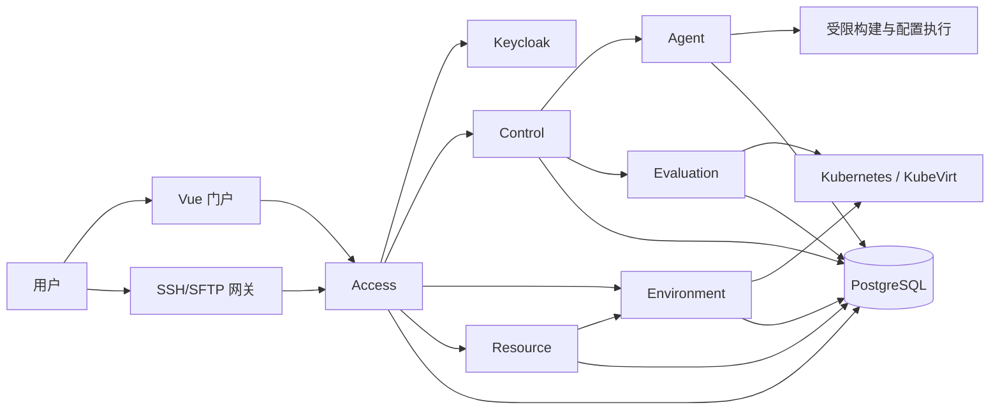

# 系统结构

教师、学生、科研用户和管理员通过 Vue 门户或 SSH/SFTP 使用平台。Keycloak 负责身份，Access 负责项目与资源范围授权。环境端点由授权网关访问，不直接作为公共服务发布。

图表达职责与主要调用，不表示每次请求都串行穿过全部服务。领域异步任务与事件使用 NATS JetStream；材料、镜像和工件使用对象存储及 Registry。每个领域保留唯一权威状态。

服务身份与用户范围授权分开。Resource 提供分配授权，Environment 管理实际环境资源，Evaluation 管理自己的执行任务。普通已有 Kubernetes 部署与基础组件 bootstrap 分开，不依赖特定校园或虚拟化宿主拓扑。
