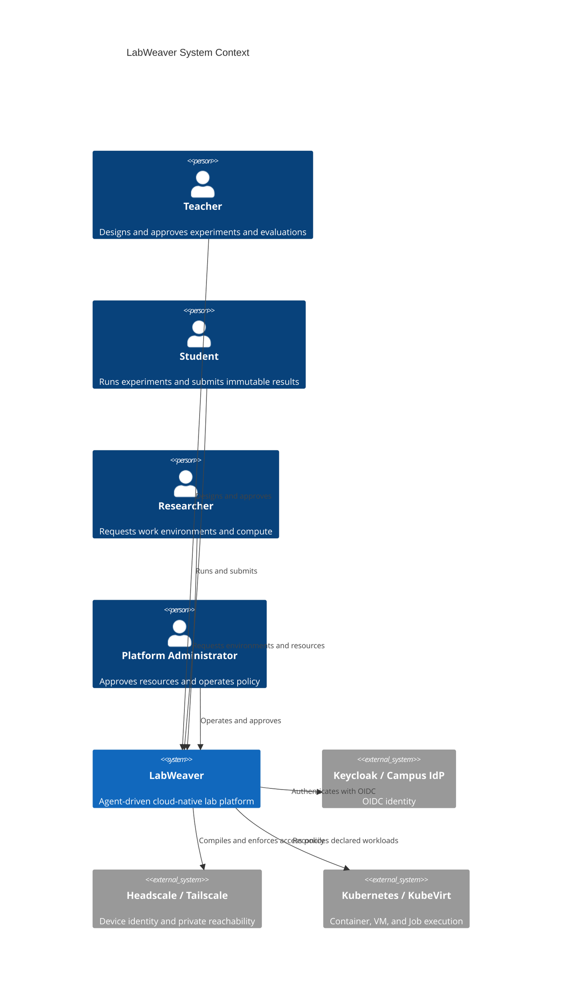
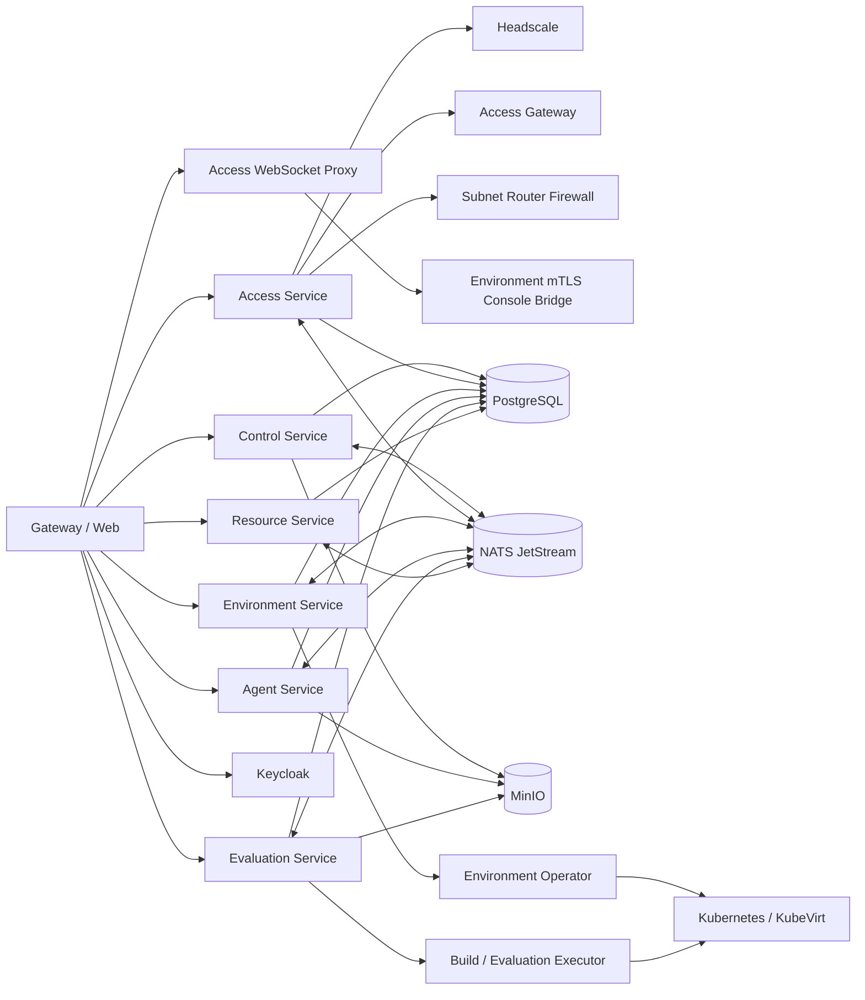

# C4 Architecture

## System context

LabWeaver 连接教师、学生、科研用户和平台管理员，通过 Keycloak/OIDC 建立用户身份，通过 Headscale/Tailscale 建立设备身份和私网可达性，通过业务服务实施课程、项目、环境、评测、资源和访问授权。

## Container boundary

The diagram defines intended boundaries, not implementation completion. Current evidence is recorded separately in the implementation status.

The P0 endpoint path is additionally constrained by the [Access Trust Boundary](access-trust-boundary.md): HTTP remains Access Gateway-mediated, browser xterm/noVNC is defined by the AccessGrant-scoped ConsoleCapability handoff in ADR 0012, and native SSH/VNC remains a deferred DirectAccessGrant proposal. No derived enforcement layer replaces the Access Service decision.
