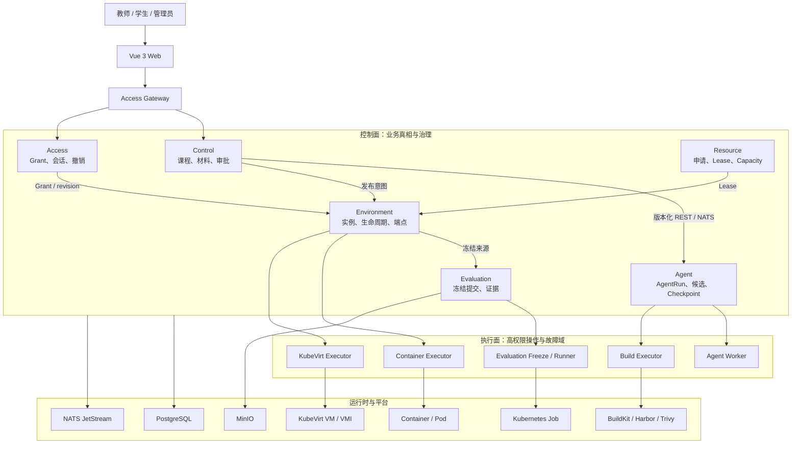
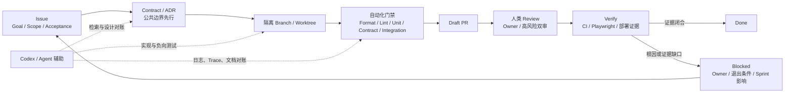

# LabWeaver 项目总结报告

> Agent 驱动的云原生实验平台
>
> 面向云计算课程终期评审与项目展示

| 字段 | 当前值 |
| --- | --- |
| 最后更新 | 2026 年 8 月 10 日 |
| 已合入基线 | `origin/develop@41521099d3f8a325840665e8381a6780d1f3cbf5` |
| 统计原则 | 只统计上述 `develop` 已合入内容；开放 Issue、Draft PR、Fixture 和本地候选不计入完成成果 |
| 当前结论 | **工程主体已成形，正式发布证据尚未闭合** |

## 1. 执行摘要

LabWeaver 是一个面向教学实验和科研工作的 Agent 驱动云原生平台。它解决的不只是“如何启动一个实验容器”，而是如何把课程材料、Agent 候选方案、教师审批、运行环境、访问授权、算力租约和冻结证据组成一条可追溯的业务链。

传统实验平台常将题面、环境配置、运行状态和学生结果分散在不同系统中。一旦镜像、脚本、权限或资源发生变化，很难说清当时究竟运行了什么，也很难稳定重现。LabWeaver 把这些状态拆分给明确的领域 Owner，再用版本化 Contract、事件和不可变引用组合起来。发生缺配置、身份不一致、权限过期或 Provider 不可用时，系统会明确阻断，不用旧报告、Fixture 或隐式 fallback 掩盖问题。

当前已合入基线包含六个领域服务、Container/KubeVirt 双运行时、统一 ConsoleCapability、事件驱动协作、不可变供应链身份、分层测试门禁、Ansible/Helm 部署链和结构化故障定位日志。这些工作说明项目已经越过单页 Demo 或单服务原型阶段，进入跨服务系统集成。当前不足也很具体：同一冻结身份下的 connected 验收和 Release Gate v3 还没有闭合，因此本报告不宣称正式 Release 已经完成。

## 2. 项目价值：从“能运行”到“能治理”

| 维度 | 传统实验环境 | LabWeaver 的已合入机制 | 直接收益 |
| --- | --- | --- | --- |
| 环境一致性 | 依赖个人电脑或可变镜像 | 材料 hash、镜像 digest、release 和 runtime artifact 显式绑定 | 教师与学生面对的是同一个可核对版本 |
| 运行时 | 通常只有容器或固定虚拟机 | Container 与 KubeVirt VM 共用环境契约，但由不同 Provider 执行 | 同一课程可同时承载 C/C++ 工具链和 Linux 系统实验 |
| 伸缩与故障域 | API、构建、运行时共享进程与权限 | 服务、Executor 和环境分层，各自管理状态与恢复 | 扩展某一类负载时不必扩大整个控制面权限 |
| 数据一致性 | API 成功即视为业务完成 | PostgreSQL 业务事务、Idempotency 与 Outbox 共享提交边界 | 避免业务已写入但事件丢失的半截状态 |
| 权限 | 网络能访问往往就等于允许使用 | OIDC 身份、AccessGrant、Lease、revision 和服务 mTLS 分层检查 | 访问过期、撤销或身份漂移时 fail closed |
| 软件供应链 | 可变 tag 与手工部署 | BuildKit、Harbor、Trivy、digest 与 deployment manifest 串联 | 能回答“这次实验究竟运行了哪个产物” |
| 可观测性 | 分散文本日志，依靠人工拼接 | `labweaver.log.v1` 连接 HTTP、NATS、Worker、Provider 和 Access 会话 | 故障可沿 request/trace/run/revision 定位，同时保持敏感数据约束 |
| 证据 | 截图、日志和口头说明各自独立 | 报告、Schema、hash、commit、image digest 和 Run ID 形成身份链 | 弱证据不能被重命名或复用为强证据 |

这张表真正要说明的是责任边界，组件数量只是结果。Kubernetes 解决工作负载的编排与生命周期；KubeVirt 把真实 VM 纳入同一套宣言式管理；PostgreSQL 保存业务真相；JetStream 传递可重放事件；Access Service 决定谁能使用什么；Release Gate 决定证据是否足以发布。组件各自有稳定的 Owner，平台才能在增加运行时、实验类型或执行节点时不重写整条业务链。

## 3. 云原生架构



> 上图表示已合入的系统架构与责任边界，不等于当前已取得 connected deployment 或 Release Gate 证据。

### 3.1 控制面与执行面分离

控制面管理课程、审批、授权、环境意图和冻结记录；执行面负责 Agent、镜像构建、Container、KubeVirt 和 Evaluation Job 等高权限操作。API 进程不直接持有 Kubernetes、BuildKit 或运行时的管理凭据，而是把已经通过契约检查的计划交给专用 Executor。这种分层有两个直接结果：一是业务 API 的水平扩展不会同步放大集群权限；二是新增 Provider 时可以保留现有的审批、授权和证据 Contract。

### 3.2 六个领域各自拥有状态

Control、Access、Agent、Environment、Evaluation 和 Resource 六个服务各自拥有 PostgreSQL schema 与迁移身份。服务不能越过契约直接修改其他领域的表。跨域协作使用版本化 REST、NATS 事件、DTO 或不可变引用。当业务需要发布事件时，业务状态、幂等记录和 Outbox 在同一事务中提交；消费者则显式处理重复、乱序、过期与重放。消息队列只是技术载体，核心是将失败语义写入业务边界。

### 3.3 Container 与 KubeVirt 双运行时

Environment Service 通过显式 Provider binding 选择运行时，不按注册顺序猜测实现，也不在 KubeVirt 不可用时悄悄改用 Container。Container 路径适合编译器、工具链和 Web/PTY 操作；KubeVirt 保留完整 Linux 系统、虚拟磁盘和启停恢复语义。两者共用 Environment revision、Lease、AccessGrant、冻结和清理契约，但各自使用独立 Executor 和身份围栏。

统一 ConsoleCapability 将两类交互纳入同一授权模型。Container xterm 使用固定 runtime PTY、二进制 I/O、有界 resize 和一次性兑换；KubeVirt noVNC 路径绑定 VMI namespace、name、UID 和 label，并通过 mTLS bridge 连接正式 `/vnc` WebSocket。Origin、CSRF、ETag、idempotency、revision 和 Lease 都在会话建立前检查，而不是把“能打开网页”当成授权成功。

### 3.4 不可变供应链与发布身份

材料、生成候选、镜像、部署和运行证据使用 hash 与版本标识串联。BuildKit 负责构建，Harbor 保存镜像，Trivy 执行扫描，运行时只消费 digest-pinned 产物。Release Gate v3 要求 source commit、package manifest、configuration、migration catalog、image digest 集合和 Run ID 属于同一候选身份。任何一段不匹配，当前候选都不具备发布资格。

这套设计的价值在于建立了可核对的因果链。它可以从某次运行追溯到镜像、构建输入、材料和源代码，也可以证明一份报告是否属于当前部署；文件数量本身不是目标。

### 3.5 安全、隔离与可观测性

Keycloak/OIDC 回答用户是谁，Access Service 再根据课程、环境、端点、Lease 和 revision 判断能否访问。服务与 Executor 之间使用独立 ServiceAccount 和 mTLS 身份。工作负载由 Namespace、ResourceQuota、SecurityContext 和 NetworkPolicy 约束；凭据不进入 Git、命令参数、普通日志或发布报告。

`labweaver.log.v1` 统一了日志 envelope，让 HTTP request/trace、CloudEvent、JetStream consumer、Worker stage、Provider generation fence 和 Access 会话共享可追踪标识。日志使用 allowlist 字段和脱敏约束，不记录 token、私有路径、终端正文或完整 payload。这使可观测性与隐私不再是二选一：日志保留足够的因果关系，但不保留可还原的私有内容。

## 4. 开发流程与 AI 协作

### 4.1 人类责任没有被 AI 模糊

| 角色 | 成员 | GitHub | 主要责任 |
| --- | --- | --- | --- |
| A：架构工程师 / 组长 / PM | 汪子昊 | `@2018wzh` | 架构、Control/Access/Resource、公共 Contract、迁移、发布判断与集成 |
| B：Agent / Environment / Evaluation 工程师 | 徐泽逸 | `@zeyi2` | Agent、Environment、Evaluation、Runner/Checker/Collector 与高风险路径 Review |
| C：前端工程师 | 刘子沛 | `@yingxvemiao` | Vue 门户、编辑器、状态可视化、响应式与交互体验 |
| D：测试 / DevOps / 文档工程师 | 沈天恩 | `@Nova-Lciop-J` | Playwright、Fixture、CI、Ansible Verify、文档、演示复现与独立验收 |

Codex/Agent 是工程工具，不是一个可以自行批准的第五名成员。它主要承担代码库检索、方案对账、隔离工作树实现、负向测试、CI 故障定位、证据校验和文档同步。人类 Owner 仍然负责目标和边界，Reviewer 负责技术和安全判断，D 负责部署与 connected 证据的独立 Verify，受保护分支决定最终能否合并。

### 4.2 Scrum 是可执行的状态机



每项工作从 GitHub Issue 开始，Issue 必须声明 Goal、Non-goals、验收条件、Owner、Reviewer 和风险。公共 API、事件、Schema 或 Migration 变更先修改 Contract/ADR，再迁移调用方。大规模改动使用独立分支和工作树，避免覆盖成员尚未提交的现场。Draft PR 用来提前暴露契约、依赖和 CI 问题，不用“先写完再一次性审”的大块交付方式。

高风险 Contract、Schema、Migration、权限、评分、Agent Tool 和 CRD 需要 A+B 人类双审；涉及测试、部署或运行证据时，D 必须独立 Verify。自动化检查全绿不代表可以跳过人工评审。工作进入 Blocked 后也不使用模糊描述，而是记录根因、解除人、退出条件与对 Sprint Goal 的影响。

### 4.3 范围冻结保护主链

项目在微服务、Runner 和用户功能层面设置了明确的范围冻结日期。这个决定降低了课程项目最后阶段持续扩功能的风险，让工作重心回到真实 KubeVirt、Environment 闭环、AccessGrant、Playwright、Ansible 和 Release Gate。EX3 Single-node Rescue Demo 则是一次明确标识的救援迭代：它用稳定 Fixture 和单节点路径保住可交互 Demo，但从未被允许替代 S4 的同身份发布证据。

## 5. 工程规模与工作量

### 5.1 可复现的基线统计

以 `origin/develop@41521099d3f8a325840665e8381a6780d1f3cbf5` 的干净 `git archive` 为输入，使用 cloc 2.08 统计 Rust、TypeScript、Vue、JavaScript/MJS、Python、Shell、SQL 和 HTML。统计排除 `.git`、`.tmp`、`artifacts`、`node_modules`、`target` 和 `vendor`，不将 Markdown、JSON 或 YAML 算入核心代码 headline。

| 指标 | 数值 | 口径 |
| --- | ---: | --- |
| 核心工程代码 | **131,178 LOC** | 424 个代码文件，不含文档与生成依赖 |
| Rust | 96,389 LOC | 领域服务、Contract、Provider、持久化、鉴权、xtask 与测试 |
| TypeScript + Vue + JavaScript/MJS | 26,056 LOC | Web、SDK、Playwright、构建与验证工具 |
| Python + Shell | 7,026 LOC | Ansible 验证、证据处理和跨平台自动化 |
| SQL | 1,671 LOC | 六个领域的迁移与约束 |
| Cargo workspace package | 14 | 6 个领域服务、6 个共享 crate、Access Gateway 和 xtask |
| 领域服务 | 6 | Control、Access、Agent、Environment、Evaluation、Resource |
| 受 Git 跟踪文件 | 1,088 | `develop` tree 路径数 |
| 测试资产 | 285 | 路径命中 `test/tests/e2e/spec` 的文件，用于表示广度，不等于测试用例数 |
| Schema | 183 | Contract、Result、Infrastructure 与 OpenAPI 投影 |
| Migration | 18 | 各领域 SQL 与 catalog |
| ADR | 14 | 已编号架构决策 |
| GitHub Actions workflow | 7 | Rust、Web、Playwright、Ansible、镜像等门禁 |
| GitHub Issue | 95 | 2026 年 8 月 10 日 GitHub 查询快照 |
| Merged PR | 61 | 2026 年 8 月 10 日 GitHub 查询快照 |
| `develop` 保留 commit | 60 | 仓库使用 squash merge，不与开发过程中的原始 commit 数直接等同 |

工程量不只体现在 LOC。共享 Contract 需要同步 Rust type、JSON Schema、OpenAPI 和 Web SDK；一条新的运行时路径需要同时进入 Provider、RBAC、NetworkPolicy、Helm、Ansible、Playwright、Release Gate 和正式文档。因此，项目中很多改动会横跨数十个文件，这是公共契约和证据链的自然结果，不是单纯追求代码量。

### 5.2 Sprint 与 Milestone

| 阶段 | 已关闭 / 总 Issue | 主要交付 | 当前解读 |
| --- | ---: | --- | --- |
| S1 Foundation | 18 / 18 | 领域边界、Contract、数据所有权、Web 基础 | 全部 Issue 已关闭 |
| S2 Environment | 23 / 23 | Agent、Access、环境生命周期、双运行时 | 全部 Issue 已关闭 |
| EX3 Single-node Rescue Demo | 4 / 4 | 确定性 Fixture、可重放单节点 Demo | 保住可演示增量，不替代 connected/Release 证据 |
| S3 Product Feature Complete | 36 / 38 | Console、Evaluation、Resource、可观测性和产品闭环 | 还有 2 个开放 Issue |
| S4 Release and Delivery | 0 / 4 | 同身份验收、Release Gate、证据归档与演示 | 尚未有 Issue 关闭，是当前发布阻塞集中区 |

这些数字是管理快照，不是 Release 证据。它们体现了工作拆分、Review 和迭代广度；具体功能是否可发布，仍然取决于当前身份下的证据。

## 6. 三个跨模块工程案例

### 6.1 Container xterm、KubeVirt noVNC 与统一验收契约

**问题。** Container 的 PTY 和 KubeVirt 的 RFB/VNC 协议完全不同，但对用户而言，它们都是“进入某个已授权环境”。如果前端和 Access 层为两类协议各维护一套权限逻辑，撤销、过期、重连和生命周期很容易分叉。

**实现。** PR [#156](https://github.com/TeamMonad/LabWeaver/pull/156) 引入生产级 Container xterm ConsoleCapability，PR [#157](https://github.com/TeamMonad/LabWeaver/pull/157) 在同一 capability/session/proxy 基础上加入 KubeVirt noVNC，PR [#158](https://github.com/TeamMonad/LabWeaver/pull/158) 将两条路径纳入 `connected-console-evidence.v1` 和 Release Gate v3。三个 PR 合计涉及 132 个文件，diff 为 10,199 行新增、2,202 行删除，覆盖 Rust、Vue、Playwright、Ansible、Schema、Release Gate 和文档。

**测试与边界。** 已合入测试覆盖 Origin/CSRF/ETag/idempotency、一次性 handoff、revision/Lease 漂移、撤销、短过期、stop/delete、控制通道丢失、PTY/RFB 探针和无固定 sleep 约束。这证明契约、实现和验收工具已合入；它不证明当前候选已在共享集群完成真实 PTY/RFB 验收。

### 6.2 v1 Ansible/Helm 部署链

**问题。** 一个云原生项目如果只有一批散落的 `kubectl` 命令，就无法稳定回答预检、配置、迁移、镜像、部署顺序、幂等重放和回滚身份。命令在某台机器上成功，也不等于该过程可审查、可重放。

**实现。** PR [#159](https://github.com/TeamMonad/LabWeaver/pull/159) 将 v1 集群准备、平台基础、BuildKit、应用 adoption/reconcile、镜像身份和报告收口到 Ansible 角色与 `cargo xtask` 入口。它修改 149 个文件，新增 6,602 行、删除 6,026 行；大量删除来自旧 Sprint 命名与路径的前向简化，而不是为废弃路径继续保留兼容层。

**测试与边界。** 已合入内容包括 OS/context 硬预检、配置和 manifest 身份检查、Helm 渲染、Ansible fixture、运行时镜像和报告 Schema。报告中只记录可安全公开的 hash、计数和 locator。本报告不把工具已合入描述成当前集群已按该身份完成部署；正式 connected 结论仍由 #126 的冻结验收窗口产生。

### 6.3 结构化故障定位日志

**问题。** 当一次请求经过 HTTP、多个服务、NATS、Worker 和 Provider 后失败，普通文本日志很难确定根因发生在哪一个边界。直接打印整个 error/debug 对象又可能泄露 token、URL、对象键、命令或学生内容。

**实现。** PR [#166](https://github.com/TeamMonad/LabWeaver/pull/166) 建立 `labweaver.log.v1` envelope，将 request ID、trace ID、actor/course/resource/run/revision 等必要标识以受控字段传递。它覆盖 Access Gateway、六个服务的关键 HTTP/NATS 路径、Freeze Worker、Container/KubeVirt Provider fence 和下游 header 传播，修改 43 个文件，新增 2,386 行、删除 449 行。

**测试与边界。** Schema、脱敏、INFO/DEBUG、W3C correlation 和非法 header 测试已合入。这证明结构化日志契约和关键组件已接入，但仍需在 #126 的同身份 connected 环境中完成一次真实 HTTP-to-provider 失败重建，才能将其提升为当前发布证据。

## 7. 当前实施状态

| 领域 | 当前状态 | 已合入事实 | 尚未闭合的边界 |
| --- | --- | --- | --- |
| 公共 Contract 与六个领域服务 | `implemented` | Rust type、REST/NATS、JSON Schema、OpenAPI/Web SDK 和独立数据所有权已建立 | 具体发布候选仍须通过当前身份的 connected 门禁 |
| Web 教师/学生/管理员界面 | `verified` | 主要产品表面已合入，Web unit、typecheck、lint 和 Fixture Playwright 路径可重放 | Fixture 不代表真实后端或集群证据 |
| Container xterm ConsoleCapability | `implemented` | PTY、一次性兑换、mTLS 代理、重连、撤销与 Web 交互已合入，本地契约/集成测试完成 | 当前候选的共享集群 PTY 与负向矩阵属于 #126 |
| KubeVirt noVNC ConsoleCapability | `implemented` | 真实 VMI `/vnc` 执行器、UID/label 围栏、RFB relay 和 noVNC UI 已合入 | 当前候选的真实浏览器至 VMI、撤销/过期/清理证据属于 #126 |
| Evaluation 与冻结 | `implemented` | FrozenSubmission、EvaluationRelease/Run/StepRun、幂等、lease fence、取消/重试和不可变身份已合入 | 真实 Runner/Probe 运行、统一评测和 connected Release 证据未闭合 |
| Resource 申请与 Lease | `implemented` | Resource Service 契约、审批/Lease 管理和管理员 Web 表面已合入 | 同身份 Resource replay、Quota readback、续租/撤销/过期和无残留证据属于 #126 |
| 本地集成与测试门禁 | `verified` | Contract、Rust/Web、Docker 依赖、BuildKit/Registry/Trivy canary、Helm/Ansible fixture 和 Playwright 入口已合入 | kind/Docker/Fixture 不能升级为 KubeVirt connected 或 Release Gate 证据 |
| v1 Ansible/Helm 部署工具 | `implemented` | 预检、配置、迁移、镜像、adoption/reconcile、Verify/rollback 契约已合入 | 当前候选尚无可用于发布的同身份部署报告 |
| Release Gate v3 | `blocked` | machine-readable Schema、身份检查、13 项 connected 检查入口与防篡改验证已合入 | #126 仍为 `In Progress`，当前冻结候选的 connected 验收与 D Verify 未闭合 |
| 正式演示与发布证据 | `blocked` | #128 定义了发布身份、证据归档和演示交付目标 | #128 当前为 `Draft PR`；未合入的工具或 Fixture 产物不计入本报告成果 |

`implemented` 表示实现与相关契约已进入 `develop`；`verified` 只用于已有与表格所述层级相匹配的验证；`blocked` 表示退出条件尚未满足。

## 8. 风险、剩余工作与交付判断

当前的主要风险已经从“是否有这个功能”转向“是否能在同一候选身份下稳定重放”。代码、Contract、部署工具和验收入口已经形成，但真实 Container/KubeVirt、Access 撤销/过期、Resource Lease、清理 readback、Ansible Verify 和 Release Gate 必须共享同一份 source/package/configuration/migration/deployment/image/runtime/Run 身份。其中任何一项失败，正式发布结论都应继续保持 blocked。

接下来应停止扩大功能面，由 #126 冻结一个可验收候选，完成真实 Container xterm、KubeVirt noVNC、授权失效、生命周期、Resource 和清理矩阵，再由 D 独立 Verify 并生成 Release Gate v3 报告。#128 只能消费这一冻结身份产生的证据，不应重复启动第二次 package、deployment、Resource replay 或 connected Playwright 窗口。

因此，对当前项目最准确的描述是：**LabWeaver 已经具备一个云原生实验平台的主要工程骨架、双运行时路径、权限边界、可观测性和可执行交付流程；它还不是一个已取得当前 Release 身份证据的正式发布版。**这个结论不会削弱项目的工程价值，反而说明团队能够将“已实现”、“已验证”和“可发布”分开判断。

## 9. 证据索引与统计命令

### 9.1 仓库事实源

- [实施状态](../status/implementation-status.md)
- [阻塞与退出条件](../status/blockers.md)
- [C4 架构](../architecture/c4.md)
- [服务边界](../architecture/service-boundaries.md)
- [数据所有权](../architecture/data-ownership.md)
- [Access 信任边界](../architecture/access-trust-boundary.md)
- [可运行环境 Demo 契约](../architecture/runnable-environment-demo.md)
- [日志与可观测契约](../contracts/logging-observability-v1.md)
- [测试计划](../testing/test-plan.md)
- [覆盖矩阵](../testing/coverage-matrix.md)
- [Release Gate](../testing/release-gate.md)
- [GitHub Scrum 流程](../process/scrum.md)
- [项目工程规则与角色边界](../../AGENTS.md)

### 9.2 当前发布阻塞

- [Issue #126：Shared-cluster product acceptance](https://github.com/TeamMonad/LabWeaver/issues/126)，截至本报告更新时为 `In Progress`。
- [Issue #128：Release identity, evidence archive, final report and demo](https://github.com/TeamMonad/LabWeaver/issues/128)，截至本报告更新时为 `Draft PR`。
- [PR #164](https://github.com/TeamMonad/LabWeaver/pull/164) 保持 Draft、`REVIEW_REQUIRED` 与禁止 auto-merge；其未合入产物不计入本报告的已完成能力。

### 9.3 可重现统计命令

```sh
git fetch origin develop
git archive origin/develop -o .tmp/labweaver-summary/source.tar
tar -xf .tmp/labweaver-summary/source.tar -C .tmp/labweaver-summary/source

cloc .tmp/labweaver-summary/source \
  --exclude-dir=.git,.tmp,artifacts,node_modules,target,vendor \
  --include-ext=rs,ts,vue,js,mjs,py,sh,sql,html \
  --force-lang=JavaScript,mjs \
  --json

cargo metadata \
  --manifest-path .tmp/labweaver-summary/source/Cargo.toml \
  --no-deps \
  --format-version 1

git ls-tree -r --name-only origin/develop
git rev-list --count origin/develop
gh issue list --state all --limit 500 --json number
gh pr list --state merged --limit 500 --json number
gh api 'repos/TeamMonad/LabWeaver/milestones?state=all&per_page=100'
```

本报告是持续更新文档。当 `develop` 基线、Milestone、Issue/PR 数量或发布证据发生变化时，应同时修改页首身份、工程量、状态矩阵和证据索引，不仅替换一个结论句。
