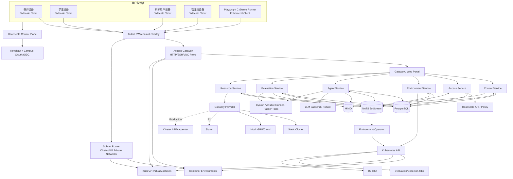
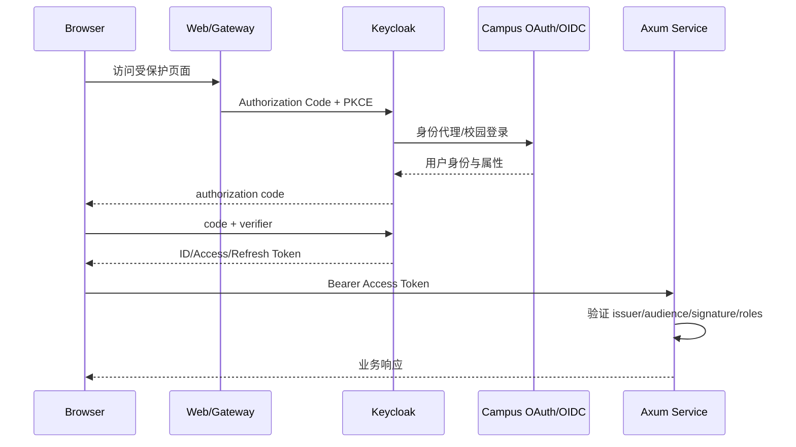
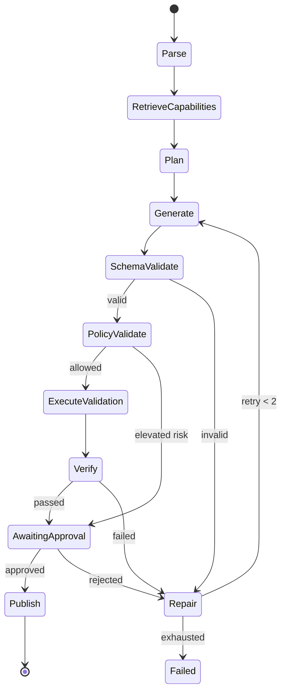
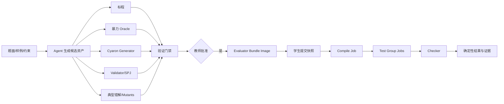
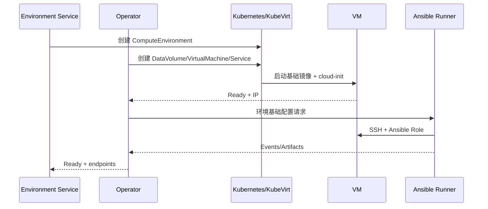
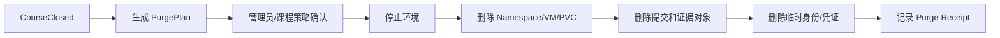

# LabWeaver 生产级技术实现方案

> **版本**：v2.1（LabWeaver 品牌、Tailnet 接入与 Playwright 修订版）
> **日期**：2026-07-11
> **架构风格**：Rust/Axum 云原生微服务 + Kubernetes Operator + Agent + 统一评测模型 + Headscale/Tailscale 零信任接入
> **部署入口**：Ansible；平台组件使用 Helm/Kubernetes API 落地；Playwright 负责部署后验收与演示重放
> **主演示**：OJ 类编程实验 + Linux 系统 KubeVirt VM
> **重要决策**：不依赖 OpenJudge；LLM 只提供建议，不直接计分；GPU/云容量在测试和演示中使用 Mock
> **代码仓库**：`github.com/TeamMonad/LabWeaver`

Web 前端以 **Material You** 为统一设计语言。允许参考 GCP Console 的信息架构、工作区切换、表格密度、状态可读性和操作层级，但不复制 Google 品牌、产品名或专有视觉资产。实现需要以语义化 dynamic color、surface/elevation 层级、完整的 loading/empty/warning/error 状态、键盘操作、无障碍对比度和响应式行为为基础。具体 token、组件 API 和页面布局由前端 Owner 后续细化；本技术方案不把方向性选择描述成已完成 UI。

---

## 目录

1. [设计目标、约束与非目标](#1-设计目标约束与非目标)
2. [总体架构](#2-总体架构)
3. [微服务拆分与数据所有权](#3-微服务拆分与数据所有权)
4. [身份、权限与 OAuth/OIDC](#4-身份权限与-oauthoidc)
5. [核心领域模型](#5-核心领域模型)
6. [教师输入与发布包模型](#6-教师输入与发布包模型)
7. [Agent 系统实现](#7-agent-系统实现)
8. [统一评测模型](#8-统一评测模型)
9. [OJ 类编程实验实现](#9-oj-类编程实验实现)
10. [Linux 系统实验实现](#10-linux-系统实验实现)
11. [环境运行时与工作环境配置](#11-环境运行时与工作环境配置)
12. [工件收集、证据与数据生命周期](#12-工件收集证据与数据生命周期)
13. [构建与配置基础设施](#13-构建与配置基础设施)
14. [资源审批、队列与容量 Provider](#14-资源审批队列与容量-provider)
15. [API、事件与数据模型](#15-api事件与数据模型)
16. [安全设计](#16-安全设计)
17. [高可用、可观测与灾备](#17-高可用可观测与灾备)
18. [Ansible 快速部署方案](#18-ansible-快速部署方案)
19. [开发环境与开发文档](#19-开发环境与开发文档)
20. [测试与质量保证](#20-测试与质量保证)
21. [代码结构与实施顺序](#21-代码结构与实施顺序)
22. [课程切片与生产目标差异](#22-课程切片与生产目标差异)
23. [参考资料](#23-参考资料)

---

# 1. 设计目标、约束与非目标

## 1.1 设计目标

LabWeaver 需要同时满足以下目标：

1. **教师低成本发布**：教师只需提供题面、材料和必要约束，Agent 自动准备候选环境和候选评测包。
2. **环境可复现**：同一模板对应固定镜像、VM 基础盘、配置版本和资源规格。
3. **评测统一**：OJ、Linux 系统、脚本、Web、HPC 等实验使用同一 `EvaluationSpec`，通过不同 Runner/Checker 组合扩展。
4. **Agent 可控**：Agent 只生成候选和调用白名单工具；发布必须教师审批；LLM 不直接计分。
5. **算力可治理**：CPU/GPU 申请、管理员审批、配额、租约、队列和到期回收统一管理。
6. **安全外部接入**：以 Headscale/Tailscale 建立设备身份和私有 Overlay，不把学生环境、VM 或运维端口直接暴露公网。
7. **可重复测试和演示**：Playwright 使用多角色 Project、固定 Seed、Trace、截图和录像复现完整业务流程。
8. **云原生和生产可运维**：微服务异步解耦、幂等、审计、HA、可观测、Ansible 快速部署。
9. **两周可落地**：课程切片优先完成 OJ + Linux 两类纵向闭环，不以“支持全部实验类型”为交付前提。

## 1.2 设计约束

- 控制面和业务服务以 Rust + Axum 实现；
- Kubernetes 管理员权限可用；
- 最终必须真实启动 KubeVirt VM；
- GPU 和云服务商扩容在测试与演示中使用 Mock；
- 教师只编辑 YAML，不提供低代码表单；
- 工作环境允许用户请求任意软件，实验环境不允许改变基线；
- 资源审批者为平台管理员；
- Keycloak 与校园 OAuth/OIDC 组合；
- NATS JetStream、MinIO、Headscale/Tailscale、Kyverno、BuildKit、Packer/cloud-init/Ansible、Playwright 为既定组件；
- 四人每人约 20–35 小时，总投入约 80–140 人时。

## 1.3 非目标

- 不重写容器运行时、虚拟化、消息队列、对象存储、IAM、镜像构建器；
- 不实现通用 CI 平台或通用工作流引擎；
- 不让 LLM 成为正确性或数值成绩的唯一来源；
- 不在 P0 实现真实 GPU、真实云扩容、跨地域多活、完整计费；
- 不将 Headscale ACL 当作唯一业务授权源，也不向公网直接暴露实验环境端口；
- 不在 P0 支持交互题、MIG、KubeVirt GPU 直通；
- 不承诺课程环境达到完整商业 SLA，但架构和部署应具备生产演进路径。

## 1.4 关键原则

```text
题面和材料是输入
Agent 产物是候选
Schema/策略/编译/差分/变异是验证
教师审批是发布门禁
确定性脚本和 Checker 给出数值结果
LLM 只给 Review 与目标达成建议
```

---

# 2. 总体架构

## 2.1 逻辑架构



## 2.2 同步与异步边界

### 同步 API

用于：

- 登录后查询；
- YAML 校验；
- 创建草稿；
- 审批命令；
- 查询状态；
- 获取预签名 URL；
- SSE 建立连接。

同步请求只做鉴权、校验、持久化和投递，不等待环境创建、镜像构建、Agent、评测或资源分配完成。

### 异步任务

使用 NATS JetStream：

- Agent 草稿生成；
- BuildKit/Packer/Ansible；
- 环境创建、启动、停止、清理；
- 工件冻结；
- EvaluationRun 和 StepRun；
- 资源分配和释放；
- 数据删除；
- 通知和审计投影。

业务服务在同一数据库事务中写业务表和 Outbox；Outbox Publisher 将事件发布到 JetStream。消费者按 `event_id` 和业务幂等键去重。

## 2.3 物理部署

课程/演示部署最少包含：

```text
web
control-service
access-service
access-gateway
headscale
tailnet-subnet-router
environment-service
environment-operator
agent-service
evaluation-service
resource-service
build-executor
postgresql
nats-jetstream
minio
keycloak
kyverno
kubevirt
buildkitd
playwright-runner (CI/验收时按需运行)
```

生产环境将 PostgreSQL、MinIO/S3、Keycloak 和镜像仓库优先替换为高可用托管或独立集群服务。

---

# 3. 微服务拆分与数据所有权

## 3.1 服务清单

| 服务 | 职责 | 不负责 |
|---|---|---|
| Gateway/Web | 前端资源、反向代理、统一错误、OIDC 跳转、SSE 接入 | 不保存业务数据，不执行长任务 |
| Access Service | AccessGrant、EndpointGrant、Tailnet 设备映射、Headscale Policy 编译、短期访问票据、撤销 | 不替代课程/项目 RBAC；不直接调度环境 |
| Access Gateway | 基于成熟代理组件转发 HTTP/SSH/VNC，并调用 Access Service 做授权 | 不保存业务主数据；不允许绕过 Tailnet 直接公网访问 |
| Control Service | 课程、项目、实验、题面包、环境模板版本、提交清单、发布审批 | 不直接创建 Pod/VM，不运行 Agent |
| Environment Service | 环境请求、状态、端点、配置请求、CRD 写入 | 不直接写其他域数据库，不做评分 |
| Environment Operator | 调谐 Container/KubeVirt/PVC/Service/Ingress/Policy | 不处理用户身份和课程逻辑 |
| Agent Service | 环境设计、评测设计、工作环境配置、工具调用、Checkpoint | 不直接发布；不持有集群管理员 Shell |
| Evaluation Service | EvaluationSpec、Run/Step、调度、Runner、Checker、聚合、证据 | 不把 LLM 输出当数值成绩 |
| Resource Service | CPU/GPU 申请、管理员审批、Quota、Lease、CapacityProvider | 不负责环境内部配置 |
| Build Executor | BuildKit、Packer、Ansible Runner 的受控异步执行 | 不是对外业务 API；不自行决定构建内容 |

## 3.2 课程实现与生产拆分

为了降低两周联调成本，所有 Rust 服务在一个 Cargo Workspace、一个 Monorepo 内开发，并共享：

- `domain-*` 领域 crate；
- `contracts` API/事件/Schema crate；
- `persistence`、`messaging`、`telemetry` 基础 crate；
- 统一错误码、鉴权和追踪中间件。

服务必须独立构建和部署。Access Gateway 优先复用 Envoy/Traefik 等成熟代理并通过外部授权接口调用 Access Service，不自研通用代理。课程环境可共用一个 PostgreSQL 集群，但每个服务使用独立 Schema 和数据库账号；生产可逐步拆为独立数据库。

## 3.3 数据所有权

| Schema/Owner | 主要表 |
|---|---|
| `control` | courses、projects、lab_packages、template_versions、publication_approvals |
| `access` | devices、access_grants、endpoint_grants、policy_revisions、preauth_issuances |
| `environment` | environment_instances、endpoints、configuration_requests、configuration_runs |
| `agent` | agent_runs、checkpoints、tool_calls、generated_artifacts |
| `evaluation` | evaluation_specs、runs、step_runs、fragments、review_reports |
| `resource` | resource_requests、approvals、leases、capacity_claims |
| `shared_audit` | append-only audit_log、outbox_events、event_projection |

服务禁止直接修改其他服务拥有的表。跨域更新通过 API 或事件完成。

## 3.4 服务 API 兼容

- REST API：`/api/v1`；
- 事件：Subject 尾部带版本，例如 `.v1`；
- YAML：`apiVersion` + `kind`；
- Rust Contract Crate 使用 SemVer；
- 破坏性 Schema 修改必须新增版本，不覆盖已发布实验。

---

# 4. 身份、权限与 OAuth/OIDC

## 4.1 认证拓扑



## 4.2 选择说明

- 应用侧使用 OpenID Connect，而不是把 OAuth 2.0 Access Token 当作完整身份协议；
- 使用 Authorization Code + PKCE；
- Keycloak 作为身份代理，连接校园 OAuth/OIDC；
- 不使用 Implicit Flow 和密码直传；
- 服务间调用使用短时 Client Credentials 或 Kubernetes ServiceAccount 身份；
- 开发环境可启用 Keycloak 内置测试用户，不实现第二套本地密码系统。

## 4.3 角色和权限

| 角色 | 关键权限 |
|---|---|
| `teacher` | 创建实验、上传材料、查看/修改 YAML、批准环境和评测、查看结果 |
| `student` | 启动自己的实验、提交、查看自己的结果、创建工作环境申请 |
| `researcher` | 工作环境、软件配置请求、资源申请、项目成员管理 |
| `platform_admin` | 审批资源、管理 Provider、镜像、策略、集群和数据清理 |
| `service_account` | 精确到服务和 Subject/API 的机器权限 |

业务权限还需检查 `course_id/project_id/owner_id`，不能只依赖 Realm Role。


## 4.4 Headscale/Tailscale 外部接入拓扑

Headscale 是自托管的 Tailscale 控制服务器，Tailscale 客户端负责建立基于 WireGuard 的 Overlay。它们在 LabWeaver 中承担**设备身份、私网连通、路由和网络层授权**，但不替代 Keycloak 和业务 RBAC。

```text
用户浏览器/终端
  └─ Tailscale Client
       └─ Headscale（通过 Keycloak OIDC 注册）
            └─ Tailnet
                 ├─ Access Gateway：code-server/HTTP/SSH/VNC
                 ├─ Subnet Router：Kubernetes/VM 私有网段
                 └─ 运维端点：仅 platform_admin
```

P0 不要求每个 Pod 安装 Tailscale Sidecar，也不默认让拥有 root 权限的学生 VM 保存长期 Tailnet 节点凭据。容器和 VM 首选通过 Access Gateway/Subnet Router 接入，这样环境重建不会引发大量节点注册和策略漂移。

## 4.5 双层权限模型

| 层次 | 责任 | 决策依据 |
|---|---|---|
| Keycloak/OIDC | 用户登录、会话、基础角色 | 校园身份、Realm/Client Role |
| Headscale/Tailnet | 设备是否可加入网络、节点/标签/路由、粗粒度端口可达 | OIDC 用户、设备状态、Policy、Tag |
| LabWeaver Access Service | 某用户是否能访问某课程/项目/环境端点 | course/project membership、owner、lease、endpoint、expires_at |
| 环境内部 | code-server、SSH、VNC 或应用自身身份 | 短期票据、SSH Certificate、应用 Session |

“能到达 Access Gateway”不等于“能访问任意环境”。所有环境请求必须同时满足 Tailnet 可达和 `AccessGrant` 有效。

## 4.6 AccessGrant 与 Policy Compiler

```rust
pub struct AccessGrant {
    pub id: Uuid,
    pub subject_id: Uuid,
    pub resource_type: AccessResourceType,
    pub resource_id: Uuid,
    pub endpoint_id: Uuid,
    pub protocols: Vec<AccessProtocol>,
    pub not_before: DateTime<Utc>,
    pub expires_at: DateTime<Utc>,
    pub reason: String,
    pub revision: i64,
}
```

`Access Service` 从课程成员、项目成员、环境所有权和资源租约生成 `AccessGrant`。`Policy Compiler` 只把稳定、粗粒度规则写入 Headscale Policy：

- 学生只能访问 `tag:labweaver-access-gateway` 的允许端口；
- 教师可访问课程诊断入口；
- 管理员可访问运维网段；
- CI/Demo Runner 使用短期、单用途 Tag；
- 细粒度“用户 A → 环境 B”由 Access Gateway 校验短期票据，避免每次环境创建都重写大规模 ACL。

Headscale OIDC 的 group claim 可用于限制哪些用户允许加入，但当前设计不假设 OIDC group 可直接作为所有 Policy 规则。Policy Compiler 使用平台数据库中的稳定用户标识和明确生成的 group/tag，并在应用前执行语法、默认拒绝和回归测试。

## 4.7 端点访问路径

### 容器

- code-server/Jupyter/HTTP：Tailnet → Access Gateway → ClusterIP Service；
- SSH：标准 SSH 经 Tailnet TCP Gateway，使用短期 SSH Certificate 或一次性凭证；
- 不创建公网 LoadBalancer/NodePort；
- Ingress 仅绑定私有地址或只允许 Access Gateway 来源。

### 虚拟机

- P0：Tailnet → Subnet Router/Access Gateway → VM 私有 IP；
- SSH/VNC 凭证由 Environment Service 短期签发；
- P1：仅对受管 Work VM 提供直接 Tailnet 节点注册，使用一次性、短期、带 Tag 的预授权键；
- 学生拥有 root 的 VM 默认不保存可横向访问其他资源的 Tailnet 权限。

### Web Portal

门户可按部署策略提供公网 HTTPS，但管理 API、环境端点和运维服务默认只允许 Tailnet 或受控 Gateway。生产建议管理员入口仅 Tailnet 可达。

## 4.8 设备生命周期

```text
OIDC 登录
→ 创建/领取一次性注册授权
→ Tailscale Client 向 Headscale 注册
→ Device Active
→ Policy/AccessGrant 生效
→ 节点或 Grant 到期
→ Reauth / Revoke / Expire
```

设备记录必须关联稳定 OIDC Provider ID、所有者、创建时间、最近在线、节点过期和撤销原因。课程结束时删除课程 AccessGrant，但不自动删除用户个人设备；离校、账号禁用或安全事件可立即 Expire 节点。

---

# 5. 核心领域模型

## 5.1 环境用途与运行时

```rust
#[derive(Debug, Clone, Serialize, Deserialize, JsonSchema)]
#[serde(rename_all = "snake_case")]
pub enum EnvironmentClass {
    Experiment,
    Work,
}

#[derive(Debug, Clone, Serialize, Deserialize, JsonSchema)]
#[serde(rename_all = "snake_case")]
pub enum RuntimeKind {
    Container,
    VirtualMachine,
}
```

## 5.2 环境状态

```text
Requested
→ Validating
→ Building
→ Provisioning
→ Ready
↔ Stopped
→ Updating
→ Expiring
→ Deleting
→ Deleted

任一步骤可进入 Failed；可重试操作必须幂等。
```

## 5.3 实验发布状态

```text
Draft
→ AgentGenerating
→ Validating
→ AwaitingTeacherApproval
→ Published
→ Closed
→ Purging
→ Purged
```

## 5.4 评测状态

```text
Created
→ Collecting
→ Ready
→ Running
→ Aggregating
→ Completed
→ AwaitingTeacherReview
→ Released

异常：Failed / Cancelled / TimedOut / InfrastructureError
```

## 5.5 资源状态

```text
Draft
→ Submitted
→ PolicyChecked
→ Reviewing
→ Approved
→ Allocating
→ Active
→ Expiring
→ Expired

旁路：Rejected / Revoked / Failed
```

---

# 6. 教师输入与发布包模型

## 6.1 ProblemPackage

教师的最小输入不是复杂表单，而是一个材料包：

```text
problem-package/
├── statement.md
├── materials/
├── starter/
├── samples/
└── intent.yaml
```

`intent.yaml` 可为空；教师可写：

```yaml
apiVersion: authoring.labweaver.io/v1alpha1
kind: LabIntent
metadata:
  name: shortest-path
spec:
  preferredRuntime: container
  expectedLanguages: [cpp17]
  resources:
    cpu: "2"
    memory: 2Gi
  constraints:
    timeLimit: 2s
    memoryLimit: 256Mi
  notes:
    - 非负权图
    - 需要覆盖退化图和大规模稀疏图
```

## 6.2 Agent 生成的发布包

```text
lab-release/
├── environment.yaml
├── submission.yaml
├── evaluation.yaml
├── evaluator/
│   ├── generators/
│   ├── solutions/
│   ├── validators/
│   ├── checkers/
│   ├── scripts/
│   └── testdata/
├── build/
│   ├── Dockerfile
│   ├── ansible/
│   ├── cloud-init/
│   └── packer/
├── smoke/
├── verification-report.json
└── release-manifest.json
```

## 6.3 版本与不可变性

发布时记录：

- `lab_version`；
- 题面材料对象版本和哈希；
- EnvironmentSpec 哈希；
- EvaluationSpec 哈希；
- evaluator bundle 哈希；
- 镜像 digest；
- VM 基础镜像 digest；
- Agent 模型、Prompt、Tool 版本；
- 自动验证结果；
- 教师审批人、时间和意见。

学生已经开始的 Attempt 始终绑定发布时版本。教师修改必须发布新版本，不可静默影响旧提交。

---

# 7. Agent 系统实现

## 7.1 三类 Agent

| Agent | 输入 | 输出 | 发布权限 |
|---|---|---|---|
| EnvironmentDesignAgent | 题面、材料、Intent、集群能力目录 | EnvironmentSpec、Dockerfile/Playbook、Smoke Test | 无；教师批准 |
| EvaluationDesignAgent | 题面、样例、约束、提交目标 | SubmissionManifest、EvaluationSpec、EvaluatorBundle | 无；教师批准 |
| WorkConfigAgent | 工作环境当前状态、用户自然语言软件请求 | ConfigurationPlan、Diff、风险和执行计划 | 低风险可用户确认；高风险管理员确认 |

## 7.2 显式状态机



## 7.3 Agent Tool 接口

```rust
#[async_trait]
pub trait AgentTool: Send + Sync {
    fn name(&self) -> &'static str;
    fn input_schema(&self) -> serde_json::Value;
    fn risk_level(&self) -> ToolRisk;

    async fn execute(
        &self,
        ctx: &AgentContext,
        input: serde_json::Value,
    ) -> Result<ToolOutput, AgentToolError>;
}
```

P0 工具：

| Tool | 作用 |
|---|---|
| `read_problem_package` | 读取题面和允许的材料 |
| `list_runtime_capabilities` | 查看容器、KubeVirt、StorageClass、入口 |
| `list_toolchain_profiles` | 查看允许的编译器/运行时镜像 |
| `list_base_images` | 查看容器/VM 基础镜像 |
| `generate_environment_spec` | 输出候选环境 YAML |
| `generate_evaluation_spec` | 输出候选评测 YAML |
| `generate_evaluator_assets` | 生成标程、Oracle、Cyaron、SPJ、Probe |
| `validate_json_schema` | 结构校验 |
| `kyverno_precheck` | 关键策略前置检查 |
| `build_image` | 提交受控 BuildKit BuildRequest |
| `run_ansible_validation` | 执行受控 Playbook |
| `run_smoke_test` | 创建短时测试环境 |
| `verify_evaluator_bundle` | 编译、差分、变异、预算、安全 |
| `request_approval` | 创建审批项，不自动批准 |

## 7.4 模型接口

```rust
#[async_trait]
pub trait LlmBackend: Send + Sync {
    async fn structured_completion<T>(
        &self,
        request: StructuredRequest,
    ) -> Result<T, LlmError>
    where
        T: DeserializeOwned + JsonSchema + Send;
}
```

实现：

- `OpenAiCompatibleBackend`：兼容标准 Chat/Responses 风格接口；
- `FixtureBackend`：CI、离线演示和回归测试；
- 后续可增加本地模型 Backend。

## 7.5 Agent 安全

1. 学生和教师材料均是“不可信数据”，不能覆盖系统规则；
2. 工具只能通过注册表调用；
3. 模型文本不能直接拼接为 Shell；
4. 生成命令必须进入结构化 Plan；
5. 高风险工具要求审批；
6. Tool 输入和输出记录哈希、版本、时间、操作者；
7. LLM 只能读取 SubmissionManifest 指定路径；
8. 所有结构化输出经过 JSON Schema；
9. 最多自动修复两次；
10. LLM 不可写最终分数和发布状态。

---

# 8. 统一评测模型

## 8.1 目标

统一模型必须做到：

- 一个模型覆盖不同实验；
- 允许 Agent 生成但可人工编辑；
- 使用 YAML 版本化；
- 支持并行、依赖、条件、Gate、超时、重试；
- 结果标准化；
- 数值评分完全确定性；
- LLM Review 与确定性结果分离；
- 工件、日志和证据可追溯。

## 8.2 核心组件

```text
ProblemPackage
  └── EnvironmentSpec
  └── SubmissionManifest
  └── EvaluationSpec
        ├── Collectors
        ├── Generators
        ├── Runners
        ├── Checkers
        ├── Assertions
        ├── Aggregator
        └── Review Policy
```

## 8.3 组件类型

### Collector

| 类型 | 场景 |
|---|---|
| `workspace_snapshot` | 容器 PVC 中按白名单收集 |
| `ssh_snapshot` | VM 通过短时 SSH 凭证收集 |
| `object_reference` | 应用已上传 MinIO 的产物 |
| `system_facts` | VM/容器系统状态和事实 |

### Generator

| 类型 | 场景 |
|---|---|
| `static` | 教师样例和固定测试 |
| `cyaron` | 图、树、数列、字符串等 OJ 数据 |
| `script` | 已审批的自定义生成器 |
| `matrix` | 参数组合生成 |
| `dataset` | 固定数据集切分 |

### Runner

| 类型 | 场景 |
|---|---|
| `container_command` | 通用命令/脚本 |
| `program` | 编译并运行学生程序 |
| `ansible_probe` | Linux VM/主机事实和断言 |
| `ssh_command` | 少量受控命令检查 |
| `http_probe` | Web/API 行为 |
| `file_assertion` | 文件、正则、哈希、权限 |
| `metric` | 性能、吞吐、延迟、资源 |
| `llm_review` | 代码/报告 Review，仅建议 |

### Checker

| 类型 | 行为 |
|---|---|
| `exact` | 字节/行精确比较 |
| `token` | 忽略空白的 Token 比较 |
| `float` | 绝对/相对误差 |
| `special_judge` | 独立 Checker 程序 |
| `json_schema` | JSON 结构和字段 |
| `regex` | 文本模式 |
| `exit_code` | 进程结果 |
| `file_state` | 文件存在、权限、内容、哈希 |
| `service_state` | systemd 服务状态 |
| `http` | 状态码、Header、Body、延迟 |
| `metric_threshold` | 指标阈值或区间 |

## 8.4 EvaluationSpec 示例

```yaml
apiVersion: evaluation.labweaver.io/v1alpha1
kind: EvaluationSpec
metadata:
  name: shortest-path-v1
  version: "1.0.0"

spec:
  submission:
    collector:
      kind: workspace_snapshot
      include:
        - src/main.cpp
        - report.md
      exclude:
        - build/**
      maxBytes: 20Mi

  steps:
    - id: preflight
      role: gate
      runner:
        kind: file_assertion
        requiredFiles: [src/main.cpp]
      score:
        max: 0
      failurePolicy: stop

    - id: compile
      dependsOn: [preflight]
      role: gate
      runner:
        kind: program
        toolchain: cpp17
        phase: compile
        command: [g++, -O2, -std=c++17, src/main.cpp, -o, /work/main]
        timeout: 30s
        resources:
          cpu: "1"
          memory: 1Gi
      score:
        max: 0
      failurePolicy: stop

    - id: correctness
      dependsOn: [compile]
      role: score
      runner:
        kind: program
        phase: test
        executable: /work/main
        testGroups:
          - name: basic
            source: evaluator://tests/basic
            weight: 20
          - name: random
            source: evaluator://generated/random
            weight: 50
          - name: boundary
            source: evaluator://tests/boundary
            weight: 30
        limits:
          wallTime: 2s
          memory: 256Mi
          output: 4Mi
      checker:
        kind: token
      score:
        max: 80
      failurePolicy: continue

    - id: report-review
      dependsOn: [preflight]
      role: advisory
      runner:
        kind: llm_review
        include: [report.md, src/main.cpp]
        rubric: evaluator://rubrics/code-review.yaml
        outputMode: goal_assessment
      score:
        max: 0
      failurePolicy: continue_advisory

  aggregation:
    kind: deterministic_sum
    maxScore: 80
    gates:
      - step: compile
        requiredStatus: passed

  review:
    teacherApprovalRequiredForRelease: false
    forceManualWhen:
      - infrastructureError
      - invalidEvidence
```

教师只编辑 YAML。前端使用 Monaco Editor、JSON Schema、示例、补全、错误定位和 Diff 提升友好性。

## 8.5 Step 状态机

```text
Pending
→ Ready
→ Dispatched
→ Running
→ Collecting
→ Succeeded / Failed / TimedOut / Cancelled / InfrastructureError
```

## 8.6 Evaluation Provider/Runner Trait

```rust
#[async_trait]
pub trait EvaluationRunner: Send + Sync {
    fn kind(&self) -> &'static str;
    fn config_schema(&self) -> serde_json::Value;

    async fn validate(
        &self,
        spec: &RunnerSpec,
    ) -> Result<ValidationReport, EvaluationError>;

    async fn start(
        &self,
        ctx: &EvaluationContext,
        spec: &RunnerSpec,
    ) -> Result<ExternalRun, EvaluationError>;

    async fn poll(
        &self,
        run: &ExternalRun,
    ) -> Result<RunnerStatus, EvaluationError>;

    async fn collect(
        &self,
        run: &ExternalRun,
    ) -> Result<EvaluationFragment, EvaluationError>;

    async fn cancel(
        &self,
        run: &ExternalRun,
    ) -> Result<(), EvaluationError>;
}
```

P0 采用编译期注册，不动态加载 Rust `.so`。未来可增加 WASI Component，但不阻塞课程交付。

## 8.7 DAG 编排

Evaluation Service：

1. 将 YAML 解析为 Rust 类型；
2. 校验 ID 唯一、依赖存在和无环；
3. 生成 `evaluation_run` 和 `step_run`；
4. 发布初始 Ready Step；
5. Worker 完成后发事件；
6. 服务计算新的 Ready/Skipped Step；
7. 所有确定性步骤终止后执行纯 Rust Aggregator；
8. LLM advisory 与数值结果并列展示；
9. Infrastructure Error 或证据异常进入人工复核。

可以使用 `petgraph` 完成拓扑验证，不实现通用工作流 DSL。

## 8.8 标准化结果协议

Runner 必须写：

```json
{
  "schema_version": "evaluation-result/v1",
  "status": "passed",
  "verdict": "accepted",
  "score": {
    "earned": 60,
    "max": 80
  },
  "metrics": [
    {"name": "wall_time_ms", "value": 84, "unit": "ms"}
  ],
  "evidence": [
    {
      "kind": "artifact",
      "uri": "s3://labweaver/evidence/run-01/basic.json",
      "sha256": "..."
    }
  ],
  "feedback": [
    {"code": "WA_CASE_12", "message": "第 12 个测试用例输出不匹配"}
  ]
}
```

LLM Review 使用不同 Schema，不含 `score`：

```json
{
  "schema_version": "goal-review/v1",
  "assessment": "partially_met",
  "confidence": 0.82,
  "findings": [
    {
      "criterion": "算法复杂度说明",
      "result": "missing",
      "evidence": [{"path": "report.md", "start_line": 1, "end_line": 28}],
      "suggestion": "补充复杂度及稀疏图下的性能分析"
    }
  ],
  "requires_teacher_attention": false
}
```

## 8.9 评分规则

- 分数只来自 `score` 类型确定性 Step；
- Gate 可阻止后续步骤或限制最高分；
- Advisory 不进入总分；
- Aggregator 是纯 Rust、版本化、可单元测试；
- 教师可对最终结果作人工记录，但必须填写理由并保留原始结果；
- 如果课程不需要数值成绩，可只发布 Verdict、Evidence 和 Review。

---

# 9. OJ 类编程实验实现

## 9.1 不使用 OpenJudge 的执行架构

OJ 类评测由统一模型完成：



平台只自研领域编排和 Runner Glue，不自研底层隔离：

- Kubernetes Job 管理一次性任务、重试和 Deadline；
- 容器资源限制/cgroup 管理 CPU、内存和临时存储；
- Pod Security `restricted`、seccomp、NetworkPolicy、无 ServiceAccount Token；
- 生产建议使用 gVisor/Kata RuntimeClass；
- 编译器、Cyaron、Checker 使用固定 OCI 镜像；
- 运行器只读挂载提交和测试数据。

## 9.2 P0 语言范围

- P0 主演示：C++17；
- ToolchainProfile 已抽象，可扩展 Rust、Python、Java；
- 每个 ToolchainProfile 固定编译命令、运行命令、镜像摘要和限制；
- 教师不能在 EvaluationSpec 中注入任意宿主命令，只能引用注册的 ToolchainProfile 或已审批 Runner Image。

## 9.3 Cyaron 工具容器

目录：

```text
tools/cyaron-toolbox/
├── Dockerfile
├── requirements.lock
├── entrypoint.py
├── schemas/
└── tests/
```

使用固定版本 Cyaron，Agent 生成 `generator.py` 和 `seeds.yaml`。每次生成记录：

- Cyaron 版本；
- Python 镜像 digest；
- generator 哈希；
- Seed；
- 生成文件哈希；
- 耗时和大小。

## 9.4 候选评测资产

```text
evaluator/
├── problem.yaml
├── solutions/
│   ├── reference.cpp
│   ├── brute.cpp
│   └── alternative.cpp        # 可选
├── generators/
│   ├── generator.py
│   └── seeds.yaml
├── validators/
│   └── input_validator.py
├── checkers/
│   └── spj.cpp                # 仅必要时
├── mutations/
│   ├── off_by_one.cpp
│   ├── overflow.cpp
│   ├── wrong_greedy.cpp
│   └── missing_edge_case.cpp
├── testdata/
└── verification-report.json
```

## 9.5 强制发布门禁

| Gate | 内容 | 失败行为 |
|---|---|---|
| G1 Schema | 题目、生成器、Checker 配置符合 Schema | 阻止发布 |
| G2 Compile | 标程、Oracle、SPJ、Mutants 全部可编译 | 阻止发布 |
| G3 Samples | 标程通过教师样例 | 阻止发布 |
| G4 Oracle Differential | 小规模随机/穷举上标程与暴力一致 | 阻止发布 |
| G5 Independent Differential | 可选第二实现与标程一致或均被 SPJ 接受 | 风险提示/阻止 |
| G6 Fixed Seed | 同一 Seed 生成相同文件哈希 | 阻止发布 |
| G7 Mutation Score | 典型错解被测试数据拒绝 | 低于阈值阻止发布 |
| G8 Boundary Coverage | 最小、最大、退化、重复、溢出等覆盖 | 缺项提示/阻止 |
| G9 SPJ Soundness | 正确输出接受，错误/非法输出拒绝 | 阻止发布 |
| G10 Budget | Generator/标程/SPJ 在预算内运行 | 阻止发布 |
| G11 Security | 无网络、非特权、输出限制、扫描通过 | 阻止发布 |
| G12 Teacher Approval | 教师查看代码、报告和数据摘要 | 未批准不发布 |

## 9.6 编译和运行 Job

### 编译 Job

- 只读提交挂载到 `/input/submission`；
- `emptyDir` 输出二进制；
- 禁止网络；
- `activeDeadlineSeconds`；
- 结果和日志上传 MinIO；
- 编译产物用哈希关联本次 Run，不跨用户共享。

### 测试组 Job

- 一个测试组一个 Job，避免每个 case 创建 Pod；
- Rust Runner 顺序执行 case；
- 每个 case 有 Wall Time、输出大小；
- Job 级 cgroup 管理内存和总 CPU；
- Checker 在同一受限环境运行；
- 每个组输出 `group-result.json`。

## 9.7 Program Runner 伪代码

```rust
for case in group.cases {
    let run = process_runner
        .command(&submission_binary)
        .stdin(case.input)
        .wall_timeout(limits.wall_time)
        .max_output_bytes(limits.output_bytes)
        .run()
        .await?;

    let verdict = checker.check(CheckerInput {
        input: case.input,
        expected: case.expected,
        actual: run.stdout,
        exit_status: run.status,
    }).await?;

    evidence.write_case(case.id, &run, &verdict).await?;
}
```

安全边界由 Pod/RuntimeClass/cgroup/NetworkPolicy 提供，Runner 不承担替代容器沙箱的职责。

---

# 10. Linux 系统实验实现

## 10.1 场景

主演示可使用：

> 在 Ubuntu VM 中安装并配置 Nginx，使其监听指定端口，返回指定内容，启用 systemd 自启动，并提交操作报告。

该场景覆盖：

- 真实 KubeVirt VM；
- Packer 基础镜像；
- cloud-init；
- Ansible 环境配置；
- SSH/VNC；
- 系统事实收集；
- 自动评测 Probe；
- LLM 报告 Review。

## 10.2 VM 创建



## 10.3 基础镜像层次

1. **Packer 基础镜像**：操作系统、cloud-init、qemu-guest-agent、SSH、基础审计；
2. **cloud-init 首启**：用户、SSH 公钥/证书、主机名、最小网络和 bootstrap；
3. **Ansible 环境 Role**：课程工具、材料、初始配置；
4. **学生修改**：实验任务内容；
5. **Ansible/SSH Probe**：只读收集和断言。

## 10.4 Agent 生成的系统评测

Agent 优先生成 allowlisted Ansible 模块，不生成任意 Shell：

- `package_facts`；
- `service_facts`；
- `stat`；
- `slurp`；
- `uri`；
- `wait_for`；
- `assert`；
- 必要时 `command`，禁止 `shell`，并设置 `changed_when: false`。

示例：

```yaml
apiVersion: evaluation.labweaver.io/v1alpha1
kind: EvaluationSpec
metadata:
  name: nginx-system-lab
  version: "1.0.0"

spec:
  submission:
    collector:
      kind: ssh_snapshot
      include:
        - /etc/nginx/nginx.conf
        - /etc/nginx/sites-enabled/**
        - /home/student/report.md
      maxBytes: 10Mi

  steps:
    - id: system-probe
      role: score
      runner:
        kind: ansible_probe
        inventory: runtime://environment
        playbook: evaluator://scripts/check-nginx.yml
        moduleAllowlist:
          - package_facts
          - service_facts
          - stat
          - slurp
          - uri
          - assert
        readOnly: true
        timeout: 90s
      score:
        max: 80

    - id: report-review
      role: advisory
      dependsOn: [system-probe]
      runner:
        kind: llm_review
        include: [/home/student/report.md]
        rubric: evaluator://rubrics/system-report.yaml
      score:
        max: 0
```

## 10.5 Probe 断言示例

```yaml
- name: Gather package facts
  ansible.builtin.package_facts:
    manager: auto

- name: Gather service facts
  ansible.builtin.service_facts:

- name: Check nginx package
  ansible.builtin.assert:
    that:
      - "'nginx' in ansible_facts.packages"

- name: Check service state
  ansible.builtin.assert:
    that:
      - "ansible_facts.services['nginx.service'].state == 'running'"
      - "ansible_facts.services['nginx.service'].status == 'enabled'"

- name: Check HTTP behavior
  ansible.builtin.uri:
    url: http://127.0.0.1:8088/
    return_content: true
    status_code: 200
  register: nginx_response

- name: Assert expected content
  ansible.builtin.assert:
    that:
      - "'LabWeaver' in nginx_response.content"
```

## 10.6 证据

Ansible Runner 事件转换为：

- 主机；
- Task 名称；
- 模块；
- Passed/Failed；
- 关键事实（脱敏）；
- 时间；
- 关联日志；
- 配置文件哈希；
- HTTP 行为结果。

评测默认不修改系统。若某实验必须执行修复或破坏性命令，应单独声明 `readOnly: false`，并在发布审批中突出显示。

---

# 11. 环境运行时与工作环境配置

## 11.1 EnvironmentSpec

```yaml
apiVersion: platform.labweaver.io/v1alpha1
kind: EnvironmentTemplate
metadata:
  name: linux-system-workstation
  version: "1.0.0"

spec:
  class: experiment
  runtime:
    kind: virtual_machine
    provider: kubevirt
    imageRef: vm-image://ubuntu-labweaver-1.0

  resources:
    cpu: "2"
    memory: 4Gi
    storage: 20Gi

  access:
    - type: ssh
    - type: vnc

  lifecycle:
    idleStopMinutes: 60
    maxLifetimeHours: 8
    resetPolicy: clone_base_volume
    deletionPolicy: delete_at_course_end

  bootstrap:
    cloudInitRef: build://cloud-init/student.yaml
    ansibleRoleRef: build://roles/linux-system-base
```

## 11.2 RuntimeProvider

```rust
#[async_trait]
pub trait RuntimeProvider: Send + Sync {
    fn kind(&self) -> RuntimeKind;

    async fn validate(
        &self,
        template: &EnvironmentTemplate,
    ) -> Result<ValidationReport, RuntimeError>;

    async fn provision(
        &self,
        ctx: &RuntimeContext,
        spec: &ComputeEnvironmentSpec,
    ) -> Result<ProvisionedResources, RuntimeError>;

    async fn observe(
        &self,
        ctx: &RuntimeContext,
    ) -> Result<RuntimeStatus, RuntimeError>;

    async fn set_power_state(
        &self,
        ctx: &RuntimeContext,
        state: PowerState,
    ) -> Result<(), RuntimeError>;

    async fn reset(
        &self,
        ctx: &RuntimeContext,
    ) -> Result<(), RuntimeError>;

    async fn delete(
        &self,
        ctx: &RuntimeContext,
    ) -> Result<(), RuntimeError>;
}
```

## 11.3 Container Runtime

每个环境创建：

```text
Namespace
ResourceQuota
LimitRange
NetworkPolicy
ServiceAccount
PVC
Deployment/StatefulSet
Service
Ingress/Gateway
```

容器实验：

- 镜像固定；
- 学生不可修改基线；
- 可重置；
- 提交由 PVC Collector 冻结。

容器工作环境：

- PVC 长期保留；
- 用户可请求软件；
- Agent 生成 Dockerfile；
- BuildKit 构建新镜像；
- Environment Operator 滚动切换镜像；
- 用户数据仍在 PVC；
- 每次配置生成可回滚镜像版本。

## 11.4 KubeVirt Runtime

创建：

```text
DataVolume/PVC
VirtualMachine
cloud-init Secret
Service
NetworkPolicy
SSH/VNC access metadata
```

使用 KubeVirt `VirtualMachine` 管理启停和持久状态。Operator 根据 `runStrategy` 调谐 Running/Halted，并将 KubeVirt 状态映射为平台状态。

## 11.5 工作环境任意软件安装

D11 选择“允许任意软件”，但只作用于 Work 环境。这里的“任意”指用户可以提出任意合理软件、版本和仓库需求，不表示可绕过平台安全策略。

### 容器工作环境

```text
自然语言请求
→ Agent 生成 ConfigurationPlan
→ 生成 Dockerfile/lock files
→ 仓库和许可证/漏洞/策略检查
→ 用户查看 Diff
→ BuildKit 构建
→ 镜像扫描
→ 切换 EnvironmentTemplate overlay
→ 滚动重启
```

### VM 工作环境

```text
自然语言请求
→ Agent 生成 Ansible Role/Variables
→ ansible-lint + allowlist/policy
→ 展示计划和风险
→ 低风险用户确认 / 高风险管理员批准
→ Ansible Runner 执行
→ 保存事件、变更摘要和事实
→ 幂等重跑验证
```

### 风险等级

| 等级 | 示例 | 门禁 |
|---|---|---|
| Low | 官方仓库普通包、用户级 Python 包 | 用户确认 |
| Medium | 新仓库、系统服务、开放内部端口 | 用户确认 + 策略检查 |
| High | 内核模块、特权、外部公网服务、未知二进制 | 管理员审批或拒绝 |
| Forbidden | 挖矿、恶意软件、绕过网络/审计、HostPath | 直接拒绝 |

## 11.6 入口与 Tailnet 暴露

环境 `AccessSpec` 不直接产生公网入口，而是生成 `Endpoint` 与 `AccessGrant`：

```yaml
access:
  - name: ide
    type: http
    targetPort: 8080
    exposure: tailnet_gateway
  - name: ssh
    type: ssh
    targetPort: 22
    exposure: tailnet_gateway
  - name: desktop
    type: vnc
    targetPort: 5900
    exposure: tailnet_gateway
```

Environment Service 创建端点后发布 `environment.endpoint.ready.v1`；Access Service 为环境所有者和授权成员生成短期 Grant，Access Gateway 仅转发有效 Grant。端点停止、租约到期、课程关闭或环境删除时，Grant 必须先撤销，再清理路由。

- 容器：code-server/HTTP、SSH；
- VM：SSH、VNC；
- HTTP/code-server 通过 OIDC 反向代理；
- SSH 使用短时证书或短时密钥；
- VNC 通过 KubeVirt/NoVNC 代理，不直接暴露宿主端口；
- 所有入口关联环境、用户和过期时间并写审计。

---

# 12. 工件收集、证据与数据生命周期

## 12.1 SubmissionManifest

```yaml
apiVersion: evaluation.labweaver.io/v1alpha1
kind: SubmissionManifest
metadata:
  name: shortest-path-submission
spec:
  source: workspace
  include:
    - src/main.cpp
    - report.md
  exclude:
    - build/**
    - .git/**
  required:
    - src/main.cpp
  maxTotalBytes: 20Mi
  maxFiles: 200
  followSymlinks: false
  llmReadable:
    - src/main.cpp
    - report.md
```

`llmReadable` 对应 D10=B，只有显式指定路径可发送给 LLM。

## 12.2 Collector 接口

```rust
#[async_trait]
pub trait ArtifactCollector: Send + Sync {
    async fn preflight(
        &self,
        ctx: &CollectContext,
        manifest: &SubmissionManifest,
    ) -> Result<PreflightReport, CollectError>;

    async fn freeze(
        &self,
        ctx: &CollectContext,
        manifest: &SubmissionManifest,
    ) -> Result<FrozenSubmission, CollectError>;
}
```

## 12.3 不可变快照

冻结结果包含：

- MinIO Bucket/Object Version；
- 整体和逐文件 SHA-256；
- EnvironmentTemplate Version；
- Container Image Digest 或 VM Image Digest；
- EvaluationSpec Version；
- 用户、课程、Attempt；
- 收集时间；
- 系统事实摘要；
- Collector 日志。

后续评测只读冻结快照，不读取仍可修改的工作目录。

## 12.4 MinIO 布局

```text
labweaver-materials/<lab-id>/<version>/...
labweaver-releases/<lab-id>/<version>/...
labweaver-submissions/<course-id>/<user-id>/<submission-id>/...
labweaver-evidence/<evaluation-run-id>/<step-id>/...
labweaver-builds/<build-id>/...
labweaver-backups/...
```

## 12.5 课程结束删除

D26=A：课程结束删除课程数据。



技术要求：

- 先 Dry Run 输出对象数量和容量；
- 以 `course_id` 前缀和数据库外键双重限定；
- 删除操作幂等；
- 保留删除回执、时间和操作者；
- 删除前生成最终成绩与统计导出包，由教师确认已下载或同步到校级教务系统；平台内不保留成绩账本、原始提交或工作区；
- 工作型研究环境按 Lease/Project 生命周期，不由课程关闭事件误删。

---

# 13. 构建与配置基础设施

## 13.1 BuildKit

BuildKit 用于动态容器环境构建：

- rootless 模式优先；
- 独立 Build Namespace/Node Pool；
- Registry Cache；
- 固定基础镜像 digest；
- 不将 Registry 凭证暴露给用户；
- 构建 Context 来自 Agent 生成包和已批准材料；
- 构建完成后 Trivy 扫描；
- 通过策略后才进入 EnvironmentTemplate。

## 13.2 BuildRequest

```yaml
apiVersion: build.labweaver.io/v1alpha1
kind: BuildRequest
metadata:
  name: cpp17-shortest-path-v1
spec:
  builder: buildkit
  contextRef: s3://labweaver-builds/context/...
  dockerfile: Dockerfile
  output:
    image: registry.example/labweaver/labs/shortest-path:1.0.0
  policy:
    rootless: true
    networkMode: restricted
    allowedRegistries:
      - registry.example
      - docker.io/library
    maxDuration: 10m
```

## 13.3 Packer

Packer 构建长期维护的 VM 基础镜像：

- Ubuntu 基础版本；
- cloud-init；
- qemu-guest-agent；
- SSH 和基础安全设置；
- 监控/审计 Agent；
- 软件源和 CA；
- 清理 machine-id、临时凭证和缓存；
- 输出 QCOW2/兼容镜像，导入 KubeVirt CDI/Registry。

基础镜像不为每个实验重建。实验差异通过 cloud-init 和 Ansible Role 叠加。

## 13.4 cloud-init

仅负责首次启动必需内容：

- 主机名；
- 初始用户；
- SSH 公钥/证书；
- qemu-guest-agent；
- 网络；
- Ansible Bootstrap；
- 回调 Environment Operator 的 Ready 信号。

复杂、需要重跑或审计的配置放到 Ansible，不塞入长篇 cloud-init Shell。

## 13.5 Ansible Runner

平台内部的 Agent/Environment/Evaluation 任务通过官方 Ansible Runner Execution Environment 执行：

- 输入是版本化 Project、Inventory、Extra Vars；
- 输出包含 stdout 和逐 Task 事件；
- 运行在独立 Job；
- 短时 SSH 凭证；
- 结果上传 MinIO；
- 事件转换为平台 Step Evidence。

部署平台用的 Ansible 与用户 VM 配置用的 Ansible 分离：

| 用途 | Inventory | 权限 | 代码位置 |
|---|---|---|---|
| 平台部署 | Kubernetes 管理端/节点 | 集群管理员 | `deploy/ansible` |
| VM 环境配置 | 单个 Environment 动态 Inventory | 仅该 VM 的短时用户 | `tools/ansible-execution` |
| Linux 评测 Probe | 单个 VM、只读约束 | 最小 sudo/无 sudo | `evaluator/scripts` |

---

# 14. 资源审批、队列与容量 Provider

## 14.1 资源申请

```yaml
apiVersion: resource.labweaver.io/v1alpha1
kind: ResourceRequest
metadata:
  name: research-gpu-request
spec:
  requesterId: user-01
  target:
    kind: work_environment
    id: env-01
  resources:
    cpu: "8"
    memory: 32Gi
    storage: 100Gi
    gpu:
      resourceName: nvidia.com/gpu
      count: 1
  schedule:
    desiredStart: 2026-07-18T09:00:00+08:00
    duration: 2h
  priority: low
  preemptible: true
  reason: 模型训练实验
```

## 14.2 审批

D15=B：只有平台管理员批准、降配、排队或拒绝。

策略引擎先给建议：

- 用户/项目配额；
- 重复 Lease；
- 最大时长；
- GPU 类型；
- 成本上限；
- 数据敏感级别；
- 是否允许抢占；
- 课程/项目优先级。

管理员决策必须记录理由。

## 14.3 CapacityProvider

```rust
#[async_trait]
pub trait CapacityProvider: Send + Sync {
    fn name(&self) -> &'static str;
    fn capabilities(&self) -> CapacityCapabilities;

    async fn estimate(
        &self,
        claim: &CapacityClaimSpec,
    ) -> Result<CapacityEstimate, CapacityError>;

    async fn ensure_capacity(
        &self,
        claim: &CapacityClaimSpec,
    ) -> Result<CapacityHandle, CapacityError>;

    async fn observe(
        &self,
        handle: &CapacityHandle,
    ) -> Result<CapacityStatus, CapacityError>;

    async fn release(
        &self,
        handle: &CapacityHandle,
    ) -> Result<(), CapacityError>;
}
```

## 14.4 Provider 范围

| Provider | 课程范围 | 行为 |
|---|---|---|
| `StaticKubernetesProvider` | P0 | 使用现有 CPU/内存集群，创建 Quota/Lease |
| `FixtureCapacityProvider` | P0 | 模拟 GPU/云的 Estimate/Allocate/Ready/Release |
| `RemoteClusterProvider` | P1 | 将任务/环境下发到一个远端 K8s |
| `SlurmProvider` | P1 | Slurm REST 提交批任务并收集结果 |
| `ClusterApiProvider` | 生产 | 声明式创建/扩缩 MachineDeployment/Pool |
| `KarpenterProvider` | 生产 | 根据工作负载约束按需创建节点 |

D13 未明确回复，本方案按 Mock/Fixture 作为课程实现。

## 14.5 Mock Provider

Mock 不只是前端假数据，而是实现完整 Provider Contract：

```text
Estimated
→ Allocating
→ Bootstrapping
→ JoiningCluster
→ Ready
→ Releasing
→ Released
```

可配置延迟、失败率、成本、GPU 型号和容量，用于：

- E2E；
- 管理员审批演示；
- 失败恢复；
- 无云账号的演示；
- Provider Contract 测试。

## 14.6 Kueue 与抢占

P1 使用 Kueue：

- ClusterQueue 表达全局 CPU/GPU 池；
- LocalQueue 表达课程/项目；
- ResourceFlavor 区分 GPU/节点类型；
- Priority 管理教学与科研；
- 低优先级、明确 `preemptible=true` 的任务可被抢占；
- 交互环境主要由 Lease + Quota 管理；批评测和训练 Job 进入 Kueue。

---

# 15. API、事件与数据模型

## 15.1 REST API

### Control

```http
POST /api/v1/lab-packages
POST /api/v1/lab-packages/{id}/agent-runs
GET  /api/v1/lab-packages/{id}/generated-release
POST /api/v1/lab-releases/{id}:validate
POST /api/v1/lab-releases/{id}:approve
POST /api/v1/lab-releases/{id}:publish
GET  /api/v1/lab-releases/{id}/versions
```

### Access

```http
GET  /api/v1/access/devices
POST /api/v1/access/enrollment
POST /api/v1/access/grants
GET  /api/v1/access/grants/{id}
POST /api/v1/access/grants/{id}:revoke
POST /api/v1/access/tickets
GET  /api/v1/access/policy-revisions
```

### Environment

```http
POST   /api/v1/environments
GET    /api/v1/environments/{id}
POST   /api/v1/environments/{id}:start
POST   /api/v1/environments/{id}:stop
POST   /api/v1/environments/{id}:reset
DELETE /api/v1/environments/{id}
GET    /api/v1/environments/{id}/endpoints
POST   /api/v1/environments/{id}/configuration-requests
```

### Evaluation

```http
POST /api/v1/submissions
POST /api/v1/submissions/{id}/evaluation-runs
GET  /api/v1/evaluation-runs/{id}
GET  /api/v1/evaluation-runs/{id}/steps
POST /api/v1/evaluation-runs/{id}:retry
POST /api/v1/evaluation-runs/{id}:cancel
GET  /api/v1/evaluation-runs/{id}/evidence
POST /api/v1/reviews/{id}:release
```

### Resource

```http
POST /api/v1/resource-requests
GET  /api/v1/resource-requests/{id}
POST /api/v1/resource-requests/{id}:approve
POST /api/v1/resource-requests/{id}:resize-and-approve
POST /api/v1/resource-requests/{id}:reject
POST /api/v1/resource-leases/{id}:renew
POST /api/v1/resource-leases/{id}:revoke
```

### Realtime

```http
GET /api/v1/events?after=<sequence>
```

SSE 支持断线续传。

## 15.2 NATS Subjects

```text
labweaver.control.lab_package.created.v1
labweaver.control.lab_release.approved.v1
labweaver.control.course.closed.v1

labweaver.agent.run.requested.v1
labweaver.agent.run.completed.v1
labweaver.agent.run.failed.v1

labweaver.build.requested.v1
labweaver.build.completed.v1
labweaver.build.failed.v1

labweaver.access.grant.created.v1
labweaver.access.grant.revoked.v1
labweaver.access.policy.publish.requested.v1
labweaver.access.device.expired.v1
labweaver.environment.requested.v1
labweaver.environment.ready.v1
labweaver.environment.failed.v1
labweaver.environment.delete.requested.v1

labweaver.artifact.freeze.requested.v1
labweaver.artifact.frozen.v1

labweaver.evaluation.requested.v1
labweaver.evaluation.step.ready.v1
labweaver.evaluation.step.completed.v1
labweaver.evaluation.completed.v1

labweaver.resource.request.submitted.v1
labweaver.resource.request.approved.v1
labweaver.resource.lease.expired.v1
```

JetStream Stream 建议：

| Stream | Subject | Retention |
|---|---|---|
| `COMMANDS` | `labweaver.*.*.requested.v1` | WorkQueue |
| `EVENTS` | `labweaver.*.*.*.v1` | Limits/按时间 |
| `AUDIT` | 必要审计事件 | 较长保留、R=3 |

消息为 at-least-once。消费者必须幂等，不假设 exactly-once。

## 15.3 关键表

| 表 | 关键字段 |
|---|---|
| `lab_packages` | id、owner、statement_uri、materials_uri、status |
| `lab_release_versions` | spec、hash、image_digest、approval、published_at |
| `devices` | Headscale node_id、OIDC provider_id、owner、state、expires_at |
| `access_grants` | subject、endpoint、protocols、not_before、expires_at、state |
| `policy_revisions` | generated_policy、sha256、validation、published_at |
| `environment_instances` | class、runtime、template_version、desired/observed_state、crd_uid |
| `configuration_requests` | intent、plan、risk、approval、status |
| `agent_runs` | type、state、model、prompt_version、checkpoint |
| `agent_tool_calls` | tool、input_hash、risk、approval、result_uri |
| `submissions` | attempt、snapshot_uri、sha256、environment_digest |
| `evaluation_specs` | yaml、schema_version、hash、status |
| `evaluation_runs` | submission、spec_version、state、aggregate_result |
| `evaluation_step_runs` | step_id、runner、state、external_id、attempt |
| `evaluation_fragments` | verdict、score、metrics、evidence、feedback |
| `goal_reviews` | assessment、confidence、findings、model |
| `resource_requests` | resource、duration、priority、decision |
| `resource_leases` | quota、start/end、provider_handle、state |
| `outbox_events` | event_id、subject、payload、published_at |
| `audit_log` | actor、action、target、before/after、trace_id |

## 15.4 幂等和并发

- 创建命令接受 `Idempotency-Key`；
- 数据库唯一约束保障重复请求不创建重复对象；
- NATS 消息有 `event_id`；
- Worker 使用任务 Lease 和 Heartbeat；
- Operator 使用 `generation/observedGeneration`；
- 发布和审批使用 optimistic version；
- Step 完成写入采用状态条件更新；
- Aggregator 可重复执行但结果相同；
- 删除和 Purge 可重复运行。

---

# 16. 安全设计

## 16.1 威胁对象

- 学生代码和二进制；
- Agent 生成的脚本、SPJ、Dockerfile、Playbook；
- 教师上传材料；
- Prompt Injection；
- 动态软件仓库和镜像；
- 短时 SSH/VNC 入口；
- Kubernetes/Registry/LLM/MinIO 凭证；
- 评分和资源审批数据。

## 16.2 Kubernetes 隔离

- 每环境独立 Namespace（课程版推荐）；
- Pod Security `restricted`；
- `runAsNonRoot`；
- `allowPrivilegeEscalation: false`；
- `readOnlyRootFilesystem: true`；
- `seccompProfile: RuntimeDefault`；
- Drop All Capabilities；
- 禁止 HostPath、hostPID、hostIPC、hostNetwork；
- 自动挂载 ServiceAccount Token 关闭；
- ResourceQuota、LimitRange、PID/ephemeral-storage 限制；
- 默认拒绝 NetworkPolicy；
- Evaluation 和 Build 使用独立 Namespace/Node Pool；
- 生产建议 gVisor/Kata RuntimeClass。

## 16.3 Kyverno 策略

P0 策略：

1. 禁止 privileged/HostPath/host namespaces；
2. 强制资源 requests/limits；
3. 强制 seccomp 和 non-root；
4. 限制镜像 Registry；
5. 禁止 `latest`；
6. 限制 Namespace 标签和环境所有者；
7. Evaluation Job 禁止网络或只允许 MinIO/NATS；
8. Build Job 只允许 BuildKit ServiceAccount；
9. VM 必须声明资源、磁盘和允许的网络；
10. 生产加入镜像签名验证。

策略同时在 CI 使用 Kyverno CLI 测试。

## 16.4 生成脚本安全

- 候选脚本先静态扫描；
- Agent 使用模块/命令 allowlist；
- 发布前教师查看 Diff；
- 构建进入隔离 BuildKit；
- 执行进入受限 Job；
- 无网络、只读输入、输出和时间上限；
- Runner Image 固定 digest；
- 产物记录 SHA-256；
- 不允许脚本访问其他学生、控制面或集群 Secret。

## 16.5 LLM 数据安全

- 仅发送 `llmReadable` 路径；
- 发送前大小限制和 Secret 扫描；
- 不发送集群凭证、环境变量、其他用户数据；
- Prompt、模型和输出版本化；
- 学生文本使用明确数据边界；
- 证据路径由服务端验证；
- 可切换 Fixture 或本地 Backend。

## 16.6 Tailnet 与外部接入安全

- Headscale 只接受 TLS；管理 API 仅平台管理网和 Access Service 可达；
- Headscale OIDC 使用 Keycloak，启用 Authorization Code/PKCE，并限制允许用户域或组；
- Tailscale 节点注册授权必须单次、短期、按用途 Tag，不能写入镜像；
- Policy 默认拒绝；变更需静态校验、差异审阅和 allow/deny 回归测试；
- Access Gateway 每次请求校验 AccessGrant、端点、协议、过期和环境状态；
- Subnet Router 只发布明确的环境网段，不接受默认路由；
- 学生不能访问 Kubernetes API、Headscale 管理 API、NATS、MinIO、数据库或运维 Namespace；
- 管理员服务不对普通用户 Tailnet Group 开放；
- 环境删除、课程关闭、租约到期时先撤销 Grant，再停止/销毁环境；
- 网络审计记录 subject、device、source IP、endpoint、decision、reason 和 trace_id；
- Headscale 不作为业务权限数据库，Access Service 故障时采用 fail-closed。

## 16.7 Secret

课程版：

- Kubernetes Secret + Sealed/Ansible Vault；
- Secret 不进入 Git；
- 使用独立 ServiceAccount；
- SSH 凭证短时生成。

生产：

- External Secrets + Vault/云 Secret Manager；
- 密钥轮换；
- Keycloak Client Secret、MinIO、Registry、LLM 分域；
- 审计访问。

---

# 17. 高可用、可观测与灾备

## 17.1 HA

| 组件 | 生产配置 |
|---|---|
| Gateway/Services | 2–3 副本、HPA、PDB、Topology Spread、Readiness/Startup Probe |
| Operator | 多副本 + Leader Election |
| Workers | JetStream Durable Pull Consumer 水平扩展 |
| PostgreSQL | 托管 HA 或 Operator/Patroni，PITR |
| NATS JetStream | 3 节点、关键 Stream R=3、持久卷 |
| MinIO | 分布式或外部 S3，Versioning/Lifecycle |
| Keycloak | 多副本 + 外部 PostgreSQL |
| Headscale | 稳定持久存储、定期备份；控制面故障不应中断已建立数据面连接，但会影响新注册/策略更新 |
| Access Gateway/Service | 2–3 副本、PDB、健康检查；授权服务失败时拒绝新访问 |
| KubeVirt | 生产安装，高可用控制组件，VM 节点标签 |
| BuildKit | 多 Worker 或固定 Builder Pool，缓存持久化 |

## 17.2 SLO

| 指标 | 生产目标 | 课程验收 |
|---|---|---|
| API 可用性 | 99.9% | 服务重启后恢复 |
| 普通 API P95 | < 500 ms | 演示环境满足 |
| 异步命令终态 | 99% 最终 Ready/Failed | 无永久卡住 |
| 事件可靠性 | 不静默丢失；允许重复 | Outbox/重放测试 |
| 容器 Ready | P95 < 2 min | 主演示满足 |
| VM Ready | P95 < 5 min | 主演示满足 |
| 提交持久性 | 哈希可验证 | 每次提交有摘要 |
| RPO/RTO | RPO 15 min、RTO 1 h | demo-reset + Fixture |

## 17.3 可观测

统一关联 ID：

```text
trace_id
request_id
event_id
lab_id
environment_id
access_grant_id
tailnet_device_id
agent_run_id
build_id
submission_id
evaluation_run_id
resource_lease_id
```

指标：

- API latency/error；
- NATS Consumer Lag；
- Agent latency/repair/approval；
- Environment Ready 时间和 reconcile error；
- Build cache hit/duration/failure；
- Evaluation Step duration/verdict/infrastructure error；
- VM provisioning；
- MinIO error/capacity；
- Lease overdue；
- Mock/真实 Provider 状态。

日志：结构化 JSON，脱敏。Trace 使用 OpenTelemetry，贯穿 HTTP → NATS → Worker → Kubernetes/LLM/Ansible/BuildKit。

## 17.4 备份

- PostgreSQL：每日全量 + WAL/PITR；
- MinIO：Versioning + Lifecycle + 必要 Bucket Replication；
- NATS：关键 Stream 复制，业务事实仍在 PostgreSQL；
- Keycloak：Realm 配置导出 + DB 备份；
- Git：YAML、Schema、Playbook、Helm、Ansible、文档；
- VM 基础镜像：Registry/Object Store 双份；
- Course Purge 前不因备份策略无限保留学生原始数据，备份 Lifecycle 必须同步删除政策。

---

# 18. Ansible 快速部署方案

## 18.1 定位

Ansible 是统一部署入口，负责：

- 检查已有 Kubernetes 集群；
- 安装/配置成熟组件；
- 调用 Helm 部署平台；
- 应用 CRD 和 Kyverno Policy；
- 初始化 Keycloak、NATS、MinIO；
- 执行数据库迁移和 Demo Seed；
- 验证、升级、回滚、备份和卸载。

Ansible 不替代 Helm。Helm 负责 Kubernetes 应用包；Ansible 负责跨组件顺序、Inventory、Secrets、环境差异和操作流程。

## 18.2 目录

```text
deploy/ansible/
├── ansible.cfg
├── requirements.yml
├── versions.lock.yml
├── inventories/
│   ├── demo/
│   │   ├── hosts.yml
│   │   ├── group_vars/all.yml
│   │   └── group_vars/vault.yml
│   └── production/
│       ├── hosts.yml
│       ├── group_vars/all.yml
│       └── group_vars/vault.yml
├── playbooks/
│   ├── preflight.yml
│   ├── site.yml
│   ├── platform-addons.yml
│   ├── platform.yml
│   ├── seed-demo.yml
│   ├── verify.yml
│   ├── upgrade.yml
│   ├── rollback.yml
│   ├── backup.yml
│   ├── restore.yml
│   ├── purge-course.yml
│   └── destroy.yml
└── roles/
    ├── preflight
    ├── namespaces
    ├── ingress_gateway
    ├── cert_manager
    ├── postgresql
    ├── nats
    ├── minio
    ├── keycloak
    ├── headscale
    ├── headscale_policy
    ├── tailscale_client
    ├── tailnet_router
    ├── access_gateway
    ├── kyverno
    ├── kubevirt
    ├── kueue
    ├── buildkit
    ├── observability
    ├── labweaver_crds
    ├── labweaver_platform
    ├── demo_seed
    └── verify
```

## 18.3 Collection

`requirements.yml`：

```yaml
collections:
  - name: kubernetes.core
  - name: community.general
  - name: ansible.posix
  - name: community.crypto
```

使用：

- `kubernetes.core.helm` 安装/升级 Chart；
- `kubernetes.core.k8s` 应用 CRD、Policy 和资源；
- Ansible Roles 复用变量、模板、Handler；
- Ansible Vault 加密敏感变量。

## 18.4 Inventory 变量

```yaml
labweaver_environment: demo
kube_context: labweaver-demo
base_domain: labweaver.example.edu

features:
  kubevirt: true
  kueue: false
  mock_capacity: true
  slurm: false
  observability: true

identity:
  keycloak_enabled: true
  campus_oidc_enabled: true
  campus_issuer: "https://sso.example.edu"

access:
  headscale_enabled: true
  headscale_url: "https://headscale.labweaver.example.edu"
  tailnet_cidr: "100.64.0.0/10"
  policy_mode: "file"
  device_expiry: "7d"
  access_gateway_enabled: true
  subnet_routes:
    - "10.42.0.0/16"
    - "10.43.0.0/16"

storage:
  class_name: standard
  snapshot_class_name: csi-snapclass

images:
  registry: registry.example.edu/labweaver
  pull_policy: IfNotPresent

retention:
  course_data: delete_at_course_end
```

所有版本写入 `versions.lock.yml`，禁止安装“latest”。

## 18.5 Preflight

`preflight.yml` 检查：

1. Kubernetes API 和管理员权限；
2. 节点 Ready；
3. 至少一个节点有 `/dev/kvm`；
4. StorageClass 和 VolumeSnapshotClass；
5. Ingress/Gateway；
6. DNS/TLS；
7. Registry 访问；
8. 所需端口；
9. CPU/内存/存储容量；
10. Helm/kubectl/Python Collection；
11. 校园 OIDC 参数；
12. Headscale 域名/TLS、Policy 文件可写性、Tailnet CIDR 和路由冲突；
13. Access Gateway/Subnet Router 节点能力和 Tailscale 客户端；
14. Playwright 浏览器依赖和 CI Runner 的短期入网凭据；
15. MinIO、NATS、PostgreSQL 目标模式。

失败必须给出具体修复命令，不继续半安装。

## 18.6 一键部署

首次安装依赖或排查 `xtask` 本身时，可以直接运行以下底层命令；平台部署、验证和后续生命周期操作必须使用下方的 `cargo xtask` 入口。

```bash
python -m venv .venv
source .venv/bin/activate
pip install -r deploy/ansible/requirements.txt
ansible-galaxy collection install -r deploy/ansible/requirements.yml

ansible-playbook \
  -i deploy/ansible/inventories/demo/hosts.yml \
  deploy/ansible/playbooks/preflight.yml \
  --ask-vault-pass

ansible-playbook \
  -i deploy/ansible/inventories/demo/hosts.yml \
  deploy/ansible/playbooks/site.yml \
  --ask-vault-pass

ansible-playbook \
  -i deploy/ansible/inventories/demo/hosts.yml \
  deploy/ansible/playbooks/verify.yml
```

`cargo xtask` 封装（正式工作流入口）：

```bash
cargo xtask bootstrap
cargo xtask preflight --env demo
cargo xtask deploy --env demo
cargo xtask verify --env demo
cargo xtask demo seed --env demo
```

`xtask` crate 已存在于 workspace，并负责参数校验、环境策略、显式确认、结构化日志、退出码和外部命令编排；Ansible、Helm、kubectl 和 Playwright 仍由各自工具执行，不在 Rust 中重写。当前真实实现并已验证的命令为 `format`、`lint`、`build`、`test --suite all` 和 `check`。`deploy`、`verify`、`test --suite contract|integration|e2e`、`demo`、`playwright`、`package`、`release-gate`、升级、回滚和其他发布命令仍是 typed design contract；当前缺少底层实现时统一返回 `XTASK_NOT_IMPLEMENTED`，不得标记为已部署或已验证。生产环境的高风险操作未来接入实现后默认要求确认；CI 或非交互运行必须显式传入 `--yes`。

## 18.7 安装顺序

```text
Preflight
→ Namespaces/CRDs prerequisites
→ PostgreSQL/NATS/MinIO/Keycloak
→ Headscale OIDC/Policy
→ Tailscale Client/Access Gateway/Subnet Router
→ Kyverno
→ KubeVirt/CDI
→ BuildKit
→ Optional Kueue/Observability
→ LabWeaver CRDs
→ LabWeaver Helm Release（含 Access Service）
→ Database Migration
→ Keycloak Realm/Clients/Roles
→ NATS Streams/Consumers
→ MinIO Buckets/Lifecycle
→ Demo Seed
→ Headscale Enrollment/Policy Verify
→ Playwright Smoke/Demo Project
→ Verify
```

## 18.8 幂等性

- Ansible 第二次执行不产生非预期 `changed`；
- Helm 使用固定 Release 名和 Values；
- 初始化操作先查询再创建；
- 数据库迁移可重复；
- NATS Stream 使用声明式配置比较；
- MinIO Bucket/Policy 先读取状态；
- Keycloak Realm/Client 以固定 ID/Name 管理；
- Headscale 配置、OIDC Client、Policy Revision 和 Tailnet Router Route 先读取再变更；
- Tailscale 预授权键不在普通幂等运行中重复创建，仅由显式 Enrollment/CI 任务生成；
- KubeVirt/CRD 安装有版本检测；
- `verify.yml` 不修改系统。

CI 中执行：

```bash
ansible-lint
ansible-playbook ... --syntax-check
ansible-playbook ... --check --diff   # 支持模块范围内
# 在临时/专用集群进行两次 site.yml，对比第二次 changed 数
```

## 18.9 Upgrade

```bash
cargo xtask backup --env production --yes
cargo xtask upgrade --env production --version 1.1.0 --yes
cargo xtask verify --env production
```

流程：

1. 兼容性和容量检查；
2. 备份数据库/关键对象；
3. 应用 CRD 兼容版本；
4. 数据库 Migration；
5. Helm Rolling Upgrade；
6. Worker 兼容事件版本；
7. Smoke/E2E；
8. 记录 Release 和变更。

## 18.10 Rollback

- 应用镜像/Helm 可回滚至上一 Revision；
- 数据库 Migration 必须区分向前兼容与不可逆；
- 不可逆 Migration 需 Expand/Contract，两阶段发布；
- YAML/事件版本不能直接删除旧消费者；
- `rollback.yml` 接受 `release_revision`；
- Verify 失败时停止继续操作并输出恢复步骤。

正式入口：

```bash
cargo xtask rollback --env production --release-revision <revision> --yes
cargo xtask restore --env production --backup-id <backup-id> --yes
cargo xtask destroy --env demo --yes
```

上述命令由 `xtask` 执行参数和环境校验、确认、审计与退出码处理，再调用对应 Ansible Playbook；直接执行 Playbook 仅用于底层诊断或故障排查。

## 18.11 Demo 与 Production

| 项目 | Demo | Production |
|---|---|---|
| PostgreSQL | 集群内单实例/轻量 | 托管/HA |
| NATS | 单/三节点视资源 | 3 节点 R=3 |
| MinIO | 单实例 | 分布式或外部 S3 |
| Keycloak | 单/双副本 | 多副本 + HA DB |
| Headscale/Tailnet | 单控制面、Access Gateway、Subnet Router | 备份、冗余 Gateway/Router、自建 DERP 可选、策略审批 |
| GPU/Cloud | Fixture | Provider 实接 |
| KubeVirt | 真实 | 真实 + 节点冗余 |
| TLS | 测试证书/已有证书 | 正式 CA |
| Observability | 基础 | 完整 |

## 18.12 部署文档最低内容

- 前置条件；
- 版本兼容矩阵；
- Inventory 全字段；
- Secret/Vault 管理；
- Headscale OIDC、Policy、Route、节点过期、撤销和故障恢复；
- Tailscale 客户端接入、Access Gateway、Subnet Router 和网络排障；
- Playwright 部署验收、Trace 查看和演示重放；
- Demo/Production 拓扑；
- 一键部署；
- 验证；
- 升级；
- 回滚；
- 备份/恢复；
- 卸载；
- 数据清理；
- 常见错误；
- 日志和诊断命令；
- 安全加固；
- 容量估算。

---

# 19. 开发环境与开发文档

## 19.1 Repository

```text
labweaver/
├── Cargo.toml
├── Cargo.lock
├── crates/
│   ├── common-domain
│   ├── contracts
│   ├── auth-oidc
│   ├── access-domain
│   ├── access-headscale
│   ├── access-policy
│   ├── persistence-sqlx
│   ├── messaging-nats
│   ├── artifact-minio
│   ├── telemetry
│   ├── environment-domain
│   ├── evaluation-domain
│   ├── resource-domain
│   ├── agent-core
│   ├── runtime-kubernetes
│   ├── runtime-kubevirt
│   ├── runner-kubernetes-job
│   ├── runner-program
│   ├── runner-ansible
│   ├── runner-llm-review
│   └── capacity-sdk
├── services/
│   ├── control-service
│   ├── access-service
│   ├── environment-service
│   ├── environment-operator
│   ├── agent-service
│   ├── evaluation-service
│   ├── resource-service
│   └── build-executor
├── web/
├── access-gateway/
├── tools/
│   ├── cyaron-toolbox
│   ├── ansible-execution
│   ├── packer
│   └── runner-images
├── schemas/
│   ├── environment
│   ├── submission
│   ├── evaluation
│   └── results
├── migrations/
├── deploy/
│   ├── helm
│   └── ansible
├── examples/
│   ├── oj-shortest-path
│   └── linux-nginx
├── tests/
│   ├── contract
│   ├── integration
│   ├── e2e
│   │   ├── playwright.config.ts
│   │   ├── auth.setup.ts
│   │   ├── teacher
│   │   ├── student
│   │   ├── admin
│   │   ├── tailnet
│   │   └── demo
│   ├── golden
│   └── failure
├── docs/
├── mkdocs.yml
├── xtask/
└── README.md
```

## 19.2 本地开发模式

本地开发分两层：

### 业务服务模式

Docker Compose 启动：

- PostgreSQL；
- NATS；
- MinIO；
- Keycloak；
- Headscale；
- Access Gateway；
- Mock LLM；
- Mock Capacity。

Rust 服务在宿主机运行，便于调试。

### 集成模式

连接已有管理员权限 Kubernetes 集群：

- KubeVirt；
- BuildKit；
- Kyverno；
- 测试 Namespace；
- 真实 Container/VM/Job。

## 19.3 开发命令

```bash
cargo xtask tools
cargo xtask dev-deps
cargo xtask migrate
cargo xtask dev
cargo xtask test --suite all
cargo xtask test --suite contract
cargo xtask test --suite integration
cargo xtask playwright install
cargo xtask test --suite e2e
cargo xtask demo replay
cargo xtask docs serve
```

## 19.4 Rust 依赖

建议使用：

```text
axum, tokio, tower, tower-http
serde, serde_json, serde_yaml, schemars, jsonschema
sqlx, uuid, chrono
kube, k8s-openapi
async-nats
reqwest, async-trait, thiserror
tracing, opentelemetry
utoipa / utoipa-axum
openidconnect, jsonwebtoken
object_store 或 S3 SDK
petgraph
proptest, wiremock, testcontainers
```

版本不在文档中写 `latest`，统一锁定到：

- `Cargo.lock`；
- `pnpm-lock.yaml`；
- `requirements.lock`；
- Helm Chart lock；
- `deploy/ansible/versions.lock.yml`；
- OCI Image Digest。

## 19.5 开发文档

必须覆盖：

1. 开发前置条件；
2. 环境变量和 Secret；
3. Monorepo 结构；
4. 各服务职责和启动；
5. 数据库迁移；
6. NATS Subject；
7. MinIO Bucket；
8. OIDC 本地配置；
9. YAML Schema 生成；
10. Runner/Runtime/Capacity Provider 开发；
11. Agent Tool 开发；
12. 前端契约生成；
13. 测试和 Fixture；
14. 常见调试；
15. Headscale/Tailscale 本地接入、Policy 和 AccessGrant；
16. Playwright Projects、Fixture、Trace 和 Demo Replay；
17. PR/Release 流程。

## 19.6 自动生成文档

- OpenAPI 从 Rust 类型生成；
- JSON Schema 从 `schemars` 生成；
- NATS Event Schema 从 Contract Crate 生成；
- `cargo doc`；
- MkDocs 汇总；
- CI 检查生成文件未漂移。

---

# 20. 测试与质量保证

## 20.1 Rust 单元/属性测试

重点：

- 环境状态机；
- Evaluation DAG 无环、依赖和 Skip；
- Gate/聚合不变量；
- LLM Fragment 无 score；
- Lease 不重复、到期；
- Outbox 和幂等；
- 权限；
- 数据 Purge 范围。

属性：

```text
总分始终在 [0, max]
Advisory 永远不改变总分
Gate 失败时限分规则始终生效
相同 Fragment 集合重复聚合结果一致
未满足依赖的 Step 不会进入 Ready
已完成 Step 的重复事件不重复计分
课程 Purge 不删除其他课程或 Work Project
```

## 20.2 API

使用 Axum/Tower `oneshot`，覆盖：

- OIDC Claims；
- 课程/项目范围；
- Idempotency-Key；
- optimistic version；
- 错误码；
- SSE 续传；
- Presigned URL 权限；
- YAML Schema 错误定位。

## 20.3 Runner Contract

所有 Runner 统一测试：

1. 配置校验；
2. Start；
3. Poll；
4. Collect；
5. Timeout；
6. Cancel；
7. Retry；
8. 重复事件；
9. 证据哈希；
10. Infrastructure Error。

## 20.4 OJ 评测测试

- 正确解；
- 编译错误；
- Runtime Error；
- Time Limit；
- Memory Limit；
- Output Limit；
- Wrong Answer；
- Float；
- SPJ；
- Generator 固定 Seed；
- Oracle Differential；
- 变异杀伤率；
- 恶意输出和文件访问。

## 20.5 Linux 评测测试

- Package 正确/缺失；
- Service running/stopped；
- Enabled/disabled；
- 配置文件正确/语法错误；
- 端口错误；
- HTTP 行为错误；
- SSH 不可达；
- 凭证过期；
- Ansible Task 失败；
- Probe 试图修改系统时被拒绝。

## 20.6 Agent

- 完整题面；
- 缺少约束；
- 需要 SPJ；
- 生成无效 YAML；
- 生成危险命令；
- Prompt Injection；
- Tool 拒绝；
- 模型超时；
- 自动修复；
- 教师拒绝后重新生成；
- 指定路径外数据隔离；
- Fixture 稳定性。

## 20.7 Ansible

- `ansible-lint`；
- Syntax Check；
- Role argument validation；
- Preflight 失败信息；
- Demo 部署；
- 第二次执行幂等；
- Upgrade；
- Rollback；
- Verify；
- Destroy；
- Vault 不泄漏；
- 中断恢复。

## 20.8 Playwright E2E 与演示复现

Playwright Test 是浏览器级验收和现场演示复现的统一工具。配置使用 Projects 表达角色和网络入口，而不是在同一测试中反复登录：

```ts
projects: [
  { name: "setup", testMatch: /.*\.setup\.ts/ },
  { name: "teacher", use: { storageState: ".auth/teacher.json" }, dependencies: ["setup"] },
  { name: "student", use: { storageState: ".auth/student.json" }, dependencies: ["setup"] },
  { name: "platform-admin", use: { storageState: ".auth/admin.json" }, dependencies: ["setup"] },
  { name: "tailnet-external", use: { baseURL: process.env.TAILNET_PORTAL_URL }, dependencies: ["setup"] },
  { name: "demo", grep: /@demo/, fullyParallel: false, retries: 0 }
]
```

测试禁止使用固定长 `sleep`，必须等待 API 状态、SSE 事件或可见业务元素。CI 使用 `trace: on-first-retry`、`screenshot: only-on-failure`、`video: retain-on-failure`；Demo Project 每次保存 Trace，以便现场展示执行证据。

黄金路径：

1. 教师上传 OJ 题面 → Agent → 验证 → 批准；
2. 学生从 Tailscale 客户端进入 Tailnet → 打开容器 → 提交错误解 → 失败证据 → 正确解；
3. 教师上传 Linux 实验 → Agent → 批准；
4. 学生经 Tailnet 打开 VM SSH/VNC → 配置 → Probe；
5. 工作容器 → 请求安装软件 → BuildKit → 版本切换；
6. 资源申请 → 管理员审批 → Mock Ready → 到期回收；
7. 未授权用户、撤销设备和过期 AccessGrant 均不能访问端点；
8. 课程关闭 → Purge Dry Run → 清理。

演示命令：

```bash
cargo xtask demo seed
cargo xtask demo replay
pnpm --dir tests/e2e exec playwright show-report
pnpm --dir tests/e2e exec playwright show-trace artifacts/demo/trace.zip
```

CI Runner 使用短期 Headscale 预授权加入 Tailnet，任务结束后立即撤销节点；密钥由 CI Secret 注入，不写入仓库或镜像。

## 20.9 Headscale/Tailnet 测试

- Keycloak OIDC 注册成功与拒绝用户；
- 单次预授权键、过期键、重复使用；
- Policy 默认拒绝；学生/教师/管理员矩阵；
- 只允许 Access Gateway 指定端口；
- AccessGrant 创建、刷新、撤销和到期；
- Subnet Router 只发布声明网段；
- 未授权用户访问其他学生环境；
- Access Service/Headscale 临时不可用时 fail-closed；
- 节点 Expire 后新连接失败；
- 审计记录包含 user/device/endpoint/decision。

---

# 21. 代码结构与实施顺序

## 21.1 实施顺序

1. 冻结领域状态机和 YAML Schema；
2. 建立 Mock Runtime、Mock Runner、Fixture LLM、Fixture Capacity；
3. 完成 Control/API/NATS/MinIO 基础；
4. 完成 Keycloak↔Headscale OIDC、AccessGrant、Policy Compiler 和 Access Gateway 基线；
5. 完成 Container/KubeVirt Environment；
6. 完成 Collector 和不可变快照；
7. 完成 Evaluation Service、Job Runner 和 Aggregator；
8. 完成 OJ Program/Cyaron/Checker；
9. 完成 Linux Ansible Probe；
10. 完成 Agent 自动生成与验证；
11. 完成 Resource/Mock Capacity；
12. 完成 Playwright 多角色/Tailnet 黄金路径；
13. 完成 Ansible 部署；
14. 最后进行 HA、安全、故障、文档和演示。

## 21.2 禁止的反向顺序

- 不先写大量前端再冻结 Contract；
- 不先接真实 LLM 再做 Fixture；
- 不先支持十种实验再跑通两种；
- 不先做云扩容再完成资源审批；
- 不在最后两天补 Headscale 接入、Playwright、Ansible 和文档；
- 不让 Agent 直接执行未建模 Shell。

## 21.3 关键 Trait 冻结点

7 月 13 日前冻结：

- EnvironmentClass/RuntimeKind；
- EvaluationSpec v1alpha1；
- EvaluationResult/GoalReview；
- RuntimeProvider；
- EvaluationRunner；
- ArtifactCollector；
- CapacityProvider；
- AgentTool；
- NATS Subject v1；
- AccessGrant/EndpointGrant；
- Headscale Policy 最小模板和 Tag 命名。

之后只允许兼容性扩展，不做破坏性重命名。

---

# 22. 课程切片与生产目标差异

| 能力 | 课程 v1.0 | 生产目标 |
|---|---|---|
| 微服务 | Gateway/Web + 6 个业务服务 + Operator/Build Executor，同一 Monorepo | 独立伸缩、独立 DB/Schema、服务网格可选 |
| OIDC | Keycloak + 测试/校园 OAuth 参数 | 正式校园 IdP、MFA、会话和账户生命周期 |
| 外部接入 | Headscale 单控制面、Tailscale Client、Access Gateway/Subnet Router、基础 Policy | 冗余 Gateway/Router、自建 DERP 可选、设备治理和策略审批 |
| 权限 | Headscale 粗粒度隔离 + AccessGrant 细粒度授权 | JIT Access、设备合规、集中审计和安全响应 |
| KubeVirt | 单集群真实 VM | 多节点、快照、迁移、容量隔离 |
| OJ 评测 | C++17、两类 Checker、Cyaron、SPJ | 多语言、多 Toolchain、gVisor/Kata、更多 Checker |
| Linux 评测 | 单 VM、Ansible/SSH Probe | 多机拓扑、网络实验、Guest Agent |
| LLM | Fixture + 一个兼容 Backend | 多 Backend、隐私路由、评估和预算 |
| 资源 | CPU 真实；GPU/云 Mock | GPU 实机、Kueue、真实云/Slurm |
| 多集群 | Provider Contract | Remote Cluster/MultiKueue/统一观测 |
| HA | 配置和局部演练 | 3 副本、托管数据层、多 AZ |
| 部署 | Ansible + Helm Demo/Prod Inventory | GitOps 可选、分环境升级和灾备 |
| 浏览器测试 | Playwright Chromium、多角色、Trace/Demo Replay | Chromium/Firefox/WebKit、视觉回归、分布式 Shard |
| 数据删除 | 课程关闭清理 | 合规策略、Legal Hold、分层生命周期 |

---

# 23. 参考资料

1. 课程附件：《软件工程实践：2026 大作业要求》。
2. USTC Vlab：<https://github.com/USTC-vlab/docs>
3. Axum：<https://docs.rs/axum/latest/axum/>
4. kube-rs：<https://docs.rs/kube/latest/kube/>
5. Kubernetes Job：<https://kubernetes.io/docs/concepts/workloads/controllers/job/>
6. Kubernetes Pod Security Standards：<https://kubernetes.io/docs/concepts/security/pod-security-standards/>
7. KubeVirt Architecture：<https://kubevirt.io/user-guide/architecture/>
8. Cyaron：<https://github.com/luogu-dev/cyaron>
9. Ansible Documentation：<https://docs.ansible.com/ansible/latest/>
10. `kubernetes.core.helm`：<https://docs.ansible.com/ansible/latest/collections/kubernetes/core/helm_module.html>
11. `kubernetes.core.k8s`：<https://docs.ansible.com/ansible/latest/collections/kubernetes/core/k8s_module.html>
12. Ansible Runner：<https://docs.ansible.com/projects/runner/en/latest/>
13. Ansible Vault：<https://docs.ansible.com/ansible/latest/vault_guide/index.html>
14. BuildKit：<https://github.com/moby/buildkit>
15. cloud-init：<https://docs.cloud-init.io/en/latest/>
16. Packer：<https://developer.hashicorp.com/packer/docs>
17. NATS JetStream：<https://docs.nats.io/nats-concepts/jetstream>
18. Keycloak OIDC：<https://www.keycloak.org/securing-apps/oidc-layers>
19. Kyverno：<https://kyverno.io/docs/>
20. Kueue：<https://kueue.sigs.k8s.io/docs/overview/>
21. Cluster API：<https://cluster-api.sigs.k8s.io/>
22. Kubernetes Node Autoscaling：<https://kubernetes.io/docs/concepts/cluster-administration/node-autoscaling/>
23. Headscale：<https://headscale.net/stable/>
24. Headscale OIDC：<https://headscale.net/stable/ref/oidc/>
25. Tailscale Policy File：<https://tailscale.com/docs/reference/syntax/policy-file>
26. Playwright：<https://playwright.dev/docs/intro>
27. Playwright Projects：<https://playwright.dev/docs/test-projects>
28. Playwright Authentication：<https://playwright.dev/docs/auth>
29. Playwright Trace Viewer：<https://playwright.dev/docs/trace-viewer>

---

## 结论

本方案用统一 `EvaluationSpec` 取代特定 OJ 平台依赖，以 Collector、Generator、Runner、Checker、Aggregator 和 Review 的组合覆盖 OJ 与系统实验；用 Agent 生成候选环境和评测包，用确定性验证与教师审批保证可信；用 Rust/Axum 微服务、NATS JetStream、MinIO、Kubernetes/KubeVirt、BuildKit 和 Ansible 构成可落地的生产目标架构。

课程实现的关键不是实现最多的实验类型，而是证明以下闭环真实可用：

```text
题面与材料
→ Agent 环境/评测生成
→ 自动验证
→ 教师批准
→ 容器或真实 VM
→ 自动收集
→ 统一确定性评测
→ LLM Review 建议
→ 证据展示
→ 资源审批与生命周期
→ Headscale/Tailscale 安全外部接入
→ Playwright 可重复测试与演示
→ Ansible 可重复部署
```
