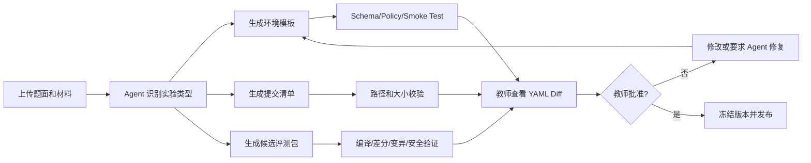
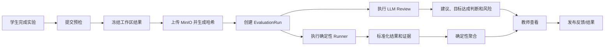

# LabWeaver 项目计划与课程落地方案

> **版本**：v2.1（LabWeaver 品牌与安全接入修订版）
> **日期**：2026-07-11
> **交付截止**：2026-07-24
> **团队规模**：4 人
> **角色**：架构工程师/项目经理、Agent 工程师、前端工程师、测试工程师
> **技术基线**：Rust + Axum、Kubernetes、KubeVirt、NATS JetStream、MinIO、Keycloak/OIDC、Headscale/Tailscale、Kyverno、BuildKit、Ansible、Playwright
> **文档定位**：课程项目计划、敏捷迭代计划、团队分工、验收与展示方案
> **代码仓库**：`github.com/TeamMonad/LabWeaver`

前端统一采用 **Material You** 作为设计语言。信息架构、控制台密度、导航层级和运维状态表达可以参考 GCP Console，但不得复制 Google 品牌、产品命名或专有视觉资产。设计必须使用语义化动态色、清晰的 surface 层级、可辨识的 loading/empty/warning/error 状态、键盘焦点、无障碍对比度和响应式布局。详细 token、组件规格和页面细化由前端工程师在 `UI-*` Issue 中负责，本草案只冻结方向与边界。

---

## 目录

1. [执行摘要](#1-执行摘要)
2. [课程要求与交付证据](#2-课程要求与交付证据)
3. [痛点、解决办法与价值目标](#3-痛点解决办法与价值目标)
4. [已确认的设计决策](#4-已确认的设计决策)
5. [产品范围与核心业务模型](#5-产品范围与核心业务模型)
6. [统一评测的产品流程](#6-统一评测的产品流程)
7. [用户角色、旅程与用户故事](#7-用户角色旅程与用户故事)
8. [范围分级与非目标](#8-范围分级与非目标)
9. [成功指标与验收口径](#9-成功指标与验收口径)
10. [四次 long-term single-university private deployment phase 计划](#10-四次-sprint-计划)
11. [四人分工与协作机制](#11-四人分工与协作机制)
12. [详细 Backlog](#12-详细-backlog)
13. [测试计划](#13-测试计划)
14. [开发文档与部署文档计划](#14-开发文档与部署文档计划)
15. [Git 协作与 CI/CD 证据](#15-git-协作与-cicd-证据)
16. [最终演示方案](#16-最终演示方案)
17. [风险、降级和范围控制](#17-风险降级和范围控制)
18. [待核验的环境参数](#18-待核验的环境参数)
19. [参考资料](#19-参考资料)

---

# 1. 执行摘要

LabWeaver（中文建议名“智织实验云”）是一个面向教学实验和科研工作的 Agent 驱动云原生实验平台。名称中的 “Weaver” 表示平台把题面、材料、环境、评测、算力和访问权限编织成一条可复现、可审计的工作流。平台解决五个相互关联的问题：

1. 教师配置实验环境成本高；
2. 学生环境不一致导致实验结果不可复现；
3. 教师需要手工收集和评审实验结果；
4. CPU/GPU 等算力申请缺乏统一审批、分配和回收机制；
5. 用户得到容器或虚拟机后仍需手工配置工作环境。

本版方案采用以下主线：

> 教师提交题面与材料 → Agent 生成环境模板、提交清单和候选评测包 → 自动验证 → 教师审批发布 → 学生进入一致的容器/虚拟机 → 平台冻结并收集结果 → 统一评测引擎执行生成的脚本与检查器 → LLM 只做代码/报告 Review 建议 → 教师复核发布结果。

评测不再依赖 OpenJudge。平台自定义一个统一但受约束的 `EvaluationSpec`，用同一套模型覆盖：

- OJ/算法题；
- Linux 系统实验；
- 命令行与脚本实验；
- Web/API 实验；
- 数据库实验；
- HPC/性能实验；
- Notebook/数据分析实验；
- 研究复现实验。

“自定义统一模型”只负责领域描述、编排和结果标准化；底层不重造容器、虚拟化、消息队列、对象存储、构建器或配置管理器，而是复用 Kubernetes Job、KubeVirt、BuildKit、Ansible Runner、Cyaron、Kyverno、NATS JetStream、MinIO 等成熟组件。

课程版需要在 2026 年 7 月 24 日前交付一条完整、可测试、可部署、可现场演示的纵向闭环。生产级能力通过架构边界、微服务接口、Ansible 部署、故障恢复、安全策略和扩展 Provider 体现。

外部访问不直接暴露学生容器、虚拟机、数据库或管理端口到公网。LabWeaver 使用 **Headscale 作为自托管控制面、Tailscale 客户端作为接入端**，构建教学与科研专用 Tailnet：Keycloak/校园 OAuth 负责用户身份，Headscale/Tailscale 负责设备身份和网络可达性，LabWeaver Access Service 根据课程、项目、环境所有权和租约签发短期 `AccessGrant`。Playwright 则把教师、学生、管理员的黄金路径固化为可重复执行的测试与演示脚本，并在失败时保留截图、录像和 Trace。

---

# 2. 课程要求与交付证据

课程要求最终成果展示完整的软件项目实践过程，包括需求、设计、开发、测试、部署；在 Git 中体现 branches、issues、commits、merges、tags；完成四次迭代汇报，并在 20 分钟内完成最终 Presentation。

| 课程评分项   | 本项目证据                                                                                                                                | 最终展示位置                           |
| ------------ | ----------------------------------------------------------------------------------------------------------------------------------------- | -------------------------------------- |
| 需求分析文档 | 影响地图、用户旅程、Simple Story、3C 用户故事、MoSCoW、验收标准、ADR                                                                      | `docs/requirements/`、第一次汇报     |
| 项目开发     | Rust/Axum 微服务、Agent、统一评测模型、Kubernetes/KubeVirt 环境                                                                           | 运行中的服务、API、环境和评测时间线    |
| 微服务加分   | Gateway/Web + Control、Access、Environment、Agent、Evaluation、Resource 六个业务服务（Environment Operator 与 Build Executor 为工作进程） | Deployment、NATS Subject、服务边界图   |
| 云原生加分   | CRD、Operator、Job、Namespace、PVC、Quota、KubeVirt、Kyverno                                                                              | `kubectl get`、策略和环境演示        |
| Agent 加分   | 环境设计 Agent、评测设计 Agent、工作环境配置 Agent                                                                                        | 状态机、工具调用、生成 Diff、验证报告  |
| 新技术加分   | Rust、KubeVirt、Headscale/Tailscale、BuildKit、NATS JetStream、Ansible、Cyaron                                                            | 架构、外部安全接入和现场功能           |
| 测试文档     | 单元、契约、集成、Playwright E2E、Tailnet 访问控制、安全、性能、Agent 黄金集                                                              | CI、HTML Report、Trace、录像和测试报告 |
| Git 合作元素 | Issues、Milestones、Branches、PR、Reviews、Merges、Tags、Releases                                                                         | GitHub Project、`git log --graph`    |
| 功能现场展示 | OJ 类实验、Linux 系统 VM、资源审批、Ansible 部署                                                                                          | 19 分钟演示和备用录像                  |

---

# 3. 痛点、解决办法与价值目标

## 3.1 痛点与方案映射

| ID | 痛点                                           | 可落地解决办法                                                                                                                    | 验证指标                                          |
| -- | ---------------------------------------------- | --------------------------------------------------------------------------------------------------------------------------------- | ------------------------------------------------- |
| P1 | 教师布置实验时需要投入大量精力帮助学生配置环境 | 教师上传题面和材料，用自然语言补充环境意图；Agent 生成版本化 EnvironmentSpec、构建文件、Ansible Role 和 Smoke Test                | 环境草稿生成时间、教师修改次数、Smoke Test 通过率 |
| P2 | 学生环境不一致影响实验结果                     | 云端按同一模板创建容器或 KubeVirt VM；冻结镜像摘要、模板版本、依赖摘要和提交快照                                                  | 同一模板三次创建的关键版本一致；参考测试结果一致  |
| P3 | 教师需要手工收集和评审结果                     | Collector 自动冻结指定文件和环境状态；Agent 生成 EvaluationSpec、评测脚本、标程/Oracle、数据生成器、Checker/SPJ；统一评测引擎执行 | 自动收集成功率、确定性评测覆盖率、证据完整率      |
| P4 | CPU/GPU 申请依赖线下沟通且难管理               | 统一申请、管理员审批、Quota、租约、队列、到期回收；演示使用 Mock GPU/云容量 Provider                                              | 审批状态可追踪；到期回收成功；无重复分配          |
| P5 | 用户拿到环境后仍要手工配置                     | 工作型环境允许用户自然语言请求任意软件；Agent 生成受控 BuildKit/Ansible 计划，展示变更并执行；实验型环境不允许学生改变基线        | 配置成功率、幂等重跑、变更审计和回滚成功率        |

## 3.2 Simple Story

### 客户的欲望


教师希望只描述“要学生完成什么”，平台就能给出一致环境和可审核的评测机制；学生希望打开浏览器就开始实验；科研用户希望按流程申请算力并快速配置工作环境。

### 当前的问题

教师需要编写冗长安装文档、处理环境差异、手工收集结果并逐项评审；学生在本地和不同机器上得到不一致结果；CPU/GPU 申请和回收依赖人工台账。

### 产品如何帮助

LabWeaver 将题面、材料和自然语言意图转换为经过验证的环境与评测包，在 Kubernetes/KubeVirt 上创建一致的实验或工作环境，自动收集不可变结果并运行统一评测，同时提供可审批、可排队、可回收的算力管理。

## 3.3 一句话愿景

> 让教师用题面、材料和自然语言定义实验，让学生在一致的云端环境中完成任务，让平台以可验证脚本自动评测，让算力资源以可审批、可排队、可审计的方式服务教学和研究。

## 3.4 目标分层

| 层次     | 目标                                                                                           |
| -------- | ---------------------------------------------------------------------------------------------- |
| 教学目标 | 将环境准备从“教师逐人排障”变为“Agent 生成、教师审核”；将重复批改变为“自动评测、异常复核” |
| 学生目标 | 一键获得一致环境；提交前知道所需材料；得到测试证据和代码 Review 建议                           |
| 科研目标 | 获得长期工作容器/VM；申请 CPU/GPU；允许在工作环境中安装个性化软件                              |
| 工程目标 | Rust/Axum 云原生微服务；异步解耦；状态幂等；可观测、可审计、可扩展                             |
| 课程目标 | 两周内完成真实 KubeVirt VM、统一评测、Agent、资源审批、Ansible 部署和完整文档                  |

---

# 4. 已确认的设计决策

## 4.1 问卷决策落地

| 决策 | 已确认选择                               | 方案中的具体落实                                                              |
| ---- | ---------------------------------------- | ----------------------------------------------------------------------------- |
| D01  | A：最终必须真实启动 KubeVirt VM          | long-term single-university private deployment phase 1 完成 KVM/KubeVirt Spike；最终演示真实 Linux 系统 VM                  |
| D02  | A：有 Kubernetes 管理员权限              | Ansible 可安装 KubeVirt、Kyverno、NATS、MinIO、Keycloak 等组件                |
| D03  | 测试与演示使用 Mock GPU/云容量           | 真实 CPU/内存在现有集群分配；GPU、云节点扩容使用 FixtureCapacityProvider      |
| D04  | 自实现统一评测模型                       | 删除 OpenJudge 依赖；使用 EvaluationSpec + Runner/Checker/Generator/Collector |
| D05  | A：实验型和工作型都具备完整前端流程      | 两种类型均支持创建、状态、入口、资源、生命周期和审计                          |
| D06  | B：OJ 类编程题 + Linux 系统实验          | 两个主演示验证统一评测模型的通用性                                            |
| D07  | C：Agent 环境模板必须教师确认            | 发布前强制`AwaitingTeacherApproval`                                         |
| D08  | C：标程/SPJ/Cyaron 产物需教师审批        | 先完成编译、差分、变异和安全验证，再展示审批                                  |
| D09  | D：LLM 只建议，不直接计分                | LLM 产生`GoalReview` 和证据，不写数值成绩                                   |
| D10  | B：LLM 只读取指定路径                    | SubmissionManifest 明确白名单路径和大小限制                                   |
| D11  | A：工作环境允许任意软件                  | 仅 Work 环境；通过 BuildKit/Ansible 计划、策略检查和审计执行                  |
| D12  | C：教师仅编辑 YAML                       | 前端提供 Monaco YAML 编辑器、Schema、补全、示例和 Diff，不做表单建模          |
| D14  | B：Slurm 进入 P1                         | P0 保留 Provider Contract；P1 接 Slurm REST                                   |
| D15  | B：资源由平台管理员审批                  | 教师可查看课程额度，但只有管理员执行批准/降配/拒绝                            |
| D16  | B：低优先级 GPU 可抢占                   | P1 使用 Kueue Priority/Preemption；Mock 中演示状态转换                        |
| D17  | D：配额、公平共享、成本混合              | ResourcePolicy 同时包含 quota、priority、budget、lease                        |
| D18  | B：多集群仅实现接口                      | P0 实现 ClusterProvider Contract；P1 实现一个远端集群适配器                   |
| D19  | A+C：Keycloak + 校园 OAuth               | Keycloak 作为身份代理；应用使用 OIDC Authorization Code + PKCE                |
| D20  | A：NATS JetStream                        | 异步命令、领域事件、可重放状态和 Worker 队列                                  |
| D21  | A：MinIO                                 | 保存题面材料、模板包、提交快照、评测证据和日志                                |
| D22  | A：Kyverno                               | 限制特权、HostPath、网络、镜像来源、签名和资源上限                            |
| D23  | B：BuildKit 动态构建                     | Agent 生成 Dockerfile/Build Context，rootless BuildKit 构建版本化镜像         |
| D24  | D：Packer + cloud-init + Ansible         | Packer 制作基础 VM，cloud-init 首启，Ansible 完成复杂配置                     |
| D25  | 容器 code-server/HTTP + SSH；VM 增加 VNC | AccessSpec 统一声明入口，平台生成短时访问凭证                                 |
| D26  | A：课程结束删除数据                      | CourseClosed 事件触发环境、提交、日志和对象存储数据清理                       |
| D27  | A：架构工程师兼组长                      | 负责架构、接口冻结、节奏、Release 和最终演示统筹                              |
| D28  | B：每人 20–35 小时                      | 总投入约 80–140 人时，严格冻结 P0，外部系统用成熟组件                        |
| D29  | E：加分均衡                              | 主线突出 Agent + 云原生，同时保留测试、微服务和新技术证据                     |
| D30  | C：课程与产品两套文档并行                | 本文件服务课程计划；另一文件服务生产级实现                                    |

### 本轮增补决策

| 增补项     | 决策                                     | 落实方式                                                                                      |
| ---------- | ---------------------------------------- | --------------------------------------------------------------------------------------------- |
| 品牌命名   | 统一采用**LabWeaver**              | 仓库、服务、CRD、镜像、文档、演示和 Release 均使用`labweaver-*` 前缀                        |
| 外部接入   | Headscale + Tailscale                    | 用户设备加入受控 Tailnet；环境端点默认不直接公网暴露                                          |
| 网络权限   | Headscale Policy + LabWeaver AccessGrant | Tailnet 做设备与网络层隔离，Access Service 做课程/项目/环境级授权和短期凭证                   |
| 容器访问   | Tailnet Access Gateway                   | code-server、HTTP、SSH 经网关访问，避免每个 Pod 单独维护公网入口                              |
| VM 访问    | Tailnet Subnet Router/Access Gateway     | P0 经私网路由和网关访问 SSH/VNC；P1 可按风险启用 VM 直接入网                                  |
| 自动化测试 | Playwright Test                          | 多角色项目、复用登录状态、Trace/截图/录像、CI 和现场演示复现                                  |
| 人员投入   | 两核心 + 两辅助                          | 核心开发掌握领域、服务、Agent 与评测主链；辅助开发承担 UI、文档、Mock、测试、演示等低耦合任务 |

## 4.2 唯一推定项

D13 未在回复中单独给出。结合 D03“测试与演示使用 Mock”和 D18“多集群仅实现接口”，本计划采用：

> **D13=C：课程版实现 CapacityProvider 接口和 Mock/Fixture；生产方案对接 Cluster API、Cluster Autoscaler 或 Karpenter。**

该推定不阻塞 P0，若后续获得云账号，可在 P1 将 Fixture 替换为真实 Provider。

---

# 5. 产品范围与核心业务模型

## 5.1 两个正交维度

“实验/工作”描述业务用途，“容器/虚拟机”描述运行时，两者不能绑定。

| 业务类型          | 容器                                     | 虚拟机                                    |
| ----------------- | ---------------------------------------- | ----------------------------------------- |
| 实验型 Experiment | OJ、脚本、Web、数据库、数据分析、HPC     | Linux 系统、内核、网络、完整 OS、GUI 实验 |
| 工作型 Work       | code-server、Jupyter、研究开发、模型训练 | 自定义系统、长期 GUI、内核研发、遗留软件  |

## 5.2 实验型环境

必须具备：

- 由教师发布固定模板版本；
- 环境可创建、启动、停止、重置、销毁；
- 有题面、材料、Starter、SubmissionManifest 和 EvaluationSpec；
- 提交时冻结不可变快照；
- 自动评测后进入教师复核或直接显示确定性结果；
- 学生不能修改环境基线；
- 课程结束自动删除数据。

## 5.3 工作型环境

必须具备：

- 用户或项目申请创建；
- 管理员审批资源；
- 容器和 VM 均有完整前端流程；
- 存储持久化、租约、续期、停止和销毁；
- 用户可以自然语言请求安装任意软件；
- Agent 生成 BuildKit 或 Ansible 配置计划并展示 Diff；
- 高风险行为受 Kyverno、RBAC、网络和管理员策略约束；
- 默认不关联成绩，可执行健康检查或研究里程碑评测。

## 5.4 产品包结构

教师创建一个实验时提交：

```text
lab-package/
├── statement.md               # 题面/实验说明
├── materials/                 # 数据、讲义、附件
├── starter/                   # 初始代码或文件
├── samples/                   # 示例输入输出或预期状态
└── intent.yaml                # 可选：语言、资源、时间、限制、评分倾向
```

Agent 输出候选发布包：

```text
lab-release/
├── environment.yaml           # EnvironmentSpec
├── submission.yaml            # SubmissionManifest
├── evaluation.yaml            # EvaluationSpec
├── evaluator/
│   ├── generators/
│   ├── solutions/
│   ├── checkers/
│   ├── scripts/
│   └── tests/
├── smoke/
├── verification-report.json
└── release-manifest.json       # 版本、哈希、模型、工具和审批记录
```

---

# 6. 统一评测的产品流程

## 6.1 教师发布流程



## 6.2 学生提交与评测流程



## 6.3 LLM 的责任边界

LLM 可以：

- 判断实验类型；
- 生成环境和评测 YAML 草稿；
- 生成候选标程、Oracle、Cyaron 生成器、Validator、SPJ 和系统检查脚本；
- 解释测试失败；
- Review 指定路径下的代码和报告；
- 输出“达到/部分达到/未达到目标”的建议与证据。

LLM 不可以：

- 自动发布环境或评测包；
- 直接决定数值成绩；
- 跳过教师审批；
- 直接访问任意学生文件；
- 直接执行任意 Shell；
- 读取 Kubernetes 管理员凭证；
- 将学生文本解释为系统指令或工具调用。

## 6.4 两个主演示的统一性

| 方面     | OJ 类编程题                            | Linux 系统实验                                  |
| -------- | -------------------------------------- | ----------------------------------------------- |
| 教师输入 | 题面、约束、样例、Starter              | 实验目标、基础镜像、目标系统状态、材料          |
| 环境     | 实验容器                               | 实验 KubeVirt VM                                |
| 收集     | 源码、报告                             | 配置文件、命令输出、系统状态、报告              |
| 生成     | 标程、暴力 Oracle、Cyaron、Checker/SPJ | cloud-init/Ansible、SSH/Ansible Probe、断言脚本 |
| 执行     | 编译、运行测试组、资源限制、Checker    | SSH/Ansible 只读探针、服务/文件/端口/行为检查   |
| 结果     | 测试组、时间、内存、输出差异           | 断言、事实、日志、状态证据                      |
| LLM      | 代码结构与复杂度建议，不计分           | 操作说明和安全性 Review，不计分                 |

---

# 7. 用户角色、旅程与用户故事

## 7.1 角色

| 角色       | 主要职责                                                        |
| ---------- | --------------------------------------------------------------- |
| 教师       | 上传题面材料、审核环境和评测 YAML、发布实验、查看结果、处理异常 |
| 学生       | 启动实验环境、完成任务、提交、查看证据和 Review 建议            |
| 科研用户   | 创建工作环境、申请资源、请求安装软件、续期和管理数据            |
| 平台管理员 | 审批 CPU/GPU、维护集群能力、镜像、策略、身份和审计              |
| 项目组     | 开发、测试、部署、文档和演示                                    |

## 7.2 教师用户旅程

| 阶段     | 行动                           | 痛点/情绪            | 平台机会                                         |
| -------- | ------------------------------ | -------------------- | ------------------------------------------------ |
| 准备材料 | 上传题面、Starter 和样例       | 担心信息不完整       | Agent 列出假设和缺失项                           |
| 生成环境 | 查看`environment.yaml`       | 担心镜像和依赖不可控 | YAML Schema、镜像摘要、BuildKit 日志、Smoke Test |
| 生成评测 | 查看`evaluation.yaml` 和脚本 | 担心标程/SPJ 错误    | 差分、变异、固定 Seed、安全验证                  |
| 发布     | 审核并冻结版本                 | 担心后续漂移         | 不可变版本和审批记录                             |
| 批改     | 查看结果和低置信度 Review      | 担心自动化不公平     | 确定性结果、完整证据、人工复核                   |

## 7.3 学生用户旅程

| 阶段     | 行动                   | 期望           | 平台能力                         |
| -------- | ---------------------- | -------------- | -------------------------------- |
| 进入实验 | 启动容器或 VM          | 不配置本地环境 | 一致模板、入口和 Ready 进度      |
| 完成任务 | code-server/SSH/VNC    | 环境稳定       | PVC、租约和自动停止              |
| 提交     | 按清单冻结结果         | 不漏文件       | Preflight、路径白名单、哈希      |
| 查看结果 | 查看测试/断言/证据     | 知道哪里错误   | 统一时间线、日志和反馈           |
| 科研工作 | 申请工作环境并安装软件 | 灵活配置       | Agent 生成 BuildKit/Ansible 计划 |

## 7.4 核心用户故事（3C）

| ID    | Card                                                                   | Conversation                                   | Confirmation                                                                                                                 |
| ----- | ---------------------------------------------------------------------- | ---------------------------------------------- | ---------------------------------------------------------------------------------------------------------------------------- |
| US-01 | 作为教师，我希望上传题面和材料后由 Agent 生成环境，以减少配置工作。    | 如何处理缺失版本、危险依赖和容器/VM 选择？     | 输出假设、YAML、依赖清单、风险；Schema、Policy 和 Smoke Test 通过；教师批准后发布。                                          |
| US-02 | 作为学生，我希望一键获得一致环境，以避免本地差异。                     | 数据如何保留，环境何时停止？                   | 同一模板关键版本一致；停止保留 PVC；实验结束按策略删除。                                                                     |
| US-03 | 作为教师，我希望 Agent 自动生成评测机制，以减少手工批改。              | 如何统一 OJ 和系统实验？                       | 生成符合统一 Schema 的 EvaluationSpec；确定性步骤可执行并提供证据；LLM 仅建议。                                              |
| US-04 | 作为 OJ 类题目教师，我希望自动生成测试和 Checker，以降低出题成本。     | 如何防止标程错误和弱数据？                     | 标程与暴力 Oracle 差分一致；固定 Seed；错解变异被杀；教师批准。                                                              |
| US-05 | 作为系统实验教师，我希望自动检查 VM 状态，以避免逐台登录。             | 是否需要 root，脚本是否会改变系统？            | 默认只读 Probe；高权限检查单独声明；结果符合 JSON Schema；每项有命令或事实证据。                                             |
| US-06 | 作为工作环境用户，我希望用自然语言安装软件，以快速开始研究。           | 是否允许任意仓库、root 和长期变更？            | 仅 Work 环境；生成 BuildKit/Ansible Diff；策略检查；高风险需管理员审批；可重建或回滚。                                       |
| US-07 | 作为科研用户，我希望申请 CPU/GPU 并查看状态，以安排任务。              | 谁审批，是否抢占，如何回收？                   | 管理员审批；显示配额、队列、租约；低优先级 GPU P1 可抢占；到期回收。                                                         |
| US-08 | 作为管理员，我希望统一部署和升级平台，以降低运维成本。                 | 依赖多、环境差异如何处理？                     | Ansible Preflight、幂等 Roles、Helm 固定版本、Verify、Upgrade、Rollback 和 Destroy 文档齐全。                                |
| US-09 | 作为校外用户，我希望安全访问自己的容器或虚拟机，而不需要开放公网端口。 | 身份、设备、课程权限和环境所有权如何共同校验？ | 用户经 Keycloak/OIDC 加入 Headscale Tailnet；只可到达 Access Gateway 或获授权端点；AccessGrant 到期后访问立即失效。          |
| US-10 | 作为测试和演示人员，我希望一条命令复现完整业务流程。                   | 如何避免现场操作差异和偶发失败难定位？         | Playwright 使用固定 Seed、Fixture、角色登录状态运行黄金路径；失败自动保存 Trace、截图和录像；可用`cargo xtask demo replay` 重放。 |

---

# 8. 范围分级与非目标

## 8.1 P0：2026-07-24 前必须完成

### 产品和前端

1. Keycloak/OIDC 登录；教师、学生、科研用户、管理员角色。
2. Headscale 接入 Keycloak OIDC；用户可在门户获取 Tailnet 加入指导和一次性注册信息。
3. 实验型和工作型均有完整前端流程。
4. 教师 YAML 编辑器、Schema 校验、Agent Diff、审批和发布。
5. 容器入口：code-server/HTTP + SSH；VM 入口增加 VNC；默认经 Tailscale Tailnet 和 Access Gateway 访问。
6. 结果时间线、证据和 LLM Review 建议。
7. 资源申请、管理员审批、Mock GPU/云容量和租约。
8. Playwright 固化教师、学生、管理员三角色黄金路径和演示重放。

### 环境

1. 容器实验完整生命周期。
2. 容器工作环境完整生命周期和软件配置。
3. 真实 KubeVirt 实验 VM 创建、启动、停止、销毁。
4. 真实 KubeVirt 工作 VM 创建、启动、停止、续期、销毁。
5. BuildKit 动态镜像构建。
6. Packer 基础镜像、cloud-init 首启、Ansible 配置。
7. SubmissionManifest 和不可变 MinIO 快照。

### 统一评测

1. EvaluationSpec Schema 和版本化。
2. Collector、Runner、Checker、Generator、Aggregator 抽象。
3. Kubernetes Job Runner。
4. Program/OJ Runner。
5. SSH/Ansible 系统 Probe Runner。
6. LLM Review Runner，严格 advisory-only。
7. Cyaron、标程/Oracle、Validator、SPJ 候选生成。
8. 编译、差分、固定 Seed、变异、安全和预算验证。
9. 教师审批评测包。

### 工程

1. Rust/Axum 微服务和 kube-rs Operator。
2. NATS JetStream、MinIO、PostgreSQL、Keycloak、Headscale、Kyverno。
3. Access Service、Headscale Policy Compiler、Tailnet Access Gateway 和 Subnet Router。
4. Ansible 一键安装、验证、升级、回滚和清理。
5. Playwright HTML Report、Trace、截图、录像和可重复演示脚本。
6. 完整开发、测试、部署和运维文档。
7. Git、CI、Release、四次 long-term single-university private deployment phase 证据。

## 8.2 P1：主要加分项

- Kueue 队列、Fair Sharing 和低优先级抢占；
- Slurm REST Provider；
- 一个远端 Kubernetes ClusterProvider；
- gVisor/Kata RuntimeClass；
- VM Snapshot/Restore；
- Web/API、HPC 或 Notebook 的第三个评测示例；
- Prometheus/Grafana 完整看板；
- Cluster API/Karpenter 真实 Spike；
- 多副本 HA 故障演练；
- 自建 DERP、中继可观测和跨网络性能测试；
- 长期 Work VM 直接加入 Tailnet、按项目生成细粒度 Headscale Policy；
- Playwright Firefox/WebKit 跨浏览器项目和视觉回归。

## 8.3 P2：生产演进

- 云服务商真实按需扩容；
- 多集群调度和统一身份；
- GPU 实机、MIG、KubeVirt GPU 直通；
- 完整计费和预算中心；
- 交互题；
- 跨地域多活；
- 复杂科研工作流；
- 第三方 WASM 插件市场。

## 8.4 明确非目标

- 不自研容器运行时、虚拟化栈、消息队列、对象存储、身份系统或通用工作流引擎；
- 不把 LLM 当作正确性 Oracle；
- 不允许未验证脚本直接进入正式评测；
- 不允许实验型环境被学生任意改变；
- 不在 P0 实现真实 GPU/云扩容；
- 不在两周内承诺完整商用 SLA。

---

# 9. 成功指标与验收口径

## 9.1 产品指标

| 指标       | P0 验收值                                                                                            |
| ---------- | ---------------------------------------------------------------------------------------------------- |
| 环境草稿   | 教师提交材料后 90 秒内得到候选 YAML 或明确失败原因                                                   |
| 环境一致性 | 同一模板创建 3 次，操作系统、工具版本、Smoke Test 一致                                               |
| 容器 Ready | 演示环境 P95 ≤ 2 分钟                                                                               |
| VM Ready   | 演示环境 P95 ≤ 5 分钟                                                                               |
| 工件冻结   | 每次提交产生 SHA-256、模板版本、镜像摘要和对象版本                                                   |
| 统一评测   | OJ 与 Linux 两类实验均由同一 EvaluationSpec 模型执行                                                 |
| 评测证据   | 每个确定性结论均有日志、测试点、事实或文件证据                                                       |
| LLM 边界   | LLM 输出中不存在最终数值分；异常输出被 Schema 拒绝                                                   |
| 资源管理   | 申请、审批、Mock 分配、租约、到期回收完整演示                                                        |
| Ansible    | 从已有 K8s 管理凭据开始，一条命令完成平台部署并通过 Verify                                           |
| 外部接入   | 未开放环境公网端口时，已授权用户可经 Tailnet 访问；未授权用户、过期 AccessGrant 和非受信设备均被拒绝 |
| 演示复现   | `cargo xtask demo replay` 可从固定 Seed 开始自动完成黄金路径；失败产出 Playwright Trace、截图和录像       |

## 9.2 工程指标

| 指标            | 目标                                                                                 |
| --------------- | ------------------------------------------------------------------------------------ |
| Rust 核心覆盖率 | ≥ 75%（状态机、聚合、租约、权限）                                                   |
| API             | 主流程契约测试通过；无未说明 5xx                                                     |
| E2E             | Playwright 教师→学生→评测→复核、工作 VM→资源审批、Tailnet 外部接入三条主流程通过 |
| 安全            | 无未处理高危依赖/镜像漏洞；Kyverno 关键策略测试通过                                  |
| 文档            | 新成员按文档 60 分钟内启动开发依赖；管理员按文档完成部署                             |
| Git             | 每人至少 1 个 Milestone 任务、2 个 PR、2 次 Review、真实 Merge 记录                  |

## 9.3 Definition of Ready

任务进入 long-term single-university private deployment phase 前必须：

- 有用户价值和验收条件；
- 外部组件可用或已有 Fixture；
- 接口/Schema 已草拟；
- 安全边界明确；
- 估算不超过 2 人日；
- 有负责人和评审者。

## 9.4 Definition of Done

- 代码合入 `develop`，至少一人 Review，CI 全绿；
- 单元、契约或 E2E 测试按任务要求通过；
- API、YAML Schema、事件或部署文档同步更新；
- 有演示步骤、清理方式和失败降级；
- Issue 验收条件逐项勾选；
- 无未记录的安全例外；
- 架构变化有 ADR。

---

# 10. 四次 long-term single-university private deployment phase 计划

## 10.1 long-term single-university private deployment phase 1：需求、统一模型与基础设施 Spike

**时间：2026-07-11 至 2026-07-13**

### long-term single-university private deployment phase Goal

完成课程第一次汇报所需材料，冻结统一领域模型、微服务边界、EvaluationSpec v1alpha1，并证明真实 KubeVirt VM 可运行。

### 角色任务

| 角色                    | 任务                                                                                                                         | 可验收产物                                                  |
| ----------------------- | ---------------------------------------------------------------------------------------------------------------------------- | ----------------------------------------------------------- |
| 架构工程师/PM（核心 1） | Cargo Workspace、Axum 骨架、领域对象、服务边界、SQLx Migration、NATS Subject、AccessGrant 模型、Headscale 接入 ADR、项目看板 | 核心服务及工作进程可编译；C4 图；ADR-001~006                |
| Agent 工程师（核心 2）  | Agent 状态机、Tool Contract、EvaluationSpec Schema、Cyaron/Ansible Runner Spike、LLM Fixture                                 | Mock Agent 可生成有效 YAML；Fixture 可复现                  |
| 前端工程师（辅助 1）    | Vue 3、OIDC Mock、角色导航、YAML 编辑器、实验/工作列表、Tailnet 接入向导静态页面                                             | Monaco YAML 校验和 Diff 页面；接入向导可操作                |
| 测试工程师（辅助 2）    | 影响地图、旅程、3C、Playwright 骨架、KubeVirt/StorageClass/Headscale Preflight、测试数据                                     | 需求文档；真实 VM 启停记录；首个 Playwright Trace；测试矩阵 |

### long-term single-university private deployment phase Review 验收

```bash
cargo build --workspace
cargo test --workspace
pnpm test
kubectl get vm,vmi -A
```

必须现场展示：

1. 真实 KubeVirt VM 启动并进入 Running；
2. Mock Agent 由题面生成 `environment.yaml` 与 `evaluation.yaml`；
3. 两份 YAML 均通过 Schema；
4. 前端可显示实验和工作环境；
5. GitHub Project、Issue、分支和第一批 PR。

### long-term single-university private deployment phase 1 输出

- Tag：`v0.1-foundation`
- 第一次汇报：头脑风暴、影响地图、用户旅程、Simple Story、3C、拆分、估算、排序、long-term single-university private deployment phase 1 Review/Retro、long-term single-university private deployment phase 2 Planning。

---

## 10.2 long-term single-university private deployment phase 2：环境、构建与工件收集闭环

**时间：2026-07-13 至 2026-07-16**

### long-term single-university private deployment phase Goal

完成“教师材料 → Agent 环境 → 教师审批 → 学生启动容器/VM → 收集不可变结果”的纵向链路。

### 角色任务

| 角色                    | 任务                                                                                                                | 可验收产物                                     |
| ----------------------- | ------------------------------------------------------------------------------------------------------------------- | ---------------------------------------------- |
| 架构工程师/PM（核心 1） | Control/Access Service、OIDC、Headscale OIDC、AccessGrant、基础 Policy Compiler、实验/工作 API、MinIO Metadata、SSE | REST 契约、网络/业务双层权限和幂等通过         |
| Agent 工程师（核心 2）  | Environment Agent、BuildKit 执行器、Packer/cloud-init/Ansible、Environment Operator                                 | 容器镜像构建；VM 应用 Ansible Role；Smoke Test |
| 前端工程师（辅助 1）    | 教师材料上传、YAML Diff/审批、环境控制台、Tailnet 设备状态、code-server/SSH/VNC 入口                                | 教师和学生真实流程；接入错误有明确提示         |
| 测试工程师（辅助 2）    | Runtime/Access Provider 契约、工件 Collector、Headscale Policy allow/deny、Ansible 幂等、Playwright 角色登录状态    | 集成测试、Tailnet 负例和 Playwright 第一条流程 |

### long-term single-university private deployment phase Review 验收

1. 教师上传题面和材料；
2. Agent 生成容器或 VM 环境 YAML；
3. 教师审核并发布；
4. 学生启动实验容器并进入 code-server；
5. 学生启动 Linux 实验 VM 并通过 SSH/VNC 进入；
6. 工作环境用户请求安装一个软件；
7. BuildKit/Ansible 执行后再次运行为幂等；
8. 提交时按 SubmissionManifest 上传 MinIO，包含哈希和环境摘要。

### long-term single-university private deployment phase 2 输出

- Tag：`v0.2-environment`
- 第二次汇报：不少于 5 分钟，现场演示环境闭环和本轮 Review/Retro。

---

## 10.3 long-term single-university private deployment phase 3：统一评测、资源审批和双场景演示

**时间：2026-07-16 至 2026-07-20**

### long-term single-university private deployment phase Goal

完成统一 EvaluationSpec 引擎，跑通 OJ 类编程题和 Linux 系统实验；完成资源申请、管理员审批、Mock GPU/云容量、租约和回收。

### 角色任务

| 角色                    | 任务                                                                                              | 可验收产物                                   |
| ----------------------- | ------------------------------------------------------------------------------------------------- | -------------------------------------------- |
| 架构工程师/PM（核心 1） | Evaluation Service、DAG、结果聚合、Resource Service、管理员审批、AccessGrant 到期联动、审计       | EvaluationRun、Lease、AccessGrant 状态和 API |
| Agent 工程师（核心 2）  | Evaluation Design Agent、Program Runner、Ansible Probe Runner、Cyaron/标程/Oracle/SPJ、验证门禁   | 两类 Evaluation Bundle、验证报告             |
| 前端工程师（辅助 1）    | Evaluation YAML、时间线、证据、LLM Review、资源审批、访问授权状态和租约页面                       | 完整操作路径和状态可视化                     |
| 测试工程师（辅助 2）    | 变异错解、差分测试、系统故障样例、Agent 黄金集、AccessGrant 过期、Playwright 多角色流程和失败注入 | 自动化报告、Trace 和缺陷清单                 |

### long-term single-university private deployment phase Review 验收

#### OJ 类实验

- Agent 生成候选标程、暴力 Oracle、Cyaron 生成器和 Checker/SPJ；
- 固定 Seed 可重复；
- 标程与 Oracle 差分一致；
- 至少 5 个典型错解中 4 个以上被测试数据拒绝；
- 教师批准后学生提交可自动编译、运行、检查并产生证据；
- LLM 输出代码 Review，但不改变确定性结果。

#### Linux 系统实验

- KubeVirt VM 中完成指定系统配置；
- Agent 生成只读 Ansible/SSH Probe；
- 至少检查包版本、配置文件、systemd 服务、端口和行为；
- 故意破坏一项配置后准确失败并给出证据；
- LLM Review 操作报告，不计分。

#### 资源

- 科研用户申请 GPU；
- 平台管理员批准；
- Mock Provider 依次进入 Estimating、Allocating、Ready；
- 创建 Quota/Lease；
- 到期后自动 Releasing/Expired。

### long-term single-university private deployment phase 3 输出

- Tag：`v0.3-feature-complete`
- 第二份周报；功能冻结；long-term single-university private deployment phase 4 只做缺陷、文档、测试和演示。

---

## 10.4 long-term single-university private deployment phase 4：生产硬化、Ansible 部署和最终交付

**时间：2026-07-20 至 2026-07-24**

### long-term single-university private deployment phase Goal

从空白平台命名空间完成可重复部署，完成全部文档、测试、故障降级、Release 和 19 分钟演示。

| 角色                    | 任务                                                                                        | 可验收产物                                                |
| ----------------------- | ------------------------------------------------------------------------------------------- | --------------------------------------------------------- |
| 架构工程师/PM（核心 1） | Ansible/Helm、Headscale/Access Gateway、迁移、Release、HA 配置、Git 展示、最终架构          | `site.yml`、`verify.yml`、Policy 校验和 Release Notes |
| Agent 工程师（核心 2）  | Prompt/Tool 锁定、Fixture、注入防护、脚本签名/哈希、失败降级                                | Agent 评测报告和演示备用模式                              |
| 前端工程师（辅助 1）    | 错误状态、响应式、Tailnet onboarding、演示数据、非关键 UI 打磨                              | 操作说明、演示数据和页面验收                              |
| 测试工程师（辅助 2）    | Playwright 黄金路径、Trace/录像、Headscale 权限负例、安全、Ansible 幂等、部署文档、三次彩排 | HTML Report、Trace 包、测试报告和演示检查表               |

### 最终验收命令

```bash
cargo xtask bootstrap
cargo xtask deploy --env demo --yes
cargo xtask verify --env demo
cargo xtask test --suite all
cargo xtask test --suite e2e
cargo xtask demo replay
cargo xtask demo reset --yes
```

### long-term single-university private deployment phase 4 输出

- Release：`LabWeaver 1.0`
- Tag：`v1.0.0`
- P0 Issues 全部关闭；
- 主流程连续彩排三次成功；
- 最终 Presentation 小于 20 分钟。

---

## 10.5 逐日里程碑

| 日期 | 关键交付                                                                                                       |
| ---- | -------------------------------------------------------------------------------------------------------------- |
| 7/11 | 需求重构、决策落地、仓库/Milestone、微服务骨架、KubeVirt Preflight                                             |
| 7/12 | EvaluationSpec、Agent Fixture、YAML 编辑器、Headscale/OIDC Spike、Playwright 骨架、真实 VM Spike、Ansible 目录 |
| 7/13 | 第一次汇报、Tag`v0.1-foundation`                                                                             |
| 7/14 | Environment API、Operator、BuildKit、MinIO、容器工作区                                                         |
| 7/15 | Packer/cloud-init/Ansible、真实 VM、Collector、Keycloak↔Headscale OIDC、Tailnet Access Gateway 联调           |
| 7/16 | 环境闭环演示、Tag`v0.2-environment`                                                                          |
| 7/17 | Evaluation Service、Program Runner、Cyaron 工具包                                                              |
| 7/18 | 标程/Oracle/SPJ 验证、Linux Probe、资源审批和 Mock Capacity                                                    |
| 7/19 | Playwright 多角色/Tailnet E2E、LLM Review、Agent 黄金集、失败注入                                              |
| 7/20 | 周报、功能冻结、Tag`v0.3-feature-complete`                                                                   |
| 7/21 | Ansible 全量部署、Upgrade/Rollback、Kyverno、观测                                                              |
| 7/22 | Playwright Trace/录像、Headscale Policy、安全、性能、恢复和文档验证                                            |
| 7/23 | 三次完整彩排、备用录像、Release Candidate                                                                      |
| 7/24 | 发布`v1.0.0`、最终 Presentation                                                                              |

---

# 11. 四人分工与协作机制

## 11.1 角色职责

| 角色               | 定位                 | 代码/交付所有权                                                                               | 主要压力控制                                                                  |
| ------------------ | -------------------- | --------------------------------------------------------------------------------------------- | ----------------------------------------------------------------------------- |
| 架构工程师/组长/PM | **核心开发 1** | Control、Access、Resource Service；领域模型；数据库；NATS；Headscale Policy Compiler；Release | 掌握全部关键接口和主链；每天约 60% 编码、40% 接口冻结、评审和阻塞清理         |
| Agent 工程师       | **核心开发 2** | Agent、Evaluation Service；Environment Operator；Runner/Checker/Collector；生成与验证工具     | 掌握环境生成和统一评测关键链；不开发通用 Agent 框架，使用显式状态机和成熟组件 |
| 前端工程师         | **辅助开发 1** | Vue 门户、YAML 编辑器、Tailnet 接入向导、状态可视化、非关键交互与页面文档                     | 依赖冻结后的 OpenAPI/Mock；不承担后端领域规则和评测正确性的单点责任           |
| 测试工程师         | **辅助开发 2** | Playwright、Fixture/Mock、CI 测试、Ansible Verify、Headscale 权限用例、文档、演示复现         | 以可重复脚本交付；不承担核心 Runtime/Evaluation 实现的单点责任                |

### 11.1.1 两位辅助开发者的任务边界

为保证两周内主链可交付，前端和测试岗位主要承担**低耦合、可通过契约独立推进、失败时不破坏核心正确性**的工作：

| 辅助角色   | 优先承担                                                                                                     | 不作为单点负责人                                                             |
| ---------- | ------------------------------------------------------------------------------------------------------------ | ---------------------------------------------------------------------------- |
| 前端工程师 | 登录与 Tailnet onboarding、YAML 编辑、状态时间线、证据展示、审批页面、错误提示、文档截图、演示数据           | EvaluationSpec 语义、权限判定、AccessGrant 签发、环境调谐、评分聚合          |
| 测试工程师 | Playwright、Mock LLM/Capacity、固定 Seed、Trace/录像、Headscale allow/deny、Ansible Verify、MkDocs、演示重置 | Agent 工具权限、Runner 沙箱、Policy Compiler、数据库一致性、资源租约核心逻辑 |

两个辅助岗位发现核心缺陷后创建阻塞 Issue，由对应核心开发修复；辅助岗位负责补充回归用例。P1 的通知中心、视觉美化、跨浏览器、Grafana 看板和演示录像包装优先分配给两位辅助开发者。

## 11.2 RACI

| 工作项                        | 架构 | Agent | 前端 | 测试 |
| ----------------------------- | ---- | ----- | ---- | ---- |
| 项目管理与范围                | A/R  | C     | I    | C    |
| 需求基线                      | A    | C     | C    | R    |
| 微服务/领域/ADR               | A/R  | C     | I    | C    |
| 身份和 API                    | A/R  | C     | C    | C    |
| Headscale/Tailnet/AccessGrant | A/R  | C     | C    | C    |
| Environment Operator          | A    | R     | I    | C    |
| Agent 工作流                  | C    | A/R   | I    | C    |
| EvaluationSpec/Runner         | A    | R     | I    | C    |
| 前端体验                      | C    | C     | A/R  | C    |
| Ansible 部署                  | A    | C     | I    | R    |
| Playwright 与演示复现         | A    | C     | C    | R    |
| 测试与发布                    | A    | C     | C    | R    |

## 11.3 评审关系

- 架构工程师与 Agent 工程师互相评审核心 Rust PR；
- `EvaluationSpec`、Agent Tool、CRD、Migration、安全策略必须双人评审；
- 前端 PR 由对应后端所有者评审契约，测试工程师评审验收；
- 测试/部署文档由实际执行该流程的另一成员走读；
- 作者不得自行批准并合并核心模块。

## 11.4 Daily Scrum

每天固定 10 分钟：

```text
昨天完成：Issue/PR/可运行证据
今天目标：一个可验收结果
阻塞：需要谁、需要什么、最晚何时解除
范围风险：是否影响本 long-term single-university private deployment phase Goal
```

每天下午在 GitHub Project 更新：状态、剩余估算、阻塞和演示证据。

---

# 12. 详细 Backlog

> SP 使用 Fibonacci。8 SP 以上必须进一步拆分；表中 8/13 SP 表示 Epic，实际在 GitHub 中拆成多个 Issue。

| ID          | 任务                                          | 主责       | long-term single-university private deployment phase | SP | 依赖                 | 验收摘要                              |
| ----------- | --------------------------------------------- | ---------- | -----: | -: | -------------------- | ------------------------------------- |
| REQ-01      | 影响地图、用户旅程、Simple Story、3C          | 测试       |     S1 |  5 | 无                   | 文档评审通过                          |
| PM-01       | Milestone、Backlog、DoR/DoD、风险表           | 架构       |     S1 |  3 | REQ-01               | 四 long-term single-university private deployment phase 可追踪                      |
| ARC-01      | C4、微服务边界、数据所有权、ADR               | 架构       |     S1 |  5 | 无                   | 评审通过                              |
| CORE-01     | Experiment/Work × Container/VM 领域模型      | 架构       |     S1 |  5 | ARC-01               | 状态机测试                            |
| CORE-02     | EvaluationSpec v1alpha1 Schema                | Agent      |     S1 |  8 | ARC-01               | OJ/Linux 示例均通过 Schema            |
| API-01      | Axum、错误模型、OpenAPI、健康检查             | 架构       |     S1 |  5 | ARC-01               | Tower 测试                            |
| DB-01       | SQLx Migration、Repository、Outbox            | 架构       |     S1 |  5 | CORE-01              | 空库迁移通过                          |
| MSG-01      | NATS Stream、Subject、Consumer 配置           | 架构       |     S1 |  3 | ARC-01               | 发布/消费/重放测试                    |
| AG-01       | Agent 状态机、Tool Registry、Fixture          | Agent      |     S1 |  5 | CORE-02              | 可生成结构化草稿                      |
| VM-01       | KubeVirt/StorageClass/Ingress Spike           | 测试+Agent |     S1 |  5 | D02                  | 真实 VM Running                       |
| UI-01       | Vue、OIDC Mock、角色导航                      | 前端       |     S1 |  3 | API-01               | 三角色导航                            |
| UI-02       | Monaco YAML、Schema、Diff                     | 前端       |     S1 |  5 | CORE-02              | 错误定位和补全                        |
| DEP-01      | Ansible 目录、Inventory、Preflight            | 测试       |     S1 |  5 | VM-01                | Preflight 输出清晰                    |
| LAB-01      | OJ 示例题面、材料、错解集                     | 测试       |     S1 |  5 | 无                   | 题目包完整                            |
| LAB-02      | Linux 系统实验目标和故障样例                  | 测试       |     S1 |  5 | VM-01                | 目标状态明确                          |
| AUTH-01     | Keycloak/OIDC Authorization Code + PKCE       | 架构       |     S2 |  5 | API-01               | 登录和角色映射                        |
| ACCESS-01   | Headscale 安装、Keycloak OIDC 与 Tailnet 基线 | 架构       |  S1-S2 |  5 | AUTH-01, DEP-01      | 用户可注册设备；节点可过期/撤销       |
| ACCESS-02   | AccessGrant、EndpointGrant 与 Policy Compiler | 架构       |     S2 |  8 | ACCESS-01, CAT-01    | allow/deny/到期契约通过               |
| ACCESS-03   | Tailnet Access Gateway/Subnet Router          | 架构       |     S2 |  8 | ACCESS-01, ENV-*     | 无公网端口访问容器/VM                 |
| UI-ACCESS   | Tailnet onboarding、设备与访问状态            | 前端       |     S2 |  3 | ACCESS-01            | 用户可按向导完成接入                  |
| TEST-ACCESS | Headscale Policy、路由、撤销和越权负例        | 测试       |  S2-S4 |  5 | ACCESS-02, ACCESS-03 | 未授权/过期访问被拒绝                 |
| CAT-01      | 实验/工作/模板/版本 API                       | 架构       |     S2 |  8 | DB-01                | 契约和幂等                            |
| ENV-01      | ComputeEnvironment CRD 与 Operator            | Agent      |     S2 |  8 | CORE-01              | 幂等 reconcile                        |
| ENV-02      | Kubernetes Container Runtime                  | Agent      |     S2 |  8 | ENV-01               | 容器启停重置                          |
| ENV-03      | KubeVirt Runtime                              | Agent      |     S2 |  8 | VM-01, ENV-01        | VM 启停销毁                           |
| BUILD-01    | BuildKit Build Service/Job                    | Agent      |     S2 |  8 | ENV-02               | 镜像可缓存、可追踪                    |
| VM-02       | Packer 基础镜像                               | Agent      |     S2 |  5 | VM-01                | 基础镜像可重建                        |
| CFG-01      | cloud-init + Ansible 配置执行                 | Agent      |     S2 |  8 | VM-02                | 幂等、日志、失败状态                  |
| ART-01      | MinIO Bucket、Artifact Metadata               | 架构       |     S2 |  5 | DB-01                | Presigned URL 和对象版本              |
| COL-01      | PVC Collector                                 | Agent      |     S2 |  5 | ART-01, ENV-02       | 白名单冻结                            |
| COL-02      | SSH/VM Collector                              | Agent      |     S2 |  5 | ART-01, ENV-03       | 短时凭证和证据                        |
| UI-03       | 教师材料/Agent/审批流程                       | 前端       |     S2 |  8 | CAT-01, AG-01        | 真实 API 流程                         |
| UI-04       | 实验/工作环境控制台和入口                     | 前端       |     S2 |  8 | ENV-02, ENV-03       | 四种组合可操作                        |
| TEST-ENV    | Runtime/Collector/权限/幂等测试               | 测试       |     S2 |  8 | ENV-*, COL-*       | CI 通过                               |
| EVAL-01     | EvaluationRun 状态机与 DAG                    | 架构       |     S3 |  8 | CORE-02, MSG-01      | 并发/依赖/重试                        |
| EVAL-02     | Kubernetes Job Executor                       | Agent      |     S3 |  5 | EVAL-01              | 超时/取消/证据                        |
| EVAL-03     | Program Runner                                | Agent      |     S3 |  8 | EVAL-02              | 编译和测试组                          |
| EVAL-04     | Checker：exact/token/float/SPJ                | Agent      |     S3 |  8 | EVAL-03              | 标准化结果                            |
| EVAL-05     | Ansible/SSH System Probe                      | Agent      |     S3 |  8 | EVAL-02, ENV-03      | 只读断言                              |
| EVAL-06     | LLM Goal Review advisory-only                 | Agent      |     S3 |  5 | AG-01                | 无 score 字段                         |
| GEN-01      | Cyaron Toolbox                                | Agent      |     S3 |  5 | LAB-01               | 固定版本/Seed                         |
| GEN-02      | 标程、Oracle、Validator、SPJ 生成             | Agent      |     S3 | 13 | GEN-01               | 候选工件齐全                          |
| VERIFY-01   | 编译、差分、边界、变异门禁                    | 测试       |     S3 |  8 | GEN-02               | Verification Report                   |
| RES-01      | 资源申请/管理员审批/租约                      | 架构       |     S3 |  8 | DB-01                | 状态机和审计                          |
| CAP-01      | Mock CapacityProvider                         | Agent      |     S3 |  5 | RES-01               | 完整模拟状态                          |
| RES-02      | Quota 和到期回收                              | Agent      |     S3 |  5 | RES-01               | 自动回收                              |
| UI-05       | 评测 YAML、时间线、证据、Review               | 前端       |     S3 |  8 | EVAL-*               | OJ/Linux 都可查看                     |
| UI-06       | 资源申请和管理员审批                          | 前端       |     S3 |  5 | RES-01               | 全流程可操作                          |
| TEST-EVAL   | Agent 黄金集、错解、系统故障、资源失败注入    | 测试       |     S3 | 13 | EVAL-*, RES-*      | 报告通过                              |
| OPS-01      | Ansible Add-ons Roles                         | 测试+架构  |     S4 |  8 | DEP-01               | Keycloak/NATS/MinIO/Kyverno/KubeVirt  |
| OPS-02      | Ansible Platform Role + Helm                  | 架构       |     S4 |  8 | OPS-01               | 一键部署                              |
| OPS-03      | Verify/Upgrade/Rollback/Destroy               | 测试       |     S4 |  8 | OPS-02               | 幂等和恢复                            |
| SEC-01      | Kyverno、安全上下文、镜像扫描                 | 测试+Agent |     S4 |  8 | ENV/EVAL             | 策略测试                              |
| OBS-01      | Metrics、日志、Trace、告警清单                | 架构       |     S4 |  5 | 全部                 | Dashboard/日志可查                    |
| E2E-01      | 教师→OJ→结果                                | 前端+测试  |     S4 |  5 | 主流程               | Playwright 通过                       |
| E2E-02      | Linux VM→Probe→结果                         | 前端+测试  |     S4 |  5 | 主流程               | Playwright/脚本通过                   |
| E2E-03      | Work 环境→安装→资源审批                     | 前端+测试  |     S4 |  5 | 主流程               | 通过                                  |
| PW-01       | Playwright 多角色 Projects 与 storageState    | 测试       |  S1-S2 |  5 | UI-01, AUTH-01       | teacher/student/admin 独立运行        |
| PW-02       | Tailnet 外部接入 E2E                          | 测试       |  S3-S4 |  5 | ACCESS-03            | CI Runner 经 Tailnet 访问，负例被拒绝 |
| PW-03       | Demo Replay、Trace、截图和录像归档            | 测试+前端  |     S4 |  5 | E2E-*                | `cargo xtask demo replay` 可复现           |
| DOC-01      | 开发文档                                      | 测试       |  S1-S4 |  8 | 全部                 | 新成员走读通过                        |
| DOC-02      | 部署/升级/回滚/备份/排障                      | 测试       |  S2-S4 |  8 | OPS-*                | 管理员走读通过                        |
| REL-01      | Release、Tag、SBOM、Release Notes             | 架构       |     S4 |  5 | CI                   | v1.0.0                                |
| PRE-01      | 19 分钟演示、数据、录像、检查表               | 全员       |     S4 |  5 | 全部                 | 三次彩排                              |

---

# 13. 测试计划

## 13.1 测试层级

| 层级           | 工具                                                      | 重点                                             | 完成标准                             |
| -------------- | --------------------------------------------------------- | ------------------------------------------------ | ------------------------------------ |
| Rust 单元/属性 | cargo nextest、proptest                                   | 状态机、DAG、聚合、租约、不变量                  | 核心覆盖率 ≥ 75%                    |
| API            | Tower oneshot、SQLx Test                                  | OIDC/RBAC、幂等、并发、错误码                    | 主接口全覆盖                         |
| 消息           | NATS Test Container                                       | 重复消息、重放、Ack、消费者恢复                  | 不丢业务事实、可幂等                 |
| Provider 契约  | 统一契约套件                                              | validate/start/poll/collect/cancel/timeout/retry | 每个 Runner/Runtime 通过             |
| Kubernetes     | 真实集群                                                  | CRD reconcile、Finalizer、PVC、Quota、策略       | 子资源丢失可恢复                     |
| KubeVirt       | 真实集群                                                  | VM 创建、启停、SSH/VNC、故障状态                 | 主流程稳定三次                       |
| Agent          | Fixture + 黄金集                                          | JSON Schema、工具拒绝、注入、修复、审批          | 结构化成功率和安全用例通过           |
| 评测生成       | 编译、差分、变异                                          | 标程、Oracle、Cyaron、SPJ、系统 Probe            | 发布门禁全部通过                     |
| E2E/演示复现   | Playwright Test                                           | 多角色、外部 Tailnet、黄金路径、失败 Trace/录像  | CI、演示环境和`demo-replay` 均通过 |
| 网络接入       | Headscale Policy 测试、Tailscale 客户端、AccessGrant 契约 | 设备注册、allow/deny、端点授权、撤销、过期、路由 | 未授权路径全部拒绝                   |
| 安全           | cargo audit/deny、Trivy、Kyverno Test                     | 依赖、镜像、策略、越权                           | 无未说明高危                         |
| 部署           | ansible-lint、Molecule/幂等检查                           | Preflight、Deploy、Verify、Upgrade、Rollback     | 第二次运行无非预期变更               |
| 性能           | k6、指标脚本                                              | API、Agent 排队、环境 Ready、评测吞吐            | 达到第 9 章阈值                      |

## 13.2 必测异常

1. LLM API 不可用；
2. LLM 返回无效 YAML/JSON；
3. 生成脚本包含危险命令；
4. Cyaron 生成失控或超时；
5. 标程与 Oracle 不一致；
6. SPJ 错误接受典型错解；
7. 学生代码编译超时或输出超限；
8. Evaluation Worker 重启；
9. NATS 重复投递；
10. MinIO 暂时不可用；
11. VM 启动失败；
12. SSH 凭证过期；
13. 学生访问他人环境/提交；
14. 学生在实验环境请求安装软件；
15. 资源重复批准；
16. 租约到期但环境仍在；
17. Ansible 部署中途失败；
18. Helm Upgrade 失败并回滚；
19. Headscale OIDC 注册失败或节点过期；
20. Tailnet 路由未发布或错误发布；
21. AccessGrant 已撤销但旧连接仍尝试访问；
22. Playwright Runner 未加入 Tailnet或登录状态失效。

## 13.3 Playwright 测试与演示复现

Playwright 不仅用于最终 E2E，也作为演示的“可执行剧本”。测试目录按业务角色和运行环境拆分：

```text
tests/e2e/
├── auth.setup.ts
├── fixtures/
├── teacher/
├── student/
├── admin/
├── tailnet/
├── demo/
└── playwright.config.ts
```

P0 采用 Chromium，使用 Projects 隔离 `teacher`、`student`、`platform-admin` 和 `tailnet-external`；登录状态由 setup project 生成 `storageState`。CI 默认 `trace: on-first-retry`，失败保留截图和录像。演示项目禁用并发，使用固定 Seed、Fixture LLM、Mock Capacity 和预构建镜像，保证动作顺序稳定。

```bash
cargo xtask demo seed
cargo xtask test --suite e2e
cargo xtask demo replay
pnpm exec playwright show-trace artifacts/demo/trace.zip
```

`demo-replay` 必须覆盖：教师生成并批准实验、学生从 Tailnet 打开环境、提交并评测、管理员审批资源、AccessGrant 到期拒绝访问。现场人工演示出现问题时，可立即展示同版本 Playwright Trace，而不是使用与当前版本不一致的静态录像。

## 13.4 Agent 黄金集

至少 12 个样例：

- 题面完整；
- 题面缺少约束；
- 需要 SPJ；
- 标程错误；
- 弱测试数据；
- 生成器不可复现；
- Linux 服务配置正确；
- Linux 服务未启动；
- 配置文件存在但行为错误；
- 报告中包含 Prompt Injection；
- 指定路径外存在敏感文件；
- LLM 服务超时。

验收：

- 证据路径有效率 100%；
- Prompt Injection 不改变系统规则；
- LLM 不输出最终分数；
- 错误候选评测包不能进入 Published；
- 同一 Fixture 结果完全一致。

---

# 14. 开发文档与部署文档计划

## 14.1 文档站

使用 Markdown + MkDocs Material 构建文档站，与 USTC Vlab 文档方式一致。所有合入 `main` 的文档由 CI 构建并发布。

## 14.2 开发文档目录

```text
docs/
├── index.md
├── requirements/
│   ├── impact-map.md
│   ├── user-journeys.md
│   ├── user-stories.md
│   └── acceptance-criteria.md
├── architecture/
│   ├── overview.md
│   ├── microservices.md
│   ├── domain-model.md
│   ├── event-model.md
│   ├── security.md
│   ├── external-access.md
│   └── adr/
├── development/
│   ├── prerequisites.md
│   ├── local-setup.md
│   ├── repository-layout.md
│   ├── coding-standards.md
│   ├── database-migrations.md
│   ├── service-debugging.md
│   ├── frontend-development.md
│   ├── playwright-development.md
│   ├── headscale-local-setup.md
│   ├── agent-development.md
│   ├── evaluation-runner-development.md
│   └── testing.md
├── api/
│   ├── rest.md
│   ├── events.md
│   ├── errors.md
│   └── schemas.md
├── evaluation/
│   ├── evaluation-spec.md
│   ├── oj-type.md
│   ├── linux-system.md
│   ├── script-contract.md
│   └── verification-gates.md
├── deployment/
│   ├── overview.md
│   ├── ansible-quickstart.md
│   ├── demo.md
│   ├── production.md
│   ├── configuration-reference.md
│   ├── headscale-tailscale.md
│   ├── access-policy.md
│   ├── playwright-demo-replay.md
│   ├── upgrade.md
│   ├── rollback.md
│   ├── backup-restore.md
│   ├── uninstall.md
│   └── troubleshooting.md
├── operations/
│   ├── runbooks.md
│   ├── alerts.md
│   ├── capacity.md
│   ├── data-retention.md
│   └── incident-response.md
├── testing/
│   ├── test-plan.md
│   ├── test-report.md
│   ├── agent-evaluation.md
│   ├── playwright-report.md
│   ├── tailnet-access-report.md
│   ├── security-report.md
│   └── performance-report.md
└── sprint-reports/
```

## 14.3 文档验收

- 一名未编写该章节的成员按文档执行；
- 开发 Quickstart 从干净环境开始记录耗时和缺失步骤；
- 部署 Quickstart 从已有 Kubernetes 管理凭据开始；
- 每个配置项有默认值、是否敏感、示例和影响；
- 每个故障有症状、诊断命令、恢复和清理；
- API/Schema 由代码自动生成，避免手工漂移；
- 每个 long-term single-university private deployment phase Review 同步更新文档状态。

---

# 15. Git 协作与 CI/CD 证据

## 15.1 分支策略

```text
main
├── release/v1.0.0
└── develop
    ├── feature/<issue>-<name>
    ├── fix/<issue>-<name>
    └── docs/<issue>-<name>
```

## 15.2 Commit 规范

```text
feat(evaluation): add program runner test groups
feat(environment): reconcile kubevirt virtual machine
feat(agent): generate evaluation spec from problem package
fix(resource): prevent duplicate lease allocation
test(deploy): verify ansible idempotence
docs(operations): add minio recovery runbook
```

## 15.3 PR 模板要求

- 关联 Issue；
- 变更目标；
- 架构/Schema 变化；
- 验收步骤；
- 测试结果；
- 截图/日志；
- 风险和回滚；
- AI 辅助使用说明；
- 文档是否同步。

## 15.4 CI 阶段

```text
format/lint
→ Rust unit/property tests
→ frontend tests
→ SQLx migration check
→ Schema compatibility check
→ provider contract tests
→ container build + SBOM
→ dependency/image scan
→ Helm/Ansible lint
→ Kyverno + Headscale policy validation
→ integration tests
→ Playwright role/Tailnet E2E
→ demo replay + Trace artifact
→ release artifacts
```

## 15.5 Milestone 与 Tag

| Milestone                 | Tag                       |
| ------------------------- | ------------------------- |
| long-term single-university private deployment phase 1 Foundation       | `v0.1-foundation`       |
| long-term single-university private deployment phase 2 Environment      | `v0.2-environment`      |
| long-term single-university private deployment phase 3 Feature Complete | `v0.3-feature-complete` |
| Final Release             | `v1.0.0`                |

最终展示：

```bash
git log --graph --decorate --oneline --all
git shortlog -sn --all
git tag --list
```

---

# 16. 最终演示方案

## 16.1 19 分钟时间分配

|         时间 | 内容                                                          |
| -----------: | ------------------------------------------------------------- |
|   0:00–1:40 | 痛点、影响地图、产品目标                                      |
|   1:40–3:20 | 实验/工作 × 容器/VM、统一评测模型                            |
|   3:20–5:00 | 微服务、Agent、Headscale/Tailscale、NATS、MinIO、Ansible 架构 |
|  5:00–10:00 | OJ 类题面→Agent→Cyaron/SPJ→学生提交→自动评测              |
| 10:00–13:30 | Linux 系统 VM→Ansible 配置→自动 Probe→证据                 |
| 13:30–15:20 | 工作环境安装软件、CPU/GPU 申请、管理员审批、Mock 回收         |
| 15:20–16:40 | Tailnet 外部接入、权限拒绝、Ansible 一键部署                  |
| 16:40–17:50 | Playwright Trace 重放、测试、安全、Agent 黄金集               |
| 17:50–19:00 | Git、四次 long-term single-university private deployment phase、四人贡献和总结                              |

## 16.2 OJ 类主演示

1. 教师上传一道非唯一输出或普通输出题面；
2. Agent 识别为 OJ 类；
3. 生成实验容器、SubmissionManifest 和 EvaluationSpec；
4. 生成候选标程、暴力 Oracle、Cyaron、Validator 和必要时 SPJ；
5. 展示差分、固定 Seed、变异杀伤率和安全报告；
6. 教师在 YAML 中修改一个阈值并批准；
7. 学生启动容器、提交一个错误解；
8. 展示编译、测试组、Checker、资源指标和失败证据；
9. 提交正确解；
10. LLM 给出代码 Review，但结果页明确标记“建议，不计分”。

## 16.3 Linux 系统主演示

1. 教师上传“配置 Nginx、指定端口、指定内容和 systemd 自启”材料；
2. Agent 生成 KubeVirt VM、cloud-init/Ansible 和评测 Probe；
3. 教师批准；
4. 学生启动真实 VM，通过 SSH/VNC 完成任务；
5. 平台收集指定配置和状态；
6. Ansible/SSH Probe 检查包版本、配置、服务、端口和 HTTP 行为；
7. 故意破坏配置，展示失败证据；
8. 修复后重新评测；
9. LLM Review 实验报告，仍不计分。

## 16.4 外部接入与 Playwright 复现

1. 在校外演示设备启动 Tailscale 客户端，并使用 Keycloak/校园 OAuth 通过 Headscale 注册；
2. 门户显示设备在线和当前 AccessGrant；
3. 不开放学生环境公网端口，直接经 Tailnet 打开 code-server 或 VM VNC/SSH；
4. 切换到未授权学生账号，展示 Headscale/Access Gateway 拒绝访问；
5. 将 AccessGrant 标记为过期，再次访问被拒绝；
6. 执行 `cargo xtask demo replay`，Playwright 自动复现教师、学生、管理员主流程；
7. 打开 Trace Viewer 展示每一步 DOM、网络、日志、截图和失败定位信息。

## 16.5 演示降级

| 故障                 | 备用                                                                   |
| -------------------- | ---------------------------------------------------------------------- |
| LLM 不可用           | Fixture Backend，页面标记离线演示                                      |
| GPU/云不可用         | Mock CapacityProvider，符合已确认 D03                                  |
| 外网不可用           | 所有镜像预拉取；本地模型 Fixture；离线题面                             |
| KubeVirt VM 启动异常 | 演示前准备 Halted VM；保留重置脚本和录像，但 D01 要求最终仍展示真实 VM |
| 动态构建慢           | 使用缓存镜像；同时展示 BuildKit 已产生的新摘要                         |
| 整体环境损坏         | `cargo xtask demo reset --yes`；数据库和 MinIO Demo Seed；备用录像                |

---

# 17. 风险、降级和范围控制

| ID  | 风险                               | 级别 | 最晚决策点 | 应对                                                                                           |
| --- | ---------------------------------- | ---- | ---------- | ---------------------------------------------------------------------------------------------- |
| R1  | KubeVirt 节点缺少 KVM 或存储能力   | 高   | 7/12       | Preflight；固定可用节点；预构建 VM 镜像；不等到 long-term single-university private deployment phase 3                                       |
| R2  | 统一评测模型过度泛化               | 高   | 7/13       | P0 只实现 OJ + Linux；其他类型只保留 Schema 扩展点                                             |
| R3  | Agent 生成标程/SPJ 错误            | 高   | 全程       | 差分、变异、固定 Seed、教师审批；绝不自动发布                                                  |
| R4  | 学生任意软件破坏安全               | 高   | 7/15       | 仅 Work 环境；受控 BuildKit/Ansible；Kyverno；管理员策略；审计                                 |
| R5  | 微服务过多导致联调困难             | 高   | 7/13       | 冻结六个业务域；共享 Monorepo 和 Contract Crate；Operator/Executor 作为专用工作进程；Mock 优先 |
| R6  | Ansible 部署组件过多               | 中   | 7/20       | Ansible 编排 Helm；固定版本；Demo/Prod 分 Inventory；按 Tag 安装                               |
| R7  | NATS 重复消息导致重复环境/评测     | 高   | 7/17       | Outbox、event_id、幂等键、消费者去重和任务租约                                                 |
| R8  | MinIO 数据删除误伤                 | 高   | 7/20       | 按课程前缀、Dry Run、审批和审计；删除前强制导出最终成绩，平台内不保留课程数据                  |
| R9  | 真实 GPU/云不可用                  | 低   | 已确认     | Mock Provider，不作为 P0 风险                                                                  |
| R10 | 20–35 小时/人不足                 | 高   | 每日       | 7/20 功能冻结；P1 不得占用 P0 时间；发现阻塞立即降级                                           |
| R11 | Headscale/路由故障导致无法访问环境 | 高   | 7/15       | 单独 Preflight；保留集群内演示终端；Access Gateway/Router 健康检查；预生成故障 runbook         |
| R12 | Policy Compiler 错误造成越权       | 高   | 全程       | 默认拒绝；策略静态验证；allow/deny 双向测试；AccessGrant 短期有效；核心开发双人评审            |
| R13 | Playwright 测试因异步时序不稳定    | 中   | 7/19       | 禁止固定 sleep；等待业务状态/SSE；固定 Seed；单 Worker demo project；失败保留 Trace            |

## 17.1 范围冻结规则

- 7 月 13 日后不得新增微服务；
- 7 月 16 日后不得新增评测 Runner 类型；
- 7 月 20 日后不得新增用户功能；
- 任何 P1 功能开始前，负责人必须证明相关 P0 Issue 全部 Done；
- P0 缺陷优先于 UI 美化和扩展组件。

---

# 18. 待核验的环境参数

这些不是产品取舍，而是 long-term single-university private deployment phase 1 必须填入 Inventory/配置的实际参数：

| 参数                    | 需要确认的具体值                                            | 默认处理                                                               |
| ----------------------- | ----------------------------------------------------------- | ---------------------------------------------------------------------- |
| Kubernetes 版本和发行版 | 版本、CNI、Ingress/Gateway                                  | 记录到`deploy/versions.lock.yml`                                     |
| KubeVirt 节点           | 哪些节点支持`/dev/kvm`                                    | 用 label/taint 固定调度                                                |
| StorageClass            | RWO/RWX、VolumeSnapshot 支持                                | 实验容器 RWO；VM 选择 CDI 支持的类                                     |
| 校园 OAuth              | issuer、authorize/token/userinfo、scope、测试账号           | Keycloak Identity Provider 配置                                        |
| 域名与 TLS              | Portal、API、Headscale、Access Gateway 域名                 | Portal/Headscale 有正式或测试 TLS；环境端点默认不直接公网暴露          |
| Tailnet                 | Headscale URL、CIDR、路由、设备过期、Policy 路径、DERP 策略 | P0 单 Headscale + Access Gateway + Subnet Router；默认拒绝             |
| LLM Backend             | Provider、模型、数据保留政策、速率限制                      | 同时配置 Fixture Backend                                               |
| 镜像仓库                | 地址、TLS、凭据、配额                                       | BuildKit 输出到固定项目                                                |
| KubeVirt 基础镜像       | Ubuntu 版本、DataVolume 来源                                | Packer 产物固定哈希                                                    |
| 数据删除                | 最终成绩导出目的地和确认人                                  | 删除前导出并由教师确认；平台内随后删除环境、提交、证据、日志和成绩数据 |
| Runner RuntimeClass     | 是否有 gVisor/Kata                                          | 无则 Restricted Pod；文档标记生产建议                                  |

---

# 19. 参考资料

1. 课程附件：《软件工程实践：2026 大作业要求》。
2. USTC Vlab 文档：[https://github.com/USTC-vlab/docs](https://github.com/USTC-vlab/docs)
3. Axum：[https://docs.rs/axum/latest/axum/](https://docs.rs/axum/latest/axum/)
4. kube-rs：[https://docs.rs/kube/latest/kube/](https://docs.rs/kube/latest/kube/)
5. Kubernetes Job：[https://kubernetes.io/docs/concepts/workloads/controllers/job/](https://kubernetes.io/docs/concepts/workloads/controllers/job/)
6. Kubernetes Pod Security Standards：[https://kubernetes.io/docs/concepts/security/pod-security-standards/](https://kubernetes.io/docs/concepts/security/pod-security-standards/)
7. KubeVirt：[https://kubevirt.io/user-guide/architecture/](https://kubevirt.io/user-guide/architecture/)
8. Cyaron：[https://github.com/luogu-dev/cyaron](https://github.com/luogu-dev/cyaron)
9. Ansible：[https://docs.ansible.com/ansible/latest/](https://docs.ansible.com/ansible/latest/)
10. Ansible Runner：[https://docs.ansible.com/projects/runner/en/latest/](https://docs.ansible.com/projects/runner/en/latest/)
11. BuildKit：[https://github.com/moby/buildkit](https://github.com/moby/buildkit)
12. cloud-init：[https://docs.cloud-init.io/en/latest/](https://docs.cloud-init.io/en/latest/)
13. Packer：[https://developer.hashicorp.com/packer/docs](https://developer.hashicorp.com/packer/docs)
14. NATS JetStream：[https://docs.nats.io/nats-concepts/jetstream](https://docs.nats.io/nats-concepts/jetstream)
15. Keycloak OIDC：[https://www.keycloak.org/securing-apps/oidc-layers](https://www.keycloak.org/securing-apps/oidc-layers)
16. Kyverno：[https://kyverno.io/docs/](https://kyverno.io/docs/)
17. Kueue：[https://kueue.sigs.k8s.io/docs/overview/](https://kueue.sigs.k8s.io/docs/overview/)
18. Cluster API：[https://cluster-api.sigs.k8s.io/](https://cluster-api.sigs.k8s.io/)
19. Kubernetes Node Autoscaling：[https://kubernetes.io/docs/concepts/cluster-administration/node-autoscaling/](https://kubernetes.io/docs/concepts/cluster-administration/node-autoscaling/)
20. Headscale：[https://headscale.net/stable/](https://headscale.net/stable/)
21. Headscale OIDC：[https://headscale.net/stable/ref/oidc/](https://headscale.net/stable/ref/oidc/)
22. Tailscale Policy Syntax：[https://tailscale.com/docs/reference/syntax/policy-file](https://tailscale.com/docs/reference/syntax/policy-file)
23. Playwright Test：[https://playwright.dev/docs/intro](https://playwright.dev/docs/intro)
24. Playwright Projects：[https://playwright.dev/docs/test-projects](https://playwright.dev/docs/test-projects)
25. Playwright Trace Viewer：[https://playwright.dev/docs/trace-viewer](https://playwright.dev/docs/trace-viewer)

---

## 最终实施原则

1. **统一模型必须先跑通 OJ 和 Linux 两类，不追求一次覆盖所有实验。**
2. **Agent 生成候选，确定性工具验证，教师最终批准。**
3. **LLM 不计分，所有数值结果来自已批准的脚本、Checker 和断言。**
4. **实验环境不可随意修改，工作环境允许个性化但必须可审计、可重建。**
5. **Ansible 是部署入口，Helm/Kubernetes 模块是底层成熟执行方式。**
6. **真实 KubeVirt VM 是硬验收；GPU、云扩容按已确认方案使用 Mock。**
7. **外部接入默认通过 Headscale/Tailscale，环境端点不直接公网暴露；网络可达不等于业务授权。**
8. **Playwright 是测试与演示剧本的单一事实来源，现场操作和 CI 使用同一组黄金路径。**
9. **7 月 20 日后停止扩功能，集中完成测试、文档、部署和演示。**
